# Kiến trúc legacy nội suy của Assassin's Creed Brotherhood Java ME

## Tổng quan

Tài liệu này dựng lại kiến trúc **runtime legacy** từ classfile, bytecode,
decompile đa view, call/field inventory và resource consumer. Đây không phải tên
source gốc của Gameloft và không phải kiến trúc rewrite mobile được đề xuất.

Kết luận ngắn:

- `proven`: Game được xác định là **Assassin's Creed Brotherhood**;
  `high-confidence`: playable protagonist được gắn với Ezio. Bằng chứng nằm
  trong title/story/tutorial string table và player consumer, không dựa trên suy
  đoán theo thương hiệu.
- `proven`: Artifact runtime có đúng 12 class. Không có bằng chứng về những class runtime
  “bị thiếu”; các subsystem bên dưới là ranh giới logic nội suy trong 12 class
  đã phát hành.
- `high-confidence`: Kiến trúc vật lý là một **layered monolith data-driven**, dùng nhiều static
  global state, numeric FSM và type dispatch. Nó không phải ECS thuần, cũng
  không phải một engine chia service sạch.
- `proven`: `i`, `k`, `g` chứa 94.651/114.642 JVM instructions, tức 82,56% logic. Sáu
  class `i`, `k`, `f`, `b`, `j`, `g` sở hữu 971/1.009 field, tức 96,23% state.
- `proven`: Level không chỉ là tile map: 4.286 entity record và một timeline scripting
  engine gồm 144 group, 510 lane, 2.366 event, 3.705 instruction điều khiển
  cutscene, mission, actor state và screen transition.

## Quy ước độ tin cậy

| Nhãn | Điều kiện dùng |
|---|---|
| `proven` | Bytecode/source consumer hoặc parser exact-EOF chứng minh trực tiếp. |
| `high-confidence` | Nhiều call site, field access và data shape cùng chỉ về một vai trò; tên gốc đã mất. |
| `inferred` | Kiến trúc hợp lý và nhất quán nhưng còn ít nhất một bước nội suy. |
| `unknown` | Raw symbol/data được bảo toàn nhưng chưa đủ bằng chứng đặt nghĩa. |

Hai nguyên tắc bắt buộc:

1. Alias semantic không phải tên gốc.
2. Genre knowledge chỉ được dùng để kiểm tra tính hợp lý sau khi code/data đã
   đưa ra bằng chứng; không dùng để lấp khoảng trống.

Quy ước sơ đồ: cạnh liền biểu diễn call/order/data relation quan sát được trong
source/bytecode; cạnh đứt biểu diễn boundary logic nội suy. Với state diagram
không dùng được edge-style như flowchart, caption ngay trước sơ đồ ghi rõ toàn
bộ graph là observed hay representative/inferred.

## Nguồn bằng chứng

| Nguồn | Vai trò |
|---|---|
| `reconstructed-project/bytecode/*.javap.txt` | Authority cho descriptor, instruction order, switch, call và field access. |
| `reconstructed-project/src/structured/` | View đọc dễ; phải đối chiếu khi có warning. |
| `reconstructed-project/src/simple/` và `fallback/` | Bảo toàn control flow khó, đặc biệt `i.aV()`. |
| `reconstructed-project/inventory/` | 666 method, 1.009 field, 7.154 call site, 25.550 field access. |
| `reconstructed-project/resources/levels-decoded/` | Entity/script corpus đã parse exact EOF. |
| `reconstructed-project/resources/sprites-decoded/` | Sprite/module/palette corpus có provenance và hash. |
| `docs/resource-formats.md`, `level-record-formats.md`, `save-format.md` | Binary contracts đã kiểm chứng. |

String `ASSASSIN'S CREED BROTHERHOOD`, `EZIO`, story về Cesare Borgia và tutorial
điều khiển nằm trong
`reconstructed-project/resources/decoded/pack-14/entry-000-strings.json`.

## 1. Bản đồ 12 class runtime

Số instruction đọc từ `inventory/methods.json`; method/field đọc từ manifest và
inventory canonical. Trong cột evidence, `structured/` rút gọn cho
`reconstructed-project/src/structured/`, còn `bytecode/` rút gọn cho
`reconstructed-project/bytecode/`; tên trần `X.java` ở các bảng sau cũng chỉ
`reconstructed-project/src/structured/X.java`.

| Gốc | Alias làm việc | Method / field | JVM instruction | Vai trò | Boundary | Caveat | Evidence anchor | Tin cậy |
|---|---|---:|---:|---|---|---|---|---|
| `GloftASBR` | `AssassinsCreedMidlet` | 4 / 3 | 56 | MIDlet lifecycle, property, bootstrap/restore canvas. | Platform lifecycle shell; delegate gameplay cho `k`. | `destroyApp()` không stop/join game loop hay IGP workers, không stop audio/save. | `structured/GloftASBR.java:8–45`; `bytecode/GloftASBR.javap.txt:94–198` | `high-confidence` |
| `a` | `SpriteAnimationPlayer` | 14 / 14 | 752 | Cursor animation: state/frame/timer/loop/transform và draw qua `b`. | Giữ cursor/timer; sprite data/draw primitive thuộc `b`. | Implements `Runnable` nhưng `run()` rỗng; caller advance trực tiếp. | `structured/a.java:44–157` | `high-confidence` |
| `b` | `GloftSpriteAndBitmapFont` | 61 / 108 | 7.673 | Parser/renderer sprite, module, palette, packed pixel và bitmap font. | Consume byte payload; không mở pack hay schedule world. | Fused asset+render class; `0x27f1` không có runtime fill branch. | `structured/b.java:123–700,907–1735` | `high-confidence` |
| `c` | `WaypointAndRegistry` | 6 / 13 | 164 | Ordered mutable node store: ID/X/Y/next, clone-relative helper và registry tối đa 400 node. | Node data/first-match lookup; actor behavior/world update vẫn thuộc `i/k`. | Dynamic clone dùng ID từ 10000; không capacity guard; wait/speed/behavior semantics của field phụ còn `inferred`. | `structured/c.java:4–66`; `structured/i.java:6433–6640,16909–17397` | `high-confidence` |
| `d` | `ActorActionAndDamageTables` | 1 / 2 | 71 | Hai bảng action/state và damage theo difficulty được `i` đọc. | Immutable lookup data; behavior consumer ở `i`. | Interface constants only; tên domain chi tiết chưa khóa. | `structured/d.java:4–6`; `structured/i.java:7987–8009,8703–8745` | `inferred` |
| `e` | `AudioManager` | 6 / 5 | 153 | 34 audio slot, một static tracked `Player` reference, play/stop và option gate. | Own stream/tracked reference; game policy/call timing thuộc `k`. | Chỉ 31 stream nonempty; boolean play thứ hai dead; stop/close lỗi hoặc race có thể phá active-player exclusivity. | `structured/e.java:9–71` | `high-confidence` |
| `f` | `IgpPromotionController` | 49 / 158 | 6.887 | Gameloft IGP catalog UI, pointer, external URL launch và existence-only `igp19`. | `/dataIGP` + platform URL riêng; không thuộc normal pack/world. | Legacy promotion; worker state unsynchronized; không có embedded HTTP hay RMS payload I/O. | `structured/f.java:177–228,559–801,1185–1511,1845–1871` | `high-confidence` |
| `g` | `PlayerSpecializedActor` | 57 / 71 | 13.434 | Subclass `i`; player input/action FSM, movement, parkour, weapon và combat. | Player-specific behavior; base physics/world ownership ở `i/k`. | Hai FSM cho raw `0/25`; khác biệt narrative `unknown`; large decompiler warnings. | `bytecode/k.javap.txt:22700–22954`; `structured/g.java:529–5750` | `high-confidence` |
| `h` | `AudioDurationTable` | 1 / 1 | 140 | 34 duration millisecond dùng làm playback activity clock. | Duration data only; playback owner là `e`. | Interface table only; duration estimate không phải `Player` completion. | `structured/h.java:4–5`; `structured/e.java:32–34` | `proven` |
| `i` | `ActorEntityAndScriptRunner` | 225 / 206 | 57.371 | Entity constructor, physics, collision, FSM, AI, trigger, script và draw. | Per-entity behavior/state; storage/screen/load policy thuộc `k`. | God class; state type-local; nhiều method lớn/type-damaged, `i.aV()` cần bytecode recovery. | `structured/i.java:1896–1968,3853–5303,17930–18927` | `high-confidence` |
| `j` | `GameCanvasAndPackRuntime` | 88 / 91 | 4.095 | Canvas/thread/timing/input primitives, math/draw helpers, indexed pack và LZMA reader. | Platform/pack mechanics; content meaning/world policy thuộc `k`. | Canvas+pack fusion; paint thread/visibility `unknown`; nhiều catch-swallow. | `structured/j.java:110–307,444–813` | `high-confidence` |
| `k` | `GameFlowAndWorldController` | 154 / 337 | 23.846 | Screen FSM, staged loading, world/update/render, camera/UI/save/audio/IGP policy. | Orchestration/global state; codec/media details delegate `j/b/e/f`. | God/static state; `k.l()` không exclusive; critical methods có decompiler damage. | `structured/k.java:734–1842,2516–3255,4741–5575` | `high-confidence` |

`ActorActionAndDamageTables` là refinement doc-only cho `d`; canonical
`semantic-aliases.json` hiện vẫn giữ alias cũ `EnemyCombatTables`. Không đổi
machine-readable overlay chỉ vì một tên rộng hơn nghe hợp lý hơn.

### 1.1 Quan hệ kiểu đã quan sát

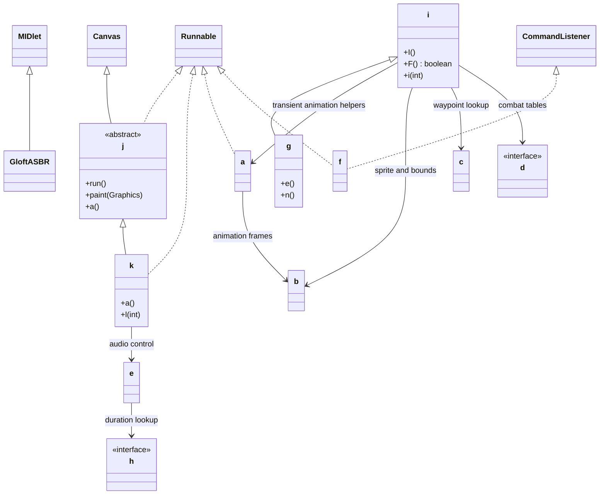

Inheritance/interface cạnh liền là `proven` từ class declarations; dependency
cạnh liền là observed consumer relation. Mỗi alias node giữ riêng mức
`high-confidence` hoặc `inferred` như bảng class.

`k` khai báo lại `Runnable` dù đã kế thừa `j implements Runnable`; đây không tạo
game loop thứ hai. `j.run()` vẫn là implementation thực. `a` cũng implements
`Runnable` nhưng `a.run()` rỗng; nó là animation cursor được caller advance trực
tiếp. Các thread khác trong `f` chỉ phục vụ IGP/platform request, không phải
simulation loop.

### 1.2 Coupling vật lý

Số dưới đây là **internal call sites**, loại self-call. Chúng đo coupling chứ
không phải số method duy nhất. Mọi count trong bảng là `proven`, được group trực
tiếp từ `reconstructed-project/inventory/calls.json` theo caller/target class.

| Từ | Đến | Call sites | Diễn giải |
|---|---|---:|---|
| `i` | `k` | 620 | Entity/AI/script trực tiếp điều khiển world, UI, audio và screen globals. |
| `g` | `i` | 567 | Player kế thừa và tái dùng physics/state/combat helper. |
| `k` | `b` | 296 | UI/world renderer phụ thuộc sprite/font runtime. |
| `g` | `k` | 236 | Player FSM đọc input/camera/world và phát side effect toàn cục. |
| `k` | `j` | 230 | Controller dùng canvas, timing, math, drawing và pack API. |
| `i` | `b` | 104 | Entity bounds/animation/draw dùng sprite metadata. |
| `i` | `g` | 104 | Generic actor logic tham chiếu player-specific globals/helpers. |
| `i` | `j` | 89 | Timing, math và render primitives. |
| `k` | `i` | 80 | Entity construction, update, lookup và draw. |
| `i` | `a` | 42 | Animation helper cho effect/script/minigame. |
| `k` | `a` | 33 | UI animation cursors. |
| `k` | `e` | 22 | Audio orchestration. |

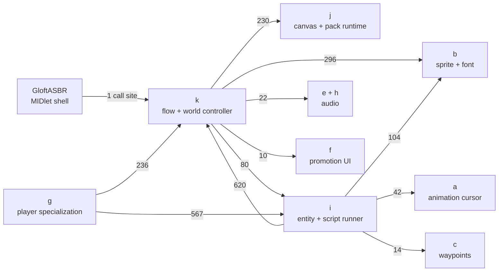

Kết luận: dependency direction không tạo layer sạch. `i ↔ k`, `i ↔ g` và
`g → k` tạo một simulation/controller cluster dùng static globals như một
service locator ngầm.

## 2. Kiến trúc logic nội suy

Sơ đồ sau là cách tách trách nhiệm để hiểu code; không khẳng định đây là package
hay class layout trước obfuscation.

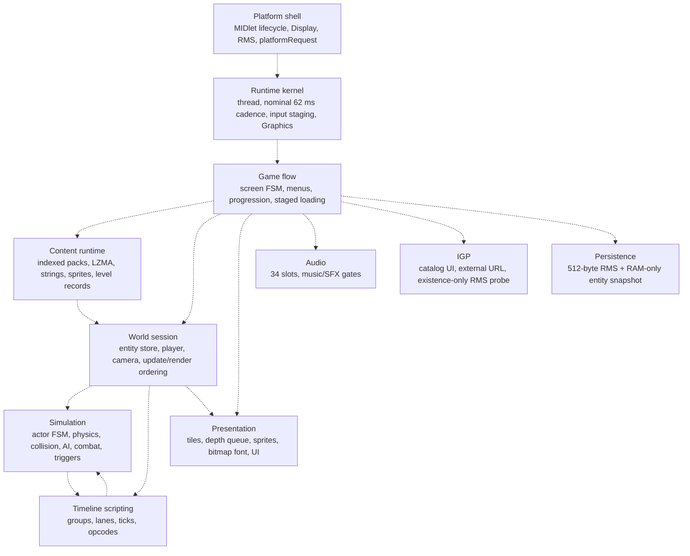

Mọi cạnh đứt trong hình này là logical boundary `high-confidence`, không phải
package/class dependency được phát hành.

Ánh xạ vật lý:

| Ranh giới logic | Nằm chủ yếu trong | Evidence anchor | Tin cậy |
|---|---|---|---|
| Platform shell | `GloftASBR`, một phần `j`, `k`, `f` | `GloftASBR.java:8–45`; `f.java:1845–1871` | `high-confidence` |
| Runtime kernel | `j`, input bridge ở `k` | `j.java:110–307`; `k.java:486–574,1594–1609` | `high-confidence` |
| Game flow | `k` | `k.java:734–1842` | `high-confidence` |
| Content runtime | `j`, `k`, `b`, `e` | `j.java:444–813`; `k.java:3949–4101,4741–5065`; `b.java:123–700`; `e.java:16–71` | `high-confidence` |
| World session | `k` | `k.java:2492–3255,4544–4705` | `high-confidence` |
| Simulation | `i`, `g`, `c`, `d` | `i.java:240–1479,3853–5303`; `g.java:529–5750`; `c.java:4–66` | `high-confidence`; `d` domain `inferred` |
| Timeline scripting | parser trong `k`, executor trong `i` | `k.java:4833–4920`; `i.java:17930–18927` | `high-confidence` |
| Presentation | `k`, `i`, `a`, `b`, primitives trong `j` | `k.java:2679–3255`; `i.java:2957–3334`; `a.java:99–144`; `b.java:907–1315` | `high-confidence` |
| Persistence/audio/promotion | `k` + `e/h/f` | `k.java:5557–5575`; `e.java:9–71`; `f.java:559–801,1845–1871` | `high-confidence` |

## 3. Bootstrap, game loop và lifecycle

### 3.1 Luồng khởi động

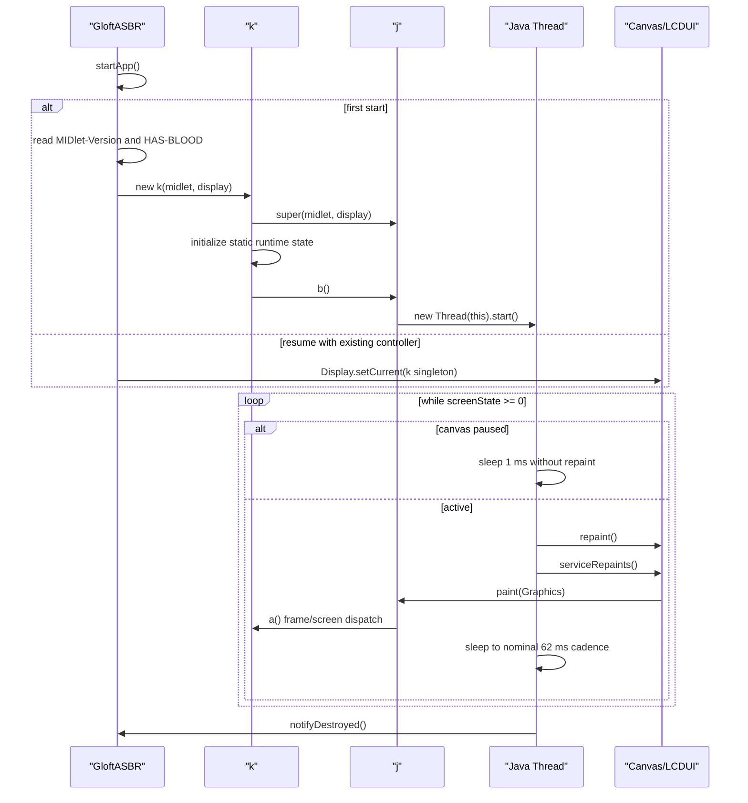

Evidence anchors:

- `GloftASBR.startApp()`: `reconstructed-project/src/structured/GloftASBR.java:20`.
- `k.<init>()`: `reconstructed-project/src/structured/k.java:479`.
- `j.b()` starts the thread: `reconstructed-project/src/structured/j.java:143`.
- `j.run()` owns the loop: `reconstructed-project/src/structured/j.java:196`.
- `j.paint()` computes/clamps delta and invokes abstract `a()`:
  `reconstructed-project/src/structured/j.java:221`.

Static code chứng minh completion order của `repaint()/serviceRepaints()` nhưng
không chứng minh thread vật lý nào của từng Java ME implementation gọi
`paint()`. Vì vậy sequence trên là call-order model, không phải thread-affinity
diagram.

`j.c` (screen/sentinel), `j.b` (paused) và `j.z` (paint gate) là plain static,
không `volatile`/`synchronized`; scheduler và Canvas/controller paths cùng truy
cập (`j.java:196–230`). Call order quan sát được không chứng minh Java
memory-model visibility hay prompt observation của pause/exit trên mọi device;
exact concurrency behavior là `unknown`.

### 3.2 Timing semantics

- Target cadence is 62 ms, khoảng 16,13 frame/s.
- Đây không phải fixed-step deterministic loop: `j.paint()` đo wall-clock delta
  `j.f`, clamp tối đa 1.000 ms, còn nhiều actor transition vẫn tiến theo frame.
- `repaint()` và `serviceRepaints()` làm update/render xảy ra trong paint
  dispatch. Không có thread simulation riêng.
- Khi paused, loop vẫn sống và poll bằng `sleep(1)` mà không repaint.
- Trước pause/re-entry guard, `j.paint()` kiểm tra frame gap lớn hơn 3.000 ms và
  gọi virtual `c(); d();`. Trên `k`, đường synthetic pause/resume này có thể stop
  audio, tác động script và đưa gameplay về pause menu trước khi reset clock.
- Exception thoát ra tới `j.run()` hoặc `j.paint()` có thể đặt `j.c = -1`, kết
  thúc loop. Nhưng `k.a()` có catch rộng quanh gần như toàn bộ
  screen/update/render dispatcher và swallow trước, nên phần lớn lỗi world/render
  chỉ bỏ dở frame/global mutation rồi loop vẫn chạy (`k.java:734–1616`).

### 3.3 Pause/resume

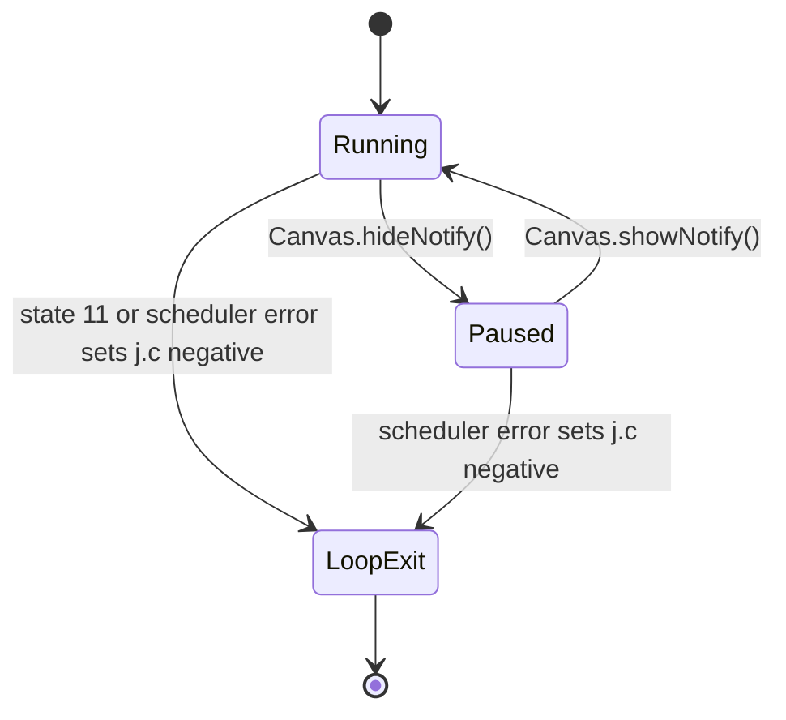

`GloftASBR.pauseApp()` chỉ gọi `notifyPaused()`. Pause thực nằm ở
`j.hideNotify() → k.c() → j.c()`: clear input, xử lý script/cutscene nếu cần,
stop audio và set paused flag. Resume ở `j.showNotify() → k.d() → j.d()` reset
timers, phục hồi display và có thể chuyển về pause menu trước khi tiếp tục;
automatic audio resume không được chứng minh vì các field resume quan sát được
không có runtime writes ngoài static initialization.

`GloftASBR.destroyApp(boolean)` không set `j.c = -1`, không stop/join game loop
hay IGP worker trong `f`, không stop audio và không save RMS. In-game exit state
`11` mới là đường game-loop shutdown đã chứng minh qua sentinel âm; prompt
thread/process termination khi platform gọi trực tiếp `destroyApp()` vẫn là một
gap thật của artifact.

## 4. Screen/state architecture

Top-level screen state nằm trong `j.c`. `k.a()` dispatch mỗi frame;
`k.l(int)` là transition gateway chính. Đây là FSM numeric 0–31, cộng sub-FSM
`k.u` khi state 21 xử lý dialogue/cutscene.

`j.c` là field hợp nhất hai nghĩa: giá trị không âm là screen state, giá trị âm
là scheduler termination sentinel. `k.l(int)` là gateway chính nhưng không độc
quyền; modal restore và exit có direct write đã chứng minh.

Sự tồn tại và control role của state là `proven`; tên UI/domain trong bảng dưới
chủ yếu `high-confidence`, còn các state transition-only giữ tên trung tính.

### 4.1 Nhóm state

| Nhóm | State | Vai trò | Evidence anchor | Tin cậy |
|---|---|---|---|---|
| Bootstrap/system | `0`, `9`, `11` | Bootstrap, staged level loading, exit. | `k.java:796–799,1067–1106`; `bytecode/k.javap.txt:5384–5418` | `proven` |
| Frontend | `1`, `2`, `3`, `4`, `5`, `6`, `18`, `19`, `23`, `25`, `27`, `28`, `29`, `30` | Title/intro, menu, options, stats/help/about, selectors, prompts và IGP. | `k.java:800–858,1146–1450` | `high-confidence` |
| Live world | `8`, `14`, `17`, `21` | Gameplay, pause/no-full-update presentation, dialogue/cutscene. | `k.java:859–1021,1122–1145` | `proven` cho dispatch; domain `high-confidence` |
| Progress/result | `10`, `15`, `20`, `22`, `24` | Interstitial, mission score, opening story, achievement, ending crawl. | `k.java:1101–1103,1140–1142,1208–1387` | `high-confidence` |
| Modal/transition | `7`, `12`, `13`, `16`, `26`, `31` | Confirmation/message/transition-only hoặc không có main dispatch case. | `k.java:1107–1121,1451–1475`; `bytecode/k.javap.txt:5384–5418` | `proven` cho absent cases; UI labels `high-confidence` |

### 4.2 Luồng đại diện

Sơ đồ không liệt kê toàn bộ 98 call site tới `k.l(int)`; nó thể hiện đường
người chơi chính đã được screen dispatcher và transition handler xác nhận.
Toàn graph là representative abstraction `high-confidence`; state IDs/dispatch
tồn tại là `proven`, nhưng node label domain không phải tên gốc.

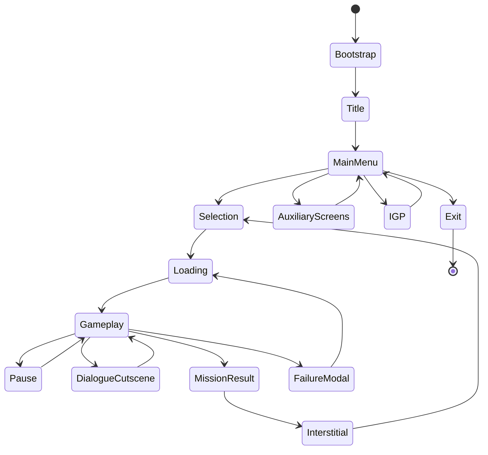

Transition được khởi phát không chỉ từ UI. `i.aa()` script executor,
`i.aV()` trigger controller và `g.e()` player FSM đều gọi `k.l(int)`. Vì vậy
gateway tập trung nhưng policy chuyển state vẫn phân tán.

## 5. Content và staged level loading

### 5.1 Runtime data flow

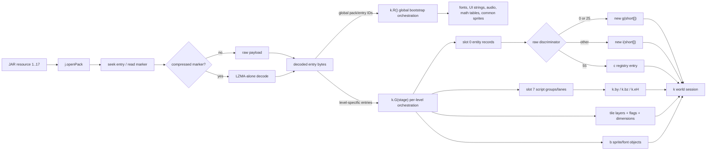

Hai orchestration path là `high-confidence`: bootstrap `k.R()` nằm tại
`k.java:3949–4101`, còn per-level `k.G(int)` tại `k.java:4741–5065`. Low-level
pack/index/raw-LZMA contract nằm ở `j.java:444–813`.

State `9` gọi `G(j.g)` qua nhiều frame. Bytecode chứng minh parse/allocation được
phân bổ qua các stage; mục đích tránh một frame quá nặng là `inferred`. `G(8)`
đọc entity slot `0` và parse script slot `7`; `G(9)` quét entity record để đánh
dấu sprite bank cần dùng; `G(10..84)` load chọn lọc các bank `/3`; `G(163)` áp
dụng module substitution và chỉ đến `G(164)` mới materialize entity vào world.
Thứ tự này chứng minh dependency discovery diễn ra trước object construction.

Failure contract của pipeline không transactional. `G(int)` catch mọi
`Exception` rồi trả `false`, cùng value với một stage chưa kết thúc; state `9`
truyền `j.g` tăng theo frame và không retry stage cũ. Vì vậy stage lỗi có thể bị
skip im lặng, không rollback/error state, rồi stage sau dùng partial state
(`k.java:1067–1089,4741–5089`; reset counter ở `k.java:1835`; `proven` về
control flow, hậu quả cụ thể theo resource `unknown`).

### 5.2 Entity record contract

```text
record := count8 + s16le[count8]
field 0 = raw type
field 1 = record/lookup ID (UID trong decoded corpus)
field 2 = X
field 3 = Y
field 5 = subtype/variant
field 6 = behavior/orientation flags
field 7+ = type-specific
```

Toàn bộ 4.286 record trong 8 pack parse đúng EOF. Constructor `i(short[])`
copy type/UID/position/flags, chọn sprite mapping rồi dispatch theo `entityType`.
Constructor giữ raw type đủ lâu để chọn sprite mapping, sau đó remap
`11 + field[5] in {80,93} -> 47` và `17 + field[5] == 120 -> 50` **trước**
type-switch khởi tạo behavior (`i.java:1944–1970`, `proven` ở
branch/assignment; domain name vẫn `unknown`). Vì `i.ax` còn có thể bị helper
đổi ở runtime, raw record discriminator và current runtime type là hai khái niệm
khác nhau; một rewrite phải lưu cả provenance lẫn giá trị dispatch hiện tại.

Record framing/count/EOF là `proven` bởi `docs/level-record-formats.md:34–103`;
field `0–3/6` và facing bit ở field `6` là `high-confidence` từ
`i.java:1896–1968`. Ý nghĩa các field type-specific còn lại là `inferred` hoặc
`unknown` tùy consumer.

Decoded level IDs là unique theo từng pack, nhưng runtime không enforce
uniqueness: transient/helper entity có thể dùng `aw = -1`, `k.q(-1)` từ chối
lookup và ID khác trả first match (`i.java:1983–2002,3644–3656,5643–5656`;
`k.java:4589–4602`, `proven`).

### 5.3 Offline reconstruction không phải runtime

Các script Python trong repo tái hiện pack/sprite/level parser để kiểm chứng
tĩnh. Chúng không được gọi bởi MIDlet. Runtime gốc đọc resource qua `j/k/b/e`;
offline pipeline đọc artifact đã pin hash và xuất JSON/PNG có provenance.

Riêng pixel code `0x27f1`, bytecode không có runtime fill branch. Bốn PNG tương
ứng là data-derived static recovery mức `high-confidence`, không phải bằng chứng
MIDlet đã decode codec đó. Level slot `3` cũng được bảo toàn offline nhưng không
có runtime consumer; ý nghĩa transform của plane này vẫn `inferred`.

## 6. World và entity model

### 6.1 Mô hình lưu trữ

| Symbol | Alias làm việc | Vai trò | Evidence anchor | Tin cậy |
|---|---|---|---|---|
| `k.bb[]` + `k.bc` | `entitySlots` + `entitySlotHighWater` | `bc` là scan/end high-water, không phải live count; deletion null slot rồi free-list reuse. | `k.java:4544–4602` | `high-confidence` |
| `k.aS` | `player` | `g` instance điều khiển chính. | `bytecode/k.javap.txt:22842–22954`; `k.java:2591–2600` | `high-confidence` |
| `k.bd[]` + `k.be` | `renderInteractionList` + `workingCount` | Visibility/depth list được render rebuild nhưng player targeting đọc lại ở update kế tiếp; backing array cố định 1.000 slot. | `k.java:253–255,2492–2504,2860–2932`; `g.java:5502–5540` | `high-confidence` |
| `k.O`, `k.P` | `cameraX`, `cameraY` | Camera world-space; script có thể override. | `k.java:1889–2095`; `i.java:18332–18377` | `high-confidence` |
| `k.C` | `selectedPostCameraScriptEntity` | Chọn một entity cho gated timeline drain hậu-camera; normal timeline step vẫn chạy per-entity trong `i.I()`. | `k.java:2642–2650`; `i.java:9811–9816,18914–18927` | `high-confidence` |
| `k.q(int)` | `findEntityById` | Lookup player trước, sau đó scan entity slots. | `k.java:4589–4602` | `high-confidence` |
| `k.b(i)` / `k.c(i)` | `addEntity` / `removeEntity` | World membership. | `k.java:4544–4587` | `high-confidence` |

`k.b(i)` luôn mutate cùng object reference bằng `as=-98`, sau đó ưu tiên pop
`ea[--eb]` theo LIFO, nếu không thì append tại `bc`. Khi đầy, mutation đã xảy ra
nhưng add bị drop im lặng. `k.c(i)` là null-noop; nó clear `ah` cùng `R/S/T/U`
và `F` theo reference identity trước khi scan, không so UID/value. Chỉ identity
match đầu tiên bị xóa; nếu `as != -98`, tombstone `bg[as]=-99` được ghi trước
`i.p()`, rồi slot mới clear và index mới push vào free stack. `bc` không giảm và
global reset vẫn tồn tại khi object không nằm trong store (`proven`). Host
contract chỉ trace vị trí `i.p()` trên normal-return path, không tái hiện cleanup
effects hay partial state nếu cleanup ném lỗi.

Hai registry/working array `bb` và `bd` đều có capacity cố định 1.000
(`proven`). Khi không còn free slot và `bc >= ba`, `k.b(i)` trả về im lặng;
method là `void`, nên caller không biết entity đã bị drop. Ngược lại,
`k.d(i)` không guard `be` trước khi shift/insert vào `bd`; renderer có thể thêm
entity, attachment và player. Corpus lớn nhất có 849 raw entity record, nhưng
dynamic helper/attachment làm khả năng chạm 1.000 ở runtime vẫn `unknown`
(`k.java:253–255,2492–2504,2860–2902,4544–4561`;
`docs/level-record-formats.md:98`). Ordered insertion shift array còn khiến mỗi
lần rebuild list là O(`be²`) ở worst case (`proven`). Rewrite parity-first nên
giữ failure policy có chủ đích: giữ silent-drop nếu cần legacy parity, còn
modern mode nên báo overflow/drop thay vì vô tình dựa vào inner frame catch để
nuốt exception.

### 6.2 Entity là FSM hai chiều

Cạnh liền trong sơ đồ dưới là observed phase/type dispatch; nhãn gom
`actor types` và `object/effect types` chỉ là semantic family
`high-confidence`, không phải Java subclass.

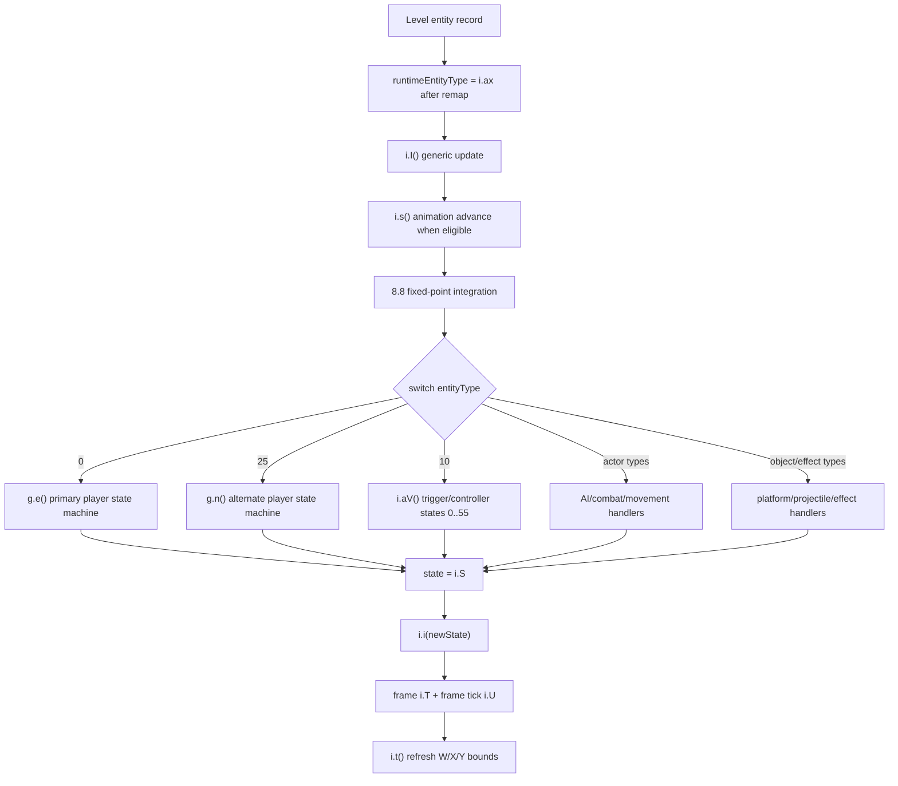

`i.i(int)` không chỉ là `setAnimation`: nó cập nhật previous/current state,
reset frame/ticks, clear flags và chạy side effects type-specific. Trong build
này animation index và gameplay state thường dùng chung numeric ID.

Data flow/type dispatch trong sơ đồ là `high-confidence`, dựa trên
`i.java:240–517,3853–5303`; tên domain cho từng numeric state vẫn `unknown` nếu
chưa có branch-specific proof.

### 6.3 Dữ liệu vật lý/collision chính

| Symbol | Nghĩa | Đơn vị | Evidence anchor | Tin cậy |
|---|---|---|---|---|
| `i.N`, `i.O` | Fixed position | 8.8 fixed-point | `i.java:1896–1943,3887–3916` | `proven` |
| `i.ak`, `i.al` | World position | integer pixel | `i.java:1896–1943,3887–3916` | `high-confidence` |
| `i.ag`, `i.ah` | Velocity | fixed-point/tick | `i.java:3887–3916` và motion consumers | `high-confidence` |
| `i.ai`, `i.aj` | Acceleration | fixed-point/tick² | `i.java:3887–3916` | `high-confidence` |
| `i.W` | Body/primary collision bounds | world rectangle | `i.java:336–568,1305–1402` | `high-confidence` |
| `i.X` | Action/hit bounds trong combat contexts | world rectangle, type/state-specific | `i.java:336–517,1305–1402` | `high-confidence` |
| `i.Y` | Secondary frame bounds | world rectangle, universal meaning chưa khóa | `i.java:336–517` và type-specific consumers | `inferred` |
| `i.P` | Behavior/render/cutscene flags | bitset | `i.java:240–278,5293–5303` | `high-confidence`; nhiều bit vẫn `unknown` |
| `i.av` | Facing/direction | boolean, mirrored vào bit 0 của `P` | `i.java:1936–1945,5293–5303` | `high-confidence` |

`N/O` và `ak/al` là hai miền state độc lập, không chỉ là hai view của một
property. Constructor đặt cả hai; integration reconcile `ak/al` vào `N/O`, cộng
motion rồi project ngược `N/O -> ak/al`. Trong khi đó collision và type handler
có thể snap/sửa trực tiếp `ak/al`, để integration sau mới hấp thụ thay đổi
(`i.java:1936–1941,3887–3912,690–716,847–909,4118,4726,4834–4835,7316`;
`g.java:203–254,845`, `proven` về read/write order). Do đó snapshot/parity model
phải giữ cả hai và không auto-sync ngoài đúng call site observed.

Collision tile lookup dùng lưới 20-pixel. `i.I()` đồng bộ integer/fixed
position, tích phân velocity/acceleration, dispatch handler, refresh bounds và
cuối tick kiểm tra tương tác với player.

Integration diễn ra trước phần lớn player/AI FSM. Vì vậy velocity được handler
chọn thường có hiệu lực vào tick kế tiếp, trừ branch snap/mutate position trực
tiếp. Đảo thành input/AI-before-physics trong rewrite sẽ thay đổi timing.

Slow branch của `i.I()` giữ nguyên reconcile order nhưng chia riêng old-velocity
và acceleration contribution bằng `aI` trước khi cộng. Đây là Java `idiv`:
truncate toward zero, `MIN_VALUE/-1` wrap, zero divisor vẫn reachable; mọi phép
cộng tiếp tục wrap signed int. Sau đó acceleration clear và fixed position mới
project ngược về pixel (`proven`).

### 6.4 RNG contract

`j` sở hữu một shared `java.util.Random`; entity/player branches tiêu thụ cùng
mutable stream nên call order là gameplay state. Range helper `j.a(min,max)` trả
ngay nếu hai bound bằng nhau; nếu không, nó lấy unbounded `nextInt()`, negate số
âm bằng arithmetic 32-bit rồi modulo `(max-min)`. Contract này có modulo bias và
`Integer.MIN_VALUE` vẫn âm, có thể trả dưới `min` — không tương đương Java/Kotlin
bounded `nextInt` (`j.java:314–331`; consumers
`i.java:3254–3257,4582,17547–17620`; `g.java:2482`, `proven`).

## 7. Luồng một gameplay frame

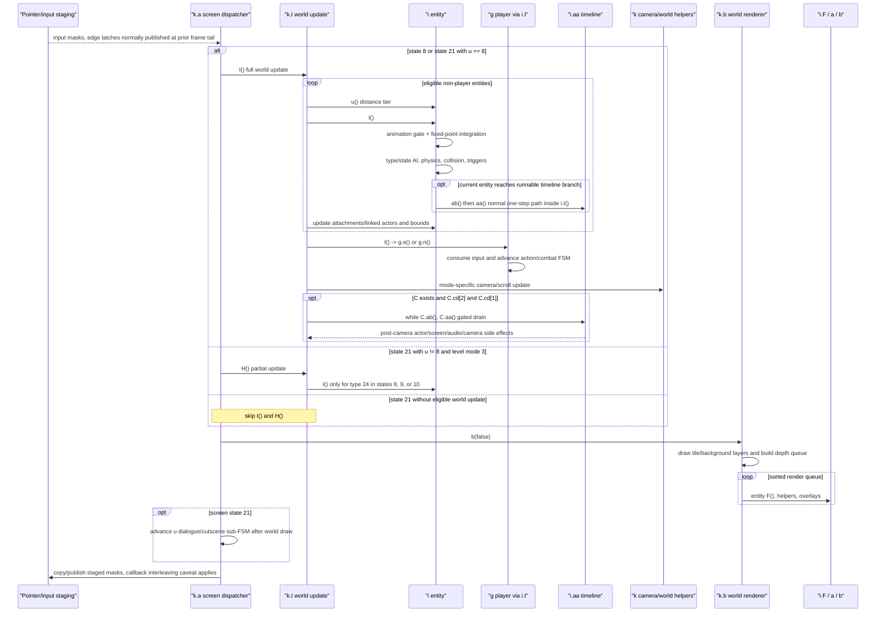

Điểm thứ tự đã chứng minh:

- Non-player entities được update trước `k.aS.I()`.
- Attachment `ac/ab/ad` có update riêng quanh owner.
- Normal timeline step xảy ra bên trong `i.I()` của entity ở vòng actor, vì vậy
  nó có thể chạy trước player và camera. Sau camera còn một gated drain riêng,
  chỉ khi `C != null && C.cd[2] && C.cd[1]`.
- Render queue được sort tăng theo `az`, sau đó tăng theo `al` (world Y) trong
  cùng depth bucket.
- State `21` xử lý dialogue/cutscene sub-FSM `u` sau `k.b(false)`, không phải
  trước entity update/render (`k.java:859–1021`).
- Khi state `21, u != 8`, full `I()` bị skip; riêng level mode `3` vẫn gọi
  `H()` để update type `24` ở state `8/9/10` trước render
  (`k.java:859–868,2507–2514`).
- Input staging được commit cuối `k.a()` tại `k.java:1594–1609`.

Call order trực tiếp là `proven` từ `k.java:2516–2651` và render path
`k.java:2679–3255`; tên semantic của helper là working alias mức
`high-confidence`.

Normal timeline step chạy trước normal/mode-3 camera, nên camera update sau đó
có thể ghi đè `k.O/k.P`. Chỉ gated drain `C.cd[2] && C.cd[1]` nằm sau camera;
nếu lane trong drain này ghi `k.O/k.P`, renderer thấy override ngay cùng frame.
Hai path và vị trí call là `proven` từ `i.java:9811–9816` và
`k.java:2531–2588,2619–2650`; tên domain timeline là `high-confidence`.

“Frozen/render-only” không đồng nghĩa no-tick tuyệt đối. State `14` và `17`
không gọi full `k.I()` nhưng vẫn gọi `k.b(true/false)`; renderer legacy rebuild
working list và mutate một số presentation/auxiliary state. Vì vậy chỉ có thể
gọi chúng là **no full world update** (`k.java:1122–1145,2679–3255`, `proven`).

## 8. Player, AI, combat và parkour

### Player

`g.e()` là method lớn nhất toàn game: 6.266 JVM instructions. Nó đọc
`k.isHeld/wasPressed`, dispatch trên hàng trăm numeric states và quản lý:

- di chuyển trái/phải, jump, crouch và free-fly debug;
- attack/hook, block, charge/special action và đổi weapon;
- climbing/ledge/parkour interactions dựa trên tile/collision probes;
- damage/death/recovery, attachment, scripted lock và camera-relative input.

Tutorial string xác nhận mapping move/jump/crouch/attack-hook/change-weapon.
Tên từng state vẫn phải xuất phát từ branch behavior, không gán chỉ vì game là
Assassin's Creed.

Raw player type `25` đi qua player FSM thứ hai `g.n()` (1.089 instructions), còn
type `0` đi qua `g.e()`. Corpus có đúng một record thuộc tập `{0,25}` trong mỗi
pack level `/6`…`/13`, chứng minh invariant một playable record/level cho corpus;
ý nghĩa narrative phân biệt hai type vẫn `unknown`.

Player routing là `proven` ở `bytecode/k.javap.txt:22700–22954`; vai trò hai FSM
là `high-confidence` từ `g.java:529–5750` và call dispatch trong `i.I()`.

### Generic actors và AI

`i.I()` dispatch nhiều entity type vào handler riêng. Một số type dùng
waypoint registry `c`, combat tables `d`, distance tier `i.au`, activation flags
và direct reference tới player/world globals. Đây là family-based actor system,
không phải một `Enemy` class riêng cho mỗi loại địch.

`c` không phải immutable level graph. Nó giữ ordered mutable store 400 slot,
lookup first-match, clone node tương đối với actor bằng ID tăng từ `10000`, và
actor logic còn mutate node position/auxiliary fields khi di chuyển. Insert/clone
không guard capacity (`c.java:4–66`;
`i.java:6433–6640,16909–16920,17053–17058,17317–17397`, `proven`). Vì vậy model
tái dựng cần tách immutable waypoint definitions khỏi mutable runtime store mà
vẫn giữ order/clone/mutation semantics; nghĩa domain của các aux field vẫn
`inferred`.

### Combat path

| Thành phần | Symbol/path | Evidence anchor | Tin cậy |
|---|---|---|---|
| Player health | `g.x[1]` | `g.java:4398–4433` | `high-confidence` |
| Generic actor health | `i.aB` | `i.java:1305–1479`; target mutation consumers | `high-confidence` |
| Body/action hitboxes | `i.W` / `i.X` | `i.java:336–568,1305–1402` | `high-confidence`; `X` không universal ngoài combat contexts |
| Incoming player damage | `g.a(i attacker)` và `attacker.W()` | `g.java:139–155` | `high-confidence` |
| Actor nhận player hit | `i.j()` overlap `player.X` với `actor.W` | `i.java:1305–1402` | `high-confidence` |
| Targeted player attacks | `g.aq()` / `g.ar()` mutate target `aB` | `g.java:4439–4547` | `high-confidence` |
| Difficulty damage | `i.W()` đọc `d.b` theo actor state/difficulty | `i.java:7987–8009` | `high-confidence` cho data flow, `inferred` cho tên attack |

Combat dùng mutable rectangles, health và direct state mutation; không có bằng
chứng về event bus, damage component hay một combat service độc lập.

### Trigger/controller entities

Entity type `10` chạy `i.aV()`. Method có 56 state entry, bao gồm overlap zone,
flag enable/disable, contextual interaction, launcher/trampoline, wave/grid
spawner, four-symbol minigame, target unlock và screen/cutscene trigger. Vì vậy
alias đúng là `TriggerController`, không phải `EnemyAI`.

Call isolation `ax == 10 -> i.aV()` là `proven` ở `i.I()`/bytecode; tên
`TriggerController` là `high-confidence` từ state behaviors đã đối chiếu trong
`docs/i-av-reconstruction.md`.

## 9. Timeline scripting engine

Slot `7` là một event timeline nhiều lane, không phải bytecode JVM thứ hai và
không có operand stack quan sát được.

Cạnh liền dưới đây là observed parser/executor data flow. Tên effect family là
`high-confidence`; operand meaning chưa khóa vẫn giữ `unknown` trong bảng sau.

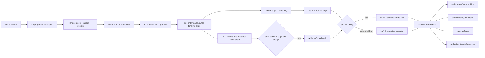

| Thành phần | Symbol | Bằng chứng | Tin cậy |
|---|---|---|---|
| Script IDs | `k.eH` | `k.s(id)` first-match scan, trả index đầu hoặc `-1`; `k.java:5544–5550`. | `high-confidence` |
| Lane blobs | `k.by[group][lane]` | Parser copy raw lane và gắn trailer cursor; `k.java:4833–4920`. | `high-confidence` |
| Raw cursor lengths | `k.bz[group][lane]` | Bytecode PCs đã đối chiếu trong `level-record-formats.md:212–222`. | `proven` |
| Active group | `i.ca` | `i.ab()` đúng bằng `ca >= 0 && !cd[0] && cK >= 0`; `i.java:18914–18927`. | `high-confidence` |
| Selected post-camera drain entity | `k.C` | Chỉ gated drain sau camera dùng singleton reference; normal step vẫn nằm trong từng `i.I()`. `k.java:2642–2650`; `i.java:9811–9816`. | `high-confidence` |
| Timeline tick | `i.cK` | So với event tick `s16`; `i.java:17930–18476`. | `high-confidence` |
| Lane cursors | `i.cL[]` | Mỗi lane tiến độc lập; `i.java:17930–18491`. | `high-confidence` |
| Step/direct/extended executor | `i.aa()` / `i.a(...)` | Low opcode trong `aa`; extended opcode delegate sau `i.java:18499`. | `high-confidence` |

`i.aa()` snapshot old `cK`, rồi mới increment có điều kiện theo latch,
normal-time hoặc Java remainder slow gate. Mỗi lane parse/dispatch current event
trước due test; event tương lai vẫn vào handler boundary nhưng cursor chỉ advance
khi `event.tick <= oldTick`, tối đa một cursor/lane/call. Opcode branch đọc
signed byte: raw `0..99`/`128..255` inline, `100..127` extended. Ở exact tick,
helper cho `108`/`113` có thể trả âm và kết thúc method sau tick stage nhưng
trước current cursor, later opcode/lane và completion writes (`proven`). Full
opcode effect vẫn chưa được mô phỏng.

Mode `0/1/2` có consumer; mode `3` chỉ có framing parser. Opcode `41–44`,
`group_meta`, `lane_meta` và một số operand semantics vẫn `unknown`.

## 10. Rendering architecture

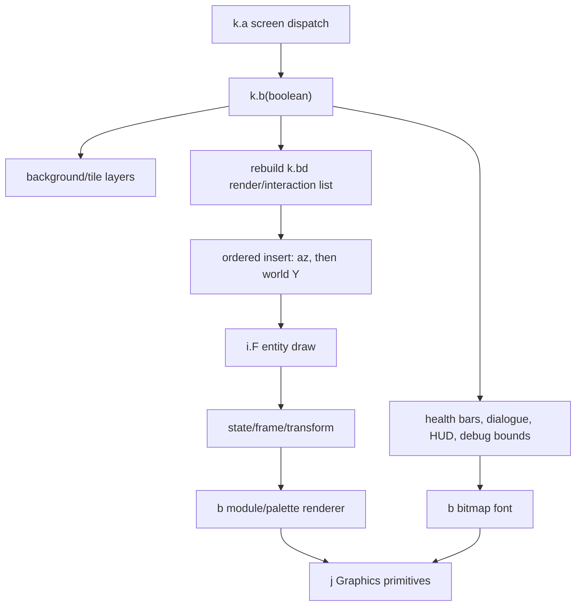

`b` chứa cả asset parser và renderer. `a` là animation cursor độc lập dùng cho
UI/effect; entity chính giữ state/frame trực tiếp trong `i`. Vì vậy không nên
giả định mọi actor đều composition với một `a` instance.

Render path không hoàn toàn pure: một số attached/auxiliary actor được draw rồi
gọi `s()` để advance animation trong `k.b(boolean)`. Một rewrite chuyển toàn bộ
animation update khỏi renderer phải bù đúng các call này để không lệch timing.
Side effect còn interleave với command order: `ae` có thể được insert rồi
advance trước vòng sorted draw, còn một số `ad`/`E` được draw trước khi advance
(`k.java:2873–2925`, `proven`). Không thể gom tất cả `s()` thành một bulk update
ở đầu/cuối tick mà vẫn mặc nhiên gọi là visual parity.

Các write presentation đã chứng minh còn gồm flash `i.bQ`, portrait/UI animation
và timer, HUD counters (`aH/aE/aF/aC/aO`), fade/letterbox (`bI/dz`), border
timer `fs`, `C.cb[3]`, flags `an/ao`, helper `ad.P` và `i.bJ/bL`
(`k.java:2848–2855,2911,3085–3128,3166–3235,4209–4244,4326–4343`,
`proven` về writes; tên effect `high-confidence`). Đây là ví dụ đã audit, không
tuyên bố exhaustive field inventory. Các write này vẫn có thể tiến trong frame
không chạy full world update.

Tile roles cũng không theo tên “primary = visual”: slot `1` (`et`) là logical
collision/query plane và chỉ được vẽ khi debug flag `dc` bật. Normal render blit
cached slot `8` (`eu`) trước, rồi optional `ef` parallax/effect, sau đó vẽ slot
`4` (`ep`) và/hoặc slot `11` (`er`) tùy `bh[aj]`/camera Y
(`k.java:2777–2847,4372–4519,5234–5299`, `proven`).

Insertion order cũng là contract: `k.d(i)` sort tăng `az`, rồi tăng `al`, nhưng
khi cả hai bằng nhau nó insert item mới **trước** item hiện có. Vì renderer scan
`bb` theo index tăng rồi thêm attachment/player, exact ties thành reverse
scan/insertion order, không có UID tie-break (`k.java:2492–2504,2860–2903`,
`proven`). Do `g.az()` đọc list này ở tick kế, đổi tie rule có thể đổi target.

Draw/order path là `high-confidence` từ `k.java:2492–2504,2679–3255`,
`i.java:2957–3334` và `b.java:907–1315`; tên `renderInteractionList` phản ánh cả
consumer render lẫn `g.az()` targeting, không phải tên gốc.

## 11. Input architecture

- Manifest khai báo `240×400`, còn game/IGP hard-code logical surface 400×240
  (`archive/META-INF/MANIFEST.MF:14–15`; `j.java:143–152`;
  `f.java:384–389`, mismatch `proven`).
- Pointer được xoay: `gameX = inputY`, `gameY = 240 - inputX`
  (`k.java:486–516`, `proven`).
- Pointer events ghi staging masks; frame tail copy held/edge staging sang
  next-frame latches, còn held cũng có thể publish ngay như caveat bên dưới
  (`k.java:553–574,1594–1609`, `high-confidence`).
- `k.u(mask)`, `k.v(mask)`, `k.w(mask)` tương ứng held, pressed, released;
  `k.x(mask)` là recent-repeat/double-like behavior mức `inferred`
  (`k.java:5585–5599`).
- `j` còn keypad mapping generic, nhưng override `k.keyPressed/keyReleased` rỗng
  trong build này. Gameplay path quan sát được là touch/virtual-pad
  (`j.java:267–301`; `k.java:5577–5583`, `high-confidence`).
- IGP `f` có pointer state riêng nhưng vẫn được `k` gọi từ screen FSM
  (`k.java:486–516,1422–1435`, `high-confidence`).

`k.E(mask)` còn có thể publish held mask ngay trong callback. Vì static artifact
không khóa event-thread interleaving với `k.a()`, exact same-frame visibility của
held input là platform-dependent. Frame-tail copy/clear chỉ bảo toàn
pressed/released edge nếu callback được serialized; callback xen giữa các lệnh
đó có thể làm mất edge, nên exact visibility vẫn `unknown`.

Frame-tail publication cũng nằm bên trong catch rộng của `k.a()`. Exception
trước `k.java:1594–1609` làm tail này bị skip, trong khi catch swallow và game
loop tiếp tục; staged/held/edge state vì vậy có thể carry sang frame sau theo
partial state (`proven` về control flow, exact user-visible outcome `unknown`).

## 12. Audio, persistence và external boundary

### Audio

`e` giữ bảng 34 audio slot: 31 payload nonempty được bọc
`ByteArrayInputStream`, còn slot `22/26/27` rỗng/null; class chỉ giữ một static
tracked `Player` reference. Trên normal successful path, player cũ được
stop/close trước replacement; stop/close exception hoặc unsynchronized
concurrency có thể để underlying player cũ còn active dù reference đã null/đổi,
nên active-player exclusivity không được chứng minh. Slot `0..9` đi qua music
option; `10..33` qua SFX
option. `h.a[]` cung cấp duration để code tự đánh giá playback còn active; đây
là wall-clock estimate, không phải `Player` completion authority. Boolean thứ
hai của `e.a(int, boolean)` không được bytecode đọc và phải xem là legacy/dead
parameter, không phải `allowRestart`.

Logical audio state là synchronous gameplay dependency: screen/script paths gọi
play/stop/status và dùng synthetic duration/active result để branch. Một rewrite
có thể defer backend playback I/O, nhưng slot/start/preemption/deadline mà
gameplay query phải mutate ngay tại recovered call position
(`k.java:1166,1797,5503,5519,6305,6327`, `high-confidence`).

Slot/stream/player behavior là `proven` từ `e.java:9–71`, `h.java:4–5` và pack
`17` metadata; nhãn policy music/SFX là `high-confidence` từ threshold `10` và
option consumers.

`e.a()` đo active bằng `System.currentTimeMillis() - start` so với `h.a[slot]`,
không phải simulation tick. Pause, dropped paint và scheduler lag vì vậy có thể
đổi kết quả gate dù backend callback không tham gia (`e.java:32–34`, `proven`).

### Save

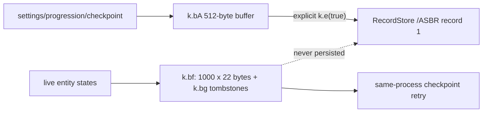

RMS `/ASBR` không có magic, version, checksum hoặc backup. Checkpoint logic có
thể mutate buffer `k.bA`, nhưng chỉ bền sau một call explicit `k.e(true)` về sau;
pause/destroy không tự flush. RAM-only entity snapshot không sống qua process
loss; `k.bg` tombstone state cũng cần cho retry để entity đã xóa không sống lại.
Đây là các persistence tier khác nhau, không được gộp thành một save format giả
định.

Failure contract quan sát được cũng yếu: `k.e(boolean)` swallow exception, nên
RecordStore có thể không được close trên exceptional path; bootstrap còn có một
`openRecordStore("/ASBR", true).getNumRecords()` không explicit close. Việc
vendor RMS có dung nạp handle đó hay không vẫn `unknown`. Load gọi
`getRecord(1, bA, 0)` vào buffer 512 byte đã pre-zero nhưng bỏ qua returned
length: record ngắn không bị reject và để zero tail; overlong/device error bị
swallow thay vì có recovery contract.

Physical `/ASBR` contract là `proven` từ `k.java:4034–4054,5557–5575` và
`docs/save-format.md`; semantic name của một số scalar vẫn `unknown`.

### IGP/network

`f` gọi `MIDlet.platformRequest()` khi người dùng chọn promotion. Khi vào IGP,
class này chỉ thử mở `igp19`, fallback tạo store rồi đóng; không có `getRecord`,
`addRecord` hay `setRecord`. Vì vậy `igp19` chỉ được chứng minh là
namespace/existence marker, không phải một save schema. Dependency inventory
không chứa `Connector`, HTTP, socket hay datagram API. Network surface của JAR
là external URL handoff, không phải HTTP client nhúng.

IGP call/store boundary là `proven` từ `f.java:782–794,1845–1871` và
`reconstructed-project/inventory/dependencies.json`; proprietary catalog field
semantics còn lại không được nâng quá `inferred`.

Filter URL `f.b(String,int)` chỉ loại `null`/rỗng và các sentinel
`DEL`/`NO`/`0`; không có scheme/host allowlist trước `platformRequest`
(`f.java:408–423,1313–1323,1845–1857`, `proven`). Nguồn URL là catalog
`/dataIGP`/MIDlet deployment properties và chỉ được handoff sau user action,
không phải arbitrary gameplay text. Vì JAD ngoài JAR có tồn tại hay không là
`unknown`, static evidence chưa đủ để kết luận remote exploit. Đây vẫn là trust
boundary mức `high-confidence`; shipping rewrite nên bỏ IGP hoặc chỉ cho phép
scheme/host đã pin.

`f` còn có unsynchronized shared-state handoff: entry methods start worker
threads rồi UI/update và `run()` cùng đọc/ghi static `aC/aD/aG` mà không
`volatile`/`synchronized` (`f.java:759–810,1185–1327,1845–1871`). Việc gọi lặp
có thể tạo worker chồng nhau; exact visibility/lost-URL outcome là `unknown` và
không nên được sao chép vô ý sang rewrite.

### Legacy error boundary

Runtime thường catch rồi swallow lỗi ở pack decode (`j.java:617–618`), sprite
parse (`b.java:698–699`), audio (`e.java:56–57`), IGP (`f.java:750–752`) và RMS
(`k.java:5572–5574`). Đây là behavior `proven`: resource hỏng/missing có thể để
lại partial state thay vì fail-fast.

Error boundary lồng nhau: `k.a()` swallow exception quanh gần như toàn bộ
screen/update/render dispatcher (`k.java:734–1616`), nên lỗi trong simulation,
timeline hoặc render thường không tới catch của `j.paint()` để đặt `j.c = -1`.
Frame có thể kết thúc giữa chừng với global state đã mutate rồi scheduler tiếp
tục frame sau (`proven` về catch/control flow; exact corrupted-state consequence
`unknown`).

Một failure mode nặng hơn cũng hiện rõ trong bytecode: hai exact-read loop của
`j` trừ trực tiếp kết quả `InputStream.read()` mà không xử lý `-1`. EOF sớm làm
remaining tăng và offset lùi; lần read sau ném bounds exception, outer catch bỏ
qua phần còn lại nhưng method vẫn advance/return đủ requested length. Kết quả là
partial/corrupt buffer được báo thành công, không phải retry. Riêng slice loader
`f.b(int)` bỏ qua kết quả `skip()`, đọc mọi partial chunk lại từ offset 0 và vẫn
lặp với valid offset khi `read()` trả `-1`, nên remaining tăng và có thể loop vô
hạn (`bytecode/j.javap.txt:3834–3908,5042–5120`;
`f.java:212–228`, `proven` về control flow; device-specific liveness outcome
`high-confidence`). Ngược lại, offline scripts trong repo cố ý validate strict,
exact EOF/hash rồi báo lỗi; strict validator không phải parity với
malformed-input behavior của MIDlet. Modern importer nên dùng bounded
exact-read, kiểm tra EOF/offset và fail atomically.

## 13. Các class logic có thể tách khi tái dựng

Bảng này trả lời “nếu đặt lại kiến trúc có nghĩa thì các class nào đang ẩn
trong god class?”. Đây là **conceptual decomposition**, không phải khôi phục tên
source gốc.

| Class logic đề xuất | Hiện nằm trong | Cơ sở | Evidence anchor | Tin cậy |
|---|---|---|---|---|
| `GameLoopScheduler` | `j` | Thread, repaint, timing, pause. | `j.java:143–230` | `high-confidence` |
| `ResourcePackReader` | `j` | Pack header/parts/marker/LZMA/read API. | `j.java:444–813` | `high-confidence` |
| `ScreenStateMachine` | `k` | `j.c`, `k.a()`, `k.l(int)`. | `k.java:734–1842` | `high-confidence` |
| `LevelLoadPipeline` | `k` | State 9 và `k.G(stage)`. | `k.java:1067–1100,4741–5065` | `high-confidence` |
| `WorldEntityStore` | `k` | `bb/bc`, add/remove/lookup, player reference. | `k.java:4544–4705` | `high-confidence` |
| `WorldUpdateScheduler` | `k` | `k.I()` update ordering. | `k.java:2516–2651` | `high-confidence` |
| `RenderInteractionWorkingList` | `k` | `bd/be`, depth/Y sort; renderer rebuilds, player targeting consumes prior list. | `k.java:2492–2504,2860–2932`; `g.java:5502–5540` | `high-confidence` |
| `EntityStateMachine` | `i` | `ax`, `S`, `i(int)`, `I()`. | `i.java:240–278,3853–5303` | `high-confidence` |
| `PhysicsAndCollision` | `i` | 8.8 integration, tile probes, W/X/Y rectangles. | `i.java:829–916,3887–3916,14828–14883` | `high-confidence` |
| `TriggerController` | `i` | Type 10 → `aV()` with 56 states. | `bytecode/i.javap.txt:39788`; `docs/i-av-reconstruction.md` | `high-confidence` |
| `TimelineScriptRunner` | `i` + parser `k` | `aa/ab`, lane cursor và opcode executor. | `k.java:4833–4920`; `i.java:17930–18927` | `high-confidence` |
| `PlayerInputController` | `g` | `g.e()`/`g.n()` direct input/action FSM. | `g.java:529–5750` | `high-confidence` |
| `SpriteAsset` / `BitmapFont` | `b` | Hai consumer family rõ nhưng chung binary/runtime class. | `b.java:123–700,907–1735` | `high-confidence` |
| `AnimationCursor` | `a` | Frame/timer/loop/draw wrapper. | `a.java:44–144` | `high-confidence` |
| `WaypointRuntimeStore` | `c` | Ordered first-match lookup, mutable node, relative clone và reset. | `c.java:4–66`; `i.java:6433–6640,16909–17397` | `high-confidence` |
| `ActorActionAndDamageTables` | `d` | Numeric action/state và difficulty-damage tables. | `d.java:4–6`; `i.java:7987–8009,8703–8745` | `inferred` |

Kiến trúc tái dựng parity-first nên giữ behavior trước, rồi mới tách class sau
khi có regression/golden-data checks. Tách sớm `i/k/g` theo tên đẹp có nguy cơ
làm mất ordering và global side effects.

Đặc biệt, không clear/rebuild `k.bd/be` trước player update: `g.az()` dùng list
từ render trước cho contextual/combat targeting. Đây là shared cross-frame state
giữa simulation và presentation, không phải render queue thuần.

## 14. Canonical timeline aliases

Các alias timeline dưới đây đã được canonize vào overlay machine-readable. Chúng
không còn là candidate wording.

| Symbol | Alias canonical | Evidence anchor | Tin cậy |
|---|---|---|---|
| `i.aa()` | `stepTimelineScript` | `i.java:17930–18476`; `bytecode/i.javap.txt:64769` | `high-confidence` |
| `i.ab()` | `isTimelineScriptActive` | `i.java:18914–18927` | `high-confidence` |
| `k.s(int)` | `findScriptGroupIndex` | `k.java:5544–5550` | `high-confidence` |

Descriptor phải luôn đi cùng alias khi method bị overload. Tổng cộng 11 alias
liên quan parity đã được promoted vào canonical overlay; bảng đầy đủ nằm trong
`docs/symbol-map.md`.

## 15. Điều đã biết, nội suy và chưa biết

### `proven`

- 12 class, inheritance/interfaces và toàn bộ method/field descriptors.
- Nominal loop 62 ms, scheduler owner, paint callback boundary và exit condition.
- Screen state owner/dispatcher/transition gateway.
- Entity record grammar, constructor routing và exact-EOF corpus.
- 8.8 fixed-point integration, 20-pixel tile probes và rectangle collision.
- Script grammar, lane cursor mechanics, executor entry points; current event
  được dispatch trước due gate và cursor chỉ advance khi
  `event.tick <= evaluated_tick`.
- `k.s(int)` là first-match scan và trả `-1` khi không khớp.
- `i.ab()` đúng bằng `ca >= 0 && cd[0] != 1 && cK >= 0`.
- Render ordering theo `az`/Y và draw chain tới `b`.
- Signed `baload` opcode branching: raw `0..99` và `128..255` inline,
  `100..127` extended.
- Exact-tick `108`/`113` negative-return handling aborts sau tick-stage nhưng
  trước current cursor advance và later opcode/lane writes.
- Audio slot count, RMS physical contract và external API footprint.

### `high-confidence`

- Semantic class aliases và logical subsystem boundaries.
- `g` là player specialization, `c` là waypoint registry; Ezio association đến
  từ title/story/tutorial strings chứ không được gán cho từng raw player type.
- `k.C` chỉ chọn entity cho gated timeline drain hậu-camera; normal timeline
  ownership/step vẫn là per-entity trong `i.I()`.
- `i.aV()` là trigger/controller FSM, không phải enemy AI đơn thuần.

### `inferred`

- Tên domain đầy đủ của hai table trong `d`.
- Một số actor/entity family và opcode action names.
- Conceptual class decomposition ở mục 13.

### `unknown`

- Tên class/method/field trước obfuscation.
- Những class source đã bị optimizer inline/remove trước khi tạo JAR, nếu có.
- Thread vật lý thực thi `paint()` và exact interleaving với pointer callback.
- Ý nghĩa narrative phân biệt playable raw type `0` và `25`.
- `group_meta`, `lane_meta`, script mode `3`, opcode `41–44`.
- Ý nghĩa tổng quát của nhiều type-specific record field và một số save scalar.
- Ý định kiến trúc ban đầu của team Gameloft.

## 16. Hướng phân tích tiếp theo có giá trị cao

| Ưu tiên | Việc | Giá trị kỳ vọng |
|---:|---|---|
| 1 | Sinh control-flow/state-transition graph từ bytecode `g.e()` | Đặt tên cụm player state, parkour/combat/death chính xác hơn. |
| 2 | Lập bảng `entityType → constructor fields → update handler → sprite IDs` | Đổi type numeric thành semantic family dựa trên consumer và asset. |
| 3 | Hoàn thiện opcode table từ `i.a(int,byte[],...)` | Dựng mission/cutscene DSL gần đầy đủ. |
| 4 | Trích full stage map của `k.G(int)` | Khóa thứ tự load/unload và dependency từng pack entry. |
| 5 | Cross-reference dialogue/tutorial với script IDs và entity UIDs | Gắn mission names vào graph mà không đoán theo genre. |
| 6 | Tạo machine-readable architecture graph từ inventory | Cho phép query caller/state/resource provenance tự động. |

## Tham chiếu

- [Semantic symbol map](./symbol-map.md)
- [Level record formats](./level-record-formats.md)
- [Resource formats](./resource-formats.md)
- [Save format](./save-format.md)
- [Khôi phục `i.aV()`](./i-av-reconstruction.md)
- [Technical analysis](./reverse-engineering-technical-analysis.md)
- [Kiến trúc tổng quan](./system-architecture.md)
