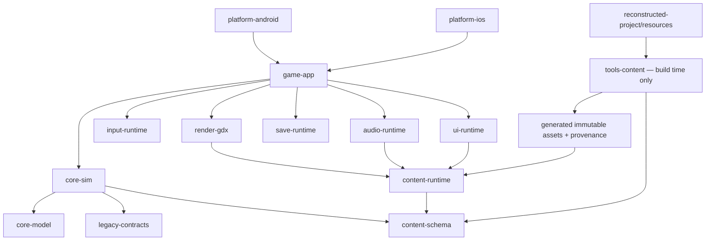

# Technical design cho bản rewrite Android/iOS

## 1. Trạng thái và quyết định

Đây là **thiết kế kỹ thuật**, không phải implementation. Không có code game mới,
không build launcher, không chạy JAR gốc và không thực thi simulator/device trong
phạm vi bài giao hiện tại.

Stack đề xuất: **Kotlin + LibGDX**, shared gameplay/content/runtime core, Android
và iOS launcher mỏng. Godot 4.x là fallback nếu iOS toolchain spike của LibGDX
không vượt gate. Chi tiết quyết định:
[`decisions/mobile-game-framework.md`](./decisions/mobile-game-framework.md).

## 2. Mục tiêu

### Functional

- Chạy native app package trên Android và iOS từ cùng gameplay code.
- Giữ tám mission, player movement/combat/parkour, actor AI, trigger, camera,
  collision, dialogue, menu, achievement, score, audio và save behavior.
- Tái sử dụng mọi gameplay resource đã phục hồi qua pipeline chuyển đổi offline.
- Giữ logical world 400×240 và pixel-art presentation, nhưng render mượt ở màn
  hình 60/120 Hz.
- Hỗ trợ touch hiện đại, safe area, suspend/resume và sandbox storage.

### Non-functional

- Deterministic simulation và replayable input.
- 60 FPS render target trên baseline device; 120 Hz là enhancement.
- Không parse JAR/custom pack trong runtime sản phẩm.
- Không network, ads, analytics hoặc obsolete IGP redirect.
- Mọi derived asset có source hash, transform version và rights disposition.
- Core gameplay không phụ thuộc Android/iOS/LibGDX API để có thể unit-test thuần.

## 3. Non-goals

- Không remake 3D hoặc thay đổi level/story.
- Không tự động “sửa” oddity trong bytecode khi chưa có parity evidence.
- Không lấy decompiled structured Java làm source compile trực tiếp.
- Không đưa file JAR, MIDlet runtime, RMS hoặc Java ME API vào app phát hành.
- Không ship cross-promotion, URL lịch sử hoặc `dataIGP` behavior.
- Không tuyên bố quyền phân phối asset; quyền sử dụng là release gate riêng.

## 4. Recovered facts và design choices

| Recovered fact | Design target | Loại quyết định |
|---|---|---|
| Scheduler nominal 62 ms; legacy update per accepted paint, mixed frame-count logic và wall delta clamp 0..1.000 ms | Simulation fixed tick 62 ms, render interpolation 60/120 Hz | Intentional timing modernization; parity fixtures/ADR required |
| 8.8 fixed-point position/velocity | Pure-Kotlin integer fixed-point core | Parity-first |
| Viewport landscape 400×240 | Offscreen logical framebuffer + pixel-perfect upscale | Parity-first |
| Touch rotation từ 240×400 | Direct landscape viewport mapping, không giữ rotation workaround | Modern platform |
| `j.c` screen FSM | Typed `ScreenState` nhưng giữ legacy numeric ID | Maintainability |
| `i.ax` type, `i.S` state | Behavior registry + explicit legacy IDs | Parity-first |
| Four tile layers/packed flags | Typed immutable `LevelBundle` | Content pipeline |
| Custom sprite/font binary | Build-time converter thành atlas/metadata | Runtime simplification |
| MIDI/WAV 34 slot + duration table | Offline normalized audio + ID/timing table | Cross-platform |
| RMS `/ASBR`, 512 byte | Versioned typed save + optional offline legacy importer | Reliability |
| IGP + `platformRequest()` | Loại khỏi product runtime; archive provenance only | Security/product |
| Hidden cheat overlay | Dev build only, stripped/gated release | Safety |

## 5. Kiến trúc tổng thể



### Dependency rules

- `core-model`, `legacy-contracts`, `content-schema`, `core-sim` là pure Kotlin;
  không import LibGDX hoặc platform SDK.
- `render-gdx`, `input-runtime`, `audio-runtime` là adapter quanh LibGDX.
- `platform-*` chỉ bootstrap/lifecycle/file path/store packaging; không có
  gameplay branch.
- `tools-content` chạy ở build/authoring time, không đóng vào runtime binary.
- Runtime chỉ đọc generated immutable assets và provenance manifest.
- Simulation chạy single-thread theo deterministic order. Background I/O không
  được mutate world trực tiếp.

## 6. Module contract

| Module | Trách nhiệm | Không được làm |
|---|---|---|
| `core-model` | Fixed-point math, geometry, IDs, deterministic RNG, immutable events | Renderer/platform I/O |
| `legacy-contracts` | Numeric class/type/state/flag/opcode maps, compatibility constants | Đổi ID vì “đẹp” |
| `content-schema` | Sprite/animation/font/level/entity/script/audio/string/provenance types | Đọc JAR trực tiếp |
| `core-sim` | Sole `ScreenStateMachine/tickScreen` owner; world/player/actors/collision/combat/mission/script/camera/logical audio | Gọi graphics/backend audio/files |
| `content-runtime` | Load/validate generated manifests và immutable asset handles | Parse LZMA/custom pack lúc chơi |
| `render-gdx` | FBO 400×240, tiles, sprite batch, interpolation, effects, HUD layers | Mutate gameplay state |
| `input-runtime` | Touch/controller mapping, capture, frame sampling, tick command queue | Gọi player method trực tiếp |
| `audio-runtime` | Thực thi deferred play/stop/pause commands trên backend | Làm authority cho slot/deadline hoặc mission branch |
| `save-runtime` | Snapshot, schema version, checksum, atomic write, migration | Serialize LibGDX object graph |
| `ui-runtime` | Menu/dialogue/pause/results/credits/accessibility layout | Chứa combat/mission rules |
| `game-app` | Lifecycle/content-load orchestration, event routing, error boundary | Mutate `ScreenState` hoặc chứa screen/gameplay rules |
| `platform-android/iOS` | Launcher, orientation, safe area, storage/lifecycle bridge | Fork shared rules |
| `tools-content` | Decode/convert/validate/atlas/audio/script/provenance | Có mặt trong shipped runtime |

## 7. Runtime flow

```text
launch
  -> validate generated content manifest
  -> load shell assets/fonts/options
  -> title/main menu
  -> select difficulty/mission or continue
  -> load immutable LevelBundle + referenced assets
  -> create deterministic WorldState
  -> fixed simulation ticks + interpolated render frames
  -> pause/dialogue/results/achievement
  -> atomic checkpoint/save
  -> unload level-scoped assets
```

Screen states được chuyển thành enum/sealed state dễ đọc nhưng giữ `legacyId`
trong mapping để đối chiếu `k.l(int)` và save/event data. Transition phải đi qua
một `ScreenStateMachine`; UI không tự đặt state global.
`ScreenStateMachine` và mọi numeric-compatibility screen timer/transition thuộc
`core-sim`; `game-app` chỉ gửi lifecycle/input/content-ready event.

Async load dùng core-issued monotonic `LoadRequestId` kèm expected
`(screenState, missionId, contentManifestHash)`. `game-app` trả immutable result
cùng token; core chỉ publish world/bundle atomically nếu token và expected tuple
vẫn khớp pending request/current state, ngược lại release result trễ. Replay ghi
tick của **accepted ContentReady event**, không dựa completion wall time. Fixtures:
A→back/B với completion đảo thứ tự, background cancellation và stale callback.

## 8. Time và deterministic simulation

### Modern authoritative clock và compatibility boundary

- `tickDuration = 62 ms` giữ nominal cadence recovered, nhưng không phải exact
  legacy timing parity: bản gốc update một lần cho mỗi accepted paint, dùng cả
  frame-count transition lẫn wall delta `j.f` clamp `0..1000 ms`.
- Render chạy theo display refresh, thường 60 hoặc 120 Hz.
- Accumulator gọi zero hoặc nhiều tick trước mỗi render.
- Chỉ transform/camera/effect presentation được interpolate; state, collision,
  AI, animation-frame advance và script trigger chỉ đổi ở tick boundary.
- Khi app background, dừng simulation và reset accumulator khi resume; không
  catch-up thời gian treo.
- Giới hạn tối đa bốn catch-up tick/frame. Phần lag dư được drop có telemetry
  dev-only để tránh spiral-of-death.

Accumulator, multi-tick catch-up và drop backlog là intentional modern
divergence. Trước khi gọi mode này là parity-capable, cần ADR và golden scenarios
cho steady 62 ms, paint bị skip, gap trên 3 giây, pause/resume, backlog drop,
animation frame-count và timeline tick.

Trong tài liệu này, `compatibility presentation-frame` là một lần core
`tickScreen` tương ứng accepted legacy paint ở cadence logic; nó không phải mỗi
physical display frame 60/120 Hz.

### Tick order

Mỗi compatibility presentation-frame được đóng thành contract:

1. chốt input command và frame/timer preamble;
2. chọn world phase đúng screen state:
   - state `8` hoặc state `21,u=8`: full `k.I()`;
   - state `21,u!=8,bh=3`: partial `H()` chỉ update type `24` state `8/9/10`;
   - state `21` còn lại, `14` và `17`: không full world update;
3. nếu full `k.I()`, chạy timer/fade, ordinary entities theo live slot order
   (normal timeline step nằm trong `i.I()`), attachment, player + attachment,
   marker/UI animation, camera, rồi optional gated post-camera timeline drain;
4. ở mọi branch legacy gọi `k.b(true/false)`, mở
   `LegacyPresentationBuilder` và emit world commands theo exact interleaving:
   insert interaction item, mutate presentation state và apply từng auxiliary
   animation advance tại recovered position;
5. với state `21`, chạy post-world sub-FSM sau world segment và append
   same-frame dialogue/UI commands vào builder;
6. finalize/cache immutable presentation snapshot;
7. publish/clear input tail rồi emit deterministic state hash.

Fixture bắt buộc gồm state `8`, state `21` ở cả full/partial/no-world paths và
state `14/17`, vì presentation side effects vẫn tick khi full simulation frozen.

### Tick failure boundary

Mỗi tick có một publication barrier duy nhất. Core mutation, synchronous
compatibility effects, presentation building, state-hash/snapshot building và
backend-command building xảy ra trước barrier; renderer/save/backend chỉ nhận
một immutable `CommittedTickBundle` bằng atomic swap. Nếu bất kỳ exception chưa
được xử lý nào xảy ra trước swap:

- tick bị abort và không publish snapshot, hash, render frame, save request hay
  backend command của tick đó;
- live world có thể đã partial-mutated nên bị quarantine vĩnh viễn, không chạy
  thêm tick, không được serialize và không được dùng làm nguồn restart;
- `save-runtime` giữ nguyên durable save đã atomic-commit gần nhất, renderer giữ
  immutable frame đã commit gần nhất, còn audio adapter nhận một out-of-band
  fail-safe stop không được feed ngược vào gameplay;
- `game-app` chỉ hiển thị fatal/restart UI đã sanitize; restart tạo world mới từ
  durable save hoặc quay về stable menu, không catch-and-continue và không giả
  rollback object graph.

Atomic swap định nghĩa linearization point: lỗi trước swap theo policy abort ở
trên; sau swap thì toàn bundle đã commit và adapter failure được cô lập/quarantine
ở adapter tương ứng, không tạo half-published tick. Failpoint tests bắt buộc ở
input-finalization, từng world phase, synchronous effect, presentation mutation,
snapshot/hash build, command build và hai phía publication point; mỗi test assert
không có partial save/command/frame, world bị quarantine, last committed artifacts
không đổi và restart chỉ đọc durable state.

`tickScreen` cũng chạy các non-world states trong core, không giao timer/branch
cho UI/render cadence: ví dụ state `18` giảm `cT` và gate bằng logical audio,
state `20` tiến `cT/cu`, state `25` giảm `dw`, save/transition, rồi mọi screen
đều đi qua input tail (`k.java:1146–1174,1208–1233,1388–1417,1594–1609`).
Menu/title/story/result/transition replay phải cho cùng state hash và commands ở
display 60/120 Hz; renderer chỉ replay snapshot.

Legacy add/remove mutate trực tiếp `bb` trong khi đang scan và có thể reuse slot;
không được đổi thành queued spawn/remove trong parity mode. Một transactional
queue chỉ được bật như intentional modernization sau ADR và same-tick
spawn/remove/free-slot fixtures.

Không dùng unordered map iteration làm logic authority.

### Numeric model

- Position/velocity/acceleration giữ integer 8.8 fixed-point ở core.
- Collision bounds dùng integer pixel rectangles.
- Float chỉ xuất hiện trong interpolation/render adapter.
- Overflow behavior cần test với Kotlin `Int`; không tự chuyển sang float/double.
- RNG nằm sau `DeterministicRandom`. Nếu cần parity Java, implement đúng Java
  LCG; version algorithm và persist **full mutable RNG state** (hoặc exact draw
  cursor đủ tái lập), không chỉ initial seed. RNG state nằm trong per-tick state
  hash và checkpoint save (`j.java:314–331`; consumers
  `i.java:3254–3257,4582,17547–17620`; `g.java:2482`).
- Parity RNG range helper phải tái hiện `j.a(min,max)`: equal bounds trả ngay
  không draw; ngược lại lấy unbounded `nextInt()`, negate bằng 32-bit overflow
  nếu âm, rồi modulo `(max-min)`. Không thay bằng bounded `nextInt`; giữ cả
  modulo bias và `Integer.MIN_VALUE` vẫn âm/có thể cho kết quả dưới `min`.
  Vector fixtures: zero, positive, negative, `MIN_VALUE`, equal bounds.

### Input latency

Mọi platform callback `down/move/up/cancel` được capture ngay vào thread-safe
monotonic sequenced queue, độc lập render polling; render chỉ đọc derived visual
state. Modern core drain event tới sequence cutoff và consume command ở tick kế.
Renderer có thể hiển thị pressed visual ngay, song không được thay đổi gameplay
ngoài tick. Đây là deterministic modernization, không phải exact input parity:
legacy có thể publish held ngay trong callback qua `k.E(mask)`, còn
pressed/released thường publish ở frame tail và callback interleaving là
`unknown`. Cần held/pressed/released latency fixtures cho serialized và
interleaved callback models. Sau khi parity đạt, cadence logic 60 Hz chỉ được cân
nhắc bằng ADR riêng vì retime có thể thay đổi AI, combo, animation và script.

## 9. Entity/gameplay architecture

### Parity-first model

Không dùng full ECS ở giai đoạn đầu. Recovered code có semantics dựa mạnh vào:

- `entityType (ax)`;
- numeric `state (S)`;
- legacy lookup ID (`aw`) có thể trùng hoặc `-1`; lookup dùng player/first-slot
  semantics, không phải unique identity;
- type-specific `Z[]` parameters;
- shared bit flags (`P`);
- mutation order trong monolithic handlers.

Thiết kế:

```text
WorldState
  entities: StableEntityStore
  player: PlayerState
  mission: MissionState
  selectedPostCameraScriptEntityHandle: EntityHandle?  // k.C, gated drain only
  screen: ScreenState
  camera: CameraState
  random: DeterministicRandomState

EntityState
  entityHandle            // unique modern identity, không lấy từ aw
  rawRecordType?          // immutable source provenance; null cho runtime helper
  runtimeEntityType       // mutable equivalent của i.ax sau constructor remap
  legacyLookupId, state, previousState
  fixedPosition, worldPixelPosition, velocity, acceleration
  facing, flags, primary/secondary bounds
  typedParams + preservedRawParams
  animationState, links, timers
  timelineState?          // per-entity ca/cK/cL/cd

BehaviorRegistry[runtimeEntityType]
  update(entity, world, commands, compatibilityEffectSink)
```

Materializer phải giữ `rawRecordType = field[0]`, khởi tạo
`worldPixelPosition = (field[2], field[3])` và
`fixedPosition = worldPixelPosition << 8`, chọn asset/dependency mapping bằng
**raw type**, rồi áp dụng remap constructor **trước** registry lookup: raw `11`
+ subtype field `5` thuộc `{80,93}` thành runtime `47`;
raw `17` + subtype `120` thành runtime `50`. Runtime helper không có record dùng
`rawRecordType = null`; mọi mutation về sau của `i.ax` chỉ đổi
`runtimeEntityType`, không làm mất provenance
(`reconstructed-project/src/structured/i.java:1936–1970`). Fixtures bắt buộc có
hai cặp `11 -> 47` và `17 -> 50`, đồng thời assert asset handle vẫn được chọn từ
raw type còn behavior registry dùng runtime type đã remap.

Hai miền tọa độ cũng không được gộp: integration reconcile integer
`worldPixelPosition` (`ak/al`) vào fixed `N/O`, cộng velocity/acceleration rồi
project `N/O -> ak/al`; collision/type handler lại có thể snap hoặc sửa trực tiếp
`ak/al` trước lần reconcile kế tiếp. Port phải giữ đúng các điểm đồng bộ/mutation
observed, không biến chúng thành một property tự động hai chiều
(`i.java:3887–3912,690–716,847–909,4118,4726,4834–4835,7316`;
`g.java:203–254,845`). Fixture cần phủ direct `ak/al` snap, quan sát state trung
gian, rồi mới chạy integration sau đó.

`StableEntityStore` ổn định theo modern `entityHandle`/legacy slot order, không
dùng `aw` làm key unique. Compatibility lookup phải giữ `q(-1) -> null`, ưu tiên
player rồi first matching live slot; fixtures phải có duplicate ID và helper ID
`-1`.

Parity profile giữ `bb` capacity 1.000, `bc` high-water, free-list reuse và
silent add-drop khi đầy. Render/interaction working list cũng capacity 1.000;
legacy ordered insertion không guard và có O(n²) rebuild. Release gate phải
chứng minh shipped scenarios không vượt cap (corpus raw peak 849 nhưng còn
attachment/dynamic spawn), hoặc mô hình đúng partial-frame failure contract.
Auto-grow/explicit overflow recovery là modern-safe profile và phải ghi ADR
divergence, không được lặng lẽ thay parity behavior.

`compatibilityEffectSink` áp dụng gameplay mutation đồng bộ ngay tại recovered
call position; nó không phải deferred gameplay queue. Logical audio scheduler
cũng mutate đồng bộ vì gameplay query slot/deadline/active state. Chỉ backend
playback command và pure UI/render notification được defer, và các event đó
không được feed ngược vào gameplay trong tick. Nếu muốn transactional gameplay
event queue thì đó là ADR deviation, không phải parity mode.

Player role được chọn bởi materialized `playerHandle`, không để generic
`BehaviorRegistry` vô tình coi raw/runtime type `25` là ordinary actor. Loader route cả
`0` và `25` vào player specialization; `0 -> primary g.e()` và
`25 -> alternate g.n()` là hai compatibility FSM riêng. Shipped corpus có đúng
một record thuộc `{0,25}` mỗi level; validator/fixtures phủ cả hai path, còn nghĩa
narrative của type `25` vẫn `unknown`
(`reconstructed-project/bytecode/k.javap.txt:22700–22954`;
`reconstructed-project/src/structured/i.java:3920–3923,5213–5218`).
Trigger/controller type 10 có behavior riêng chứa
56 state từ [`i-av-reconstruction.md`](./i-av-reconstruction.md). Central
oddities được giữ trong parity layer trước khi refactor helper.

### Collision/physics

- Port rectangle overlap, tile query và fixed-point integration từ `i/j/k`.
- Layer flags không được suy ra lại ở runtime; converter tạo typed flags.
- Resolve collision theo stable entity/layer order.
- Hitbox, hurtbox và interaction bounds là data riêng dù legacy tái dùng arrays.
- Mỗi thay đổi từ raw index sang type phải có fixture chứng minh.

### Combat/AI

- `EnemyCombatTables` chỉ là working alias `inferred`: tách action/state array và
  difficulty-damage array thành hai contract, giữ nguyên values/mapping recovered.
- State transition là data/event có ID, không string dispatch.
- Damage, invulnerability, animation gate và facing order test riêng.
- AI không đọc wall clock; chỉ đọc tick, deterministic RNG và immutable level
  query trong tick.

### Waypoints

Waypoint được tách thành immutable `WaypointDefinition` từ record type `55` và
ordered mutable `WaypointRuntimeStore`. Runtime store giữ capacity 400,
first-match legacy lookup, position/auxiliary mutation và clone-relative ID tăng
từ `10000`. Legacy parity profile giữ no-guard insert/clone; overflow có thể fault
giữa frame và để partial state, nên release gate phải chứng minh tổng initial +
dynamic clone không vượt 400. Modern-safe deterministic reject/grow là ADR
deviation, không phải parity. Fixtures: 399/400/401 nodes và multiple same-tick
clones (`c.java:19–45`). `wait`, `speed` hoặc behavior chỉ trở thành typed field
sau khi consumer chứng minh; hiện semantic đó còn `inferred`.

## 10. Mission scripting

Slot 7 chứa group/lane/event/instruction timeline stream. Giai đoạn parity không
thay bằng Lua hoặc arbitrary scripting. Converter tạo một
`LegacyScriptProgram` typed:

```text
ScriptProgram
  groups[]
    legacyScriptId
    groupMetaRaw
    lanes[]
      mode
      laneMetaRaw
      modeExtraRaw?
      events[]
        tick
        instructions[]
          opcode
          typedOperandsOrRaw
          sourceOffset
          rawBytesHash

TimelineRuntimeState
  ownerEntityHandle
  activeGroupIndex + legacyScriptId  // i.ca -> k.eH mapping
  timelineTick                       // i.cK
  laneCursors[]                      // i.cL, independent progress per lane
  controlFlagsRaw[]                  // i.cd; typed views only for proven bits
```

Đây là state theo timeline-owning entity, không chỉ program-global cursor.
`ca/cK/cL/cd` và active owner phải nằm trong state hash/replay snapshot; nếu
modern save cho phép lưu giữa timeline thì cũng phải serialize/version chúng.
Fixtures cần cover gates `cd[0/1/2/5]`, active predicate `ab()` và independent
lane advance (`i.java:17936–17957,18464–18475,18914–18916`).

Runtime interpreter:

- whitelist opcode recovered;
- bounds-check operand/index;
- deterministic, không file/network/reflection;
- gameplay state/flag/screen/camera/spawn/remove và logical-audio effect được
  commit đồng bộ tại recovered instruction position; chỉ backend playback và
  pure UI/render event mới được defer;
- giữ source offset để trace lỗi về pack/entry;
- preserve opaque metadata/opcode bytes; fail content build nếu framing/operand
  width không parse an toàn, và không tuyên bố mission parity cho tới khi executor
  semantics cần dùng đã được chứng minh.

Golden fixtures tối thiểu: early-slot script thay đổi later actor/player trong
cùng tick; pre-camera opcode có thể bị camera ghi đè; gated post-camera opcode
sống tới presentation snapshot; spawn/remove có free-slot reuse đúng scan order.

Sau parity có thể thêm authoring DSL compile về cùng bytecode-neutral schema;
runtime schema vẫn không phụ thuộc DSL.

## 11. Rendering

### Logical framebuffer

- Render world vào framebuffer logical `400×240`.
- Nearest-neighbor sampling để giữ pixel art.
- Composite vào safe viewport lớn nhất giữ aspect ratio; letterbox/pillarbox thay
  vì stretch.
- Integer scale được ưu tiên; fractional final composite chỉ dùng khi thiết bị
  không thể integer-fit, với pixel snapping.
- Touch hit region được map qua đúng viewport, bỏ vùng bars.

### Render order

1. clear/shell background khi screen mode yêu cầu;
2. cached base visual từ slot `8` (`eu`);
3. optional `ef` parallax/effect;
4. mode-dependent visual slot `4` (`ep`) và/hoặc slot `11` (`er`) theo exact
   `bh[mission]` branch;
5. slot `1` (`et`) chỉ là collision/query plane; chỉ emit debug visualization
   khi dev collision flag tương đương `dc` bật, không vẽ trong normal render;
6. depth-sorted entities bằng exact legacy ordered insertion: tăng `az`, rồi tăng
   world `al`; exact tie được insert trước item đang có nên thành reverse
   scan/insertion order, không dùng legacy ID tie-break;
7. particles/effects;
8. world-space prompts;
9. HUD/dialogue, gồm state-21 commands append sau world draw;
10. dev overlay nếu debug build.

Simulation lưu previous/current transform; renderer interpolate position/camera,
không interpolate discrete sprite frame hoặc collision state.

Legacy renderer không pure: `k.b()` rebuild `bd/be` để `g.az()` đọc ở update kế
tiếp và gọi `s()` trên một số helper/attachment. Thứ tự cũng interleave: có helper
được insert rồi advance trước sorted draw, có helper được draw rồi mới advance.
Proven examples còn có flash `i.bQ`, portrait/UI animation timers, HUD counters
`aH/aE/aF/aC/aO`, fade/letterbox `bI/dz`, border timer `fs`, `C.cb[3]`, `an/ao`,
helper `ad.P` và `i.bJ/bL`. Trước khi tuyên bố render pure, implementation gate
phải sinh exhaustive static write inventory cho toàn `k.b` call tree và port mỗi
gameplay/presentation write vào deterministic builder ở exact legacy point, kể
cả state `14/17` không chạy full world update.
`render-gdx` chỉ giữ contract “không mutate gameplay” khi
`LegacyPresentationBuilder` trong `core-sim` replay **đúng thứ tự** insert,
emit-command và `s()` một lần mỗi compatibility presentation-frame, sau camera/script drain và
trước/trong post-draw screen sub-FSM; không được gom animation advances thành
một bulk phase. Builder emit world segment, nhận same-frame state-21 UI segment,
rồi mới finalize immutable ordered interaction/presentation snapshot để renderer
60/120 Hz chỉ replay draw commands. Golden tests phải so slot `1` absent khỏi
normal render, mode-dependent `4/8/11` order, target selection,
pre/post-advance sprite frame, flash/HUD/fade timers và exact-tie ordering
(`k.java:2848–2855,2873–2925,3085–3223,4209–4244,4326–4343`).

Ordered interaction handles (`bd/be` equivalent) và toàn compatibility
presentation state phải nằm trong state hash/replay. Checkpoint phải serialize
state này hoặc reconstruct từ stored state **không chạy lại** presentation side
effects trước resume; nếu không target selection/timers sẽ lệch một frame.

### Sprite/font conversion output

Static recovery baseline đã có 84/84 sprite input parsed tới EOF, 4.376 module
inventoried và 4.371 pixel module xuất thành 12.102 PNG palette variant. Pipeline
rewrite phải dùng metadata/range/hash đó làm fixture/provenance, không decode lại
theo phỏng đoán. Bốn module runtime non-pixel cần typed disposition; một
pixel-bearing module partial (optional tail absent) phải giữ raw và chặn ship nếu
mission thực sự cần hình chưa chứng minh. Hai payload `0x27f1` là recovery dữ
liệu mức tin cậy cao, không phải runtime branch. Frame/animation assembly vẫn
phải được xác nhận từ record references, không suy từ filename PNG.

Mỗi sprite asset tạo:

- atlas page PNG;
- palette-normalized RGBA modules;
- module rectangles/hotspots;
- frame module list và transforms;
- animation sequence, duration, loop count;
- collision/attachment metadata nếu section có;
- module-substitution variant metadata hoặc deterministically baked variant
  frames, kèm ordered source→target records;
- source pack/entry/hash và converter version.

Pack `4/5` có 307 module-substitution record: bốn map áp cho `z[0]`, một map cho
`z[52]` ở load stage `163`. Converter phải giữ identity initialization,
source/target provenance và sequential last-write semantics của `b.a(int,byte[])`,
hoặc bake output variant đã chứng minh tương đương; không được bỏ map sau khi tạo
atlas (`k.java:5042–5055`; `b.java:713–733`;
`resource-formats.md:201–217`). Cả năm map là golden fixtures.

Bitmap font tạo glyph atlas, ordered Unicode lookup, advance, line height và
wrapping metadata. Lookup phải giữ base-bucket rồi overflow first-match của
`b.s(int)`; không dùng naïve map dedup/last-write. Nếu converter materialize
resolved map thì phải chọn first winner, vẫn ledger các duplicate loser và chứng
minh tương đương. Corpus duplicate keys `32`, `186`, `1059` là fixtures bắt buộc
(`b.java:1553–1607`; `resource-formats.md:191–199`). Các transform rotate/flip
phải được normalize hoặc biểu diễn rõ; không bake mơ hồ rồi mất hotspot.

## 12. Input và controls

### Command model

```text
MOVE_LEFT, MOVE_RIGHT, MOVE_UP, MOVE_DOWN
JUMP, CROUCH, ATTACK, ACTION, SWITCH_WEAPON
PAUSE, MENU_ACCEPT, MENU_BACK
```

`InputFrame` giữ `held`, `pressed`, `released`, optional analog/vector và monotonic
sequence. Replay serialize command theo tick, không serialize raw screen pointer.

Producer cấp sequence `u64` đơn điệu từ `nextInputSequence`; counter, last
consumed cutoff và ordered queued events đều thuộc canonical snapshot/hash.
Capture barrier đóng một cutoff nguyên tử: event trước cutoff nằm trong frame hoặc
queue snapshot, event sau cutoff chờ tick sau. Load restore exact counter trước
khi platform callback được publish; không reset/rebase từ zero. Fixture phải gửi
một callback ngay trước capture và callback kế tiếp ngay sau restore, rồi assert
sequence không collision/đi lùi và command frame giống uninterrupted run.

Giữa hai tick cutoff, aggregator OR toàn bộ queued `pressed` và `released`, lấy
`held` cuối cùng, và chọn pointer/analog event bằng rule deterministic
`(zone owner, latest sequence <= cutoff)`. Tick ghi sequence cutoff vào replay.
Như vậy quick press+release giữa hai tick — kể cả hoàn toàn giữa hai physical
render frame — không biến mất và display 60/120 Hz cho cùng command stream. Đây
là robust modern departure khỏi legacy latch race; fixtures phải phủ quick tap
between-render, drag-cancel/release, multi-touch owner và 60-vs-120 equivalence.

### Touch layout

- Landscape locked.
- Virtual pad trái; action/jump/attack phải theo recovered control surface.
- Multi-touch pointer capture: một pointer sở hữu movement zone, pointer khác sở
  hữu action; drag ra ngoài có rule rõ và release luôn được phát khi cancel.
- Safe-area inset và handedness option thay đổi layout nhưng không command
  semantics.
- Hit target tối thiểu được xác nhận trong UX phase; không dùng hard-coded physical
  pixel từ device cũ.
- Keyboard/gamepad có thể dùng cho desktop test/accessibility nhưng không là
  dependency của mobile release.

Original transform `x=inputY, y=240-inputX` chỉ là workaround portrait canvas;
runtime mới map trực tiếp screen → safe viewport → logical 400×240.

## 13. Content conversion pipeline

### One-way pipeline

```text
untouched recovered artifact + reconstruction manifest
  -> verify hash/inventory
  -> decode pack/container
  -> canonical intermediate representation
  -> validate every index/reference/opcode
  -> convert sprite/font/audio/level/string
  -> pack immutable runtime bundles
  -> emit provenance-manifest.json
  -> Android/iOS consume identical bundles
```

JAR gốc không được app runtime mở. CI chỉ dùng recovered inputs trong content job
được kiểm soát; product package chứa derived runtime assets, không chứa class
Java ME.

### Stable asset identity

ID canonical không phụ thuộc filename do người dịch đặt:

```text
jar/<sha256>/pack/<packId>/entry/<entryIndex>
jar/<sha256>/aux/<name>
```

Mỗi record provenance:

| Field | Ý nghĩa |
|---|---|
| `sourceArtifactSha256` | Hash JAR authority |
| `sourcePath` | Pack/entry hoặc aux resource |
| `sourcePayloadSha256` | Hash decoded raw payload |
| `sourceType` | Detected/proven type |
| `confidence` | `proven` / `high-confidence` / `inferred` / `unknown` |
| `transformId/version` | Converter và configuration |
| `derivedFiles/hashes` | Runtime outputs |
| `rightsStatus` | approved/restricted/unknown |
| `runtimeDisposition` | ship/archive/exclude-with-reason |

Build fail nếu runtime asset thiếu provenance, hash đổi không có version bump,
hoặc `rightsStatus != approved` cho release artifact.

### Disposition mọi recovered resource

| Source | Runtime disposition |
|---|---|
| Packs `1`–`5` | Convert common sprite/font/UI/mapping assets |
| Packs `6`–`13` | Convert eight level/entity/script bundles |
| Pack `14` | Convert indexed UI/story string tables |
| Pack `15` | Convert level/scene sprite assets |
| Pack `16` | Convert hai bảng toán fixed-point cosine Q8/square-root Q4 |
| Pack `17` | Convert 34-slot audio table, giữ three empty IDs |
| File `0` | Archive MIME metadata; converter input only |
| File `999` | Archive catalog/provenance validation |
| `icon.png` | App icon source, qua platform icon pipeline |
| `dataIGP` + 29 PNG | Archive đầy đủ; không ship quảng cáo/URL. Optional offline museum only after rights/product approval |
| 22 empty pack slots | Giữ ID/tombstone trong schema; không compact index |
| 114 signature-generic payloads | Family đã phân loại 114/114; giữ raw/hash/confidence, converter typed cho family đã biết và explicit contract cho record subtype còn opaque |

“Tái sử dụng tất cả resource” được hiểu là không mất asset: mọi resource có ledger
và disposition. Gameplay asset được convert; quảng cáo obsolete được archive chứ
không tái kích hoạt. Không thể coi engine license là quyền phân phối IP/content.

## 14. Level data contract

Mỗi pack `6`–`13` map thành `LevelBundle`:

Converter phải bám grammar/corpus oracle trong
[`level-record-formats.md`](./level-record-formats.md): slot `0` có 4.286 record
framed; slot `7` có 144 group, 510 lane, 2.366 event và 3.705 instruction parse
đúng EOF. Managed level tree hiện có 10 file / 34.570.387 byte / tree SHA
`d2f71b3fbede3bc29c32df5bb666fcba46cb431b32e18bf17f66f665bbc2ff60` /
manifest SHA `75ff246a5aa567a1f9cb7b8f2b58978305d88750f8bbef1589fe722c5f0f0648`.
Các metadata byte/opcode chưa có runtime meaning vẫn giữ opaque.

```text
LevelBundle
  missionId
  legacyPackId
  levelType
  collisionLayer     // slot 1 + dimensions slot 2; query/debug, not normal visual
  slot3CompanionRaw  // runtime-unused companion to slot 1; transform meaning inferred
  visualLayerA?      // slot 4 + dimensions 5 + flags 6
  scriptDescriptors  // slot 7
  cachedVisualLayer? // slot 8 + dimensions 9 + flags 10; base normal render
  visualLayerB?      // slot 11 + dimensions 12 + flags 13
  entityRecords      // slot 0
  sourceHashes[14]
  confidenceByField
```

Validator:

- dimensions footer đúng 4 byte/two `u16 LE`;
- tile count phù hợp width×height hoặc có documented packing rule;
- packed flags đủ coverage;
- entity lookup/link/reference hợp lệ theo legacy first-match/`-1` policy; không
  ép `aw` unique;
- script opcode và operand không vượt buffer;
- sprite/audio/string IDs tồn tại;
- empty optional layer chỉ ở configuration cho phép;
- slot 3 luôn giữ raw bytes/hash/provenance; converter validate exact
  `ceil(primaryTileCount/4)` và không đưa plane này vào runtime parity khi chưa có
  ADR chứng minh một semantics mới.

## 15. Audio design

- Stable `AudioId 0..33`, không renumber empty slot.
- MIDI được render offline bằng pinned synthesizer + soundfont + settings; hash
  soundfont/config trong provenance để Android/iOS không khác timbre/timing.
- WAV được normalize sample format/level qua deterministic converter; bản gốc
  vẫn ở archival input.
- Runtime giữ music/SFX option riêng như recovered UI.
- `AudioDurationTable` là compatibility metadata cho script/state gates; không
  lấy backend callback timing làm gameplay authority.
- Parity mode đặt `LegacyAudioScheduler` trong deterministic core: slot đang
  tracked, logical start, synthetic deadline/status, option gate và preemption
  mutate đồng bộ tại script/screen call position; gameplay status query chỉ đọc
  state này (`k.java:1166,1797,5503,5519,6305,6327`). Scheduler emit deferred
  backend command. Backend có thể dùng pool/channel hiện đại nhưng callback/timing
  không được đổi mission branch.
- Strict compatibility profile dùng recorded monotonic wall-clock sample làm
  input cho `currentTime-start` như `e.a()`; replay phải chứa elapsed samples.
  Nếu product chọn simulation/tick clock để deterministic đơn giản hơn, đó là
  intentional timing divergence cần ADR và fixtures cho pause, backlog/drop,
  title/audio gates và resume (`e.java:32–34`).
- Background/pause dừng hoặc pause channel theo lifecycle; resume không phát lại
  event đã consume nếu policy không yêu cầu.
- Backend commands mang monotonic `commandSeq` + `audioGeneration` và đi qua một
  ordered drain có thread affinity. Play/stop/pause/lifecycle dùng chung stream,
  giữ stop-before-replace; async start/completion callback có generation cũ bị
  bỏ qua, không được resurrect/stop clip mới. Test delayed callback và rapid
  `play -> stop -> play`.
- Canonical `LogicalAudioClockState` gồm tracked `AudioId?`, logical status,
  compatibility duration, elapsed/remaining logical milliseconds, option gates,
  `nextAudioCommandSeq` và current `audioGeneration`; toàn bộ được save/hash và
  restore exact. Không persist absolute monotonic timestamp: khi status đang chạy,
  first post-restore compatibility-time sample rebases start từ saved elapsed;
  thời gian app suspended/background không consume logical duration. Clock
  reset/wrap và restore từ paused/background đều có fixtures.
- Backend coordinator tạo `backendSessionEpoch` mới khi load/restore, trước khi
  publish state. Epoch là transport-only, không nằm trong save/hash/semantic
  command equality; callback phải match cả epoch lẫn `audioGeneration`. Nhờ vậy
  delayed callback trước save bị loại, còn persisted sequence/generation vẫn cho
  semantic backend command stream tương đương uninterrupted execution. Fixture
  giữ một delayed pre-save callback, restore và play clip mới rồi chứng minh
  callback cũ không đổi logical slot/status.

## 16. Save/persistence

### Runtime model

Tách:

- `CampaignSave`: mission unlock/progress, difficulty, score, achievements,
  checkpoint/player/mission state và optional `CanonicalWorldSnapshot`;
- `SettingsSave`: music/SFX, controls, accessibility;
- `SaveEnvelope`: magic + envelope/schema/content version, 64-bit
  `saveRevision`, random `saveLineageId`, bounded payload length, timestamp
  metadata, integrity digest và backup generation.

Thiết kế chọn **intentional exact-resume** cho save native; đây là extension so
với durable `/ASBR` legacy, không được gọi là physical save parity.

```text
CanonicalWorldSnapshot
  coreGlobals: flattened CoreGlobalsSnapshot
    screenId/subState + compatible timers/frame counter
    camera current/previous/target
    mission globals/flags/counters + handle references
    input latches/aggregator cutoff + nextInputSequence + barrier queued events
  entityStore: capacityProfile, slotHighWater, orderedFreeList, slotHandleOrNull[]
    nextEntityHandleId  // monotonic allocator authority, included in state hash
  objects[]: complete flattened EntitySnapshot handle table
    entityHandle, objectKind, ownerHandle?, legacyLookupId
    rawRecordType?, runtimeEntityType/state/animation
    fixedPosition + worldPixelPosition, motion/bounds/flags/health/timers/raw params
    linkHandleIds[]
    timelineState?  // per-entity ca/cK/cL/cd
  playerHandle  // player is outside legacy bb slots but present in objects[]
  waypointRuntime: ordered nodes, mutable fields, nextDynamicId
  selectedPostCameraScriptEntityHandle  // separate k.C equivalent for gated drain
  interactionHandleOrder + compatibility presentation state
  logicalAudioClockState
    trackedAudioId/status/durationMs/elapsedMs/remainingMs/optionGates
    nextAudioCommandSeq/audioGeneration  // no absolute monotonic timestamp
  versionedFullRngState
```

`objects[]` phải chứa **mọi** handle-addressable runtime object: player, slotted
actor và non-slot owned/linked auxiliaries (`ac/ab/ad/ae/E` families); store slots
chỉ reference một subset. `EntitySnapshot` phải bao phủ exhaustive gameplay-read
mutable-field inventory, không phải serialize object graph. Field tables của `CoreGlobalsSnapshot`,
`EntitySnapshot` và các ordered stores đều là phần của root
`CanonicalWorldSnapshot`, để global authority không bị bỏ sót. Load dùng hai
pass: allocate exact handles và
slot/free-list layout trước, rồi resolve links/targets/timeline owner; toàn bundle
validate atomically trước publish, gồm group ID/index và lane-count compatibility
cho từng `timelineState`. Mọi global/link/interaction/slot handle phải resolve
đúng một object duy nhất; mỗi link kind có explicit ownership/cycle policy và
không được loại legacy cycle chỉ vì modern model thích tree. Checkpoint restore
không được rebuild bằng
cách chạy presentation side effects thêm một lần. Nếu product chọn coarse
legacy-like save, phải bỏ exact-continuation claim và reload level từ durable
progress/checkpoint thay vì mix hai contract.

`EntityHandle` dùng ID 64-bit monotonic, không tái sử dụng trong cùng save
lineage; xóa object không trả ID về pool. `nextEntityHandleId` là allocator
authority độc lập với max live handle, được serialize, validate lớn hơn mọi ID đã
cấp, và đưa vào canonical hash. Load restore đúng counter trước lần spawn kế
tiếp; không suy nó từ `objects[]`. Fixture bắt buộc: tạo ID `1..10`, xóa `10`,
save/load rồi spawn phải cho cùng ID `11` như execution không ngắt. Nếu sau này
chọn reuse, schema mới phải lưu ordered free IDs **và** generation counter, đồng
thời chứng minh stale handle không alias; không thay policy ngầm trong schema cũ.

Exact resume chỉ được capture ở post-input-tail tick boundary của gameplay-family
states `8/14/17/21`, qua một input sequence barrier. Non-eligible title/load/menu/
result states persist progression/settings rồi restart ở stable screen; không hứa
next-tick continuation. Fixtures so uninterrupted với suspend/restore cho cả bốn
eligible states, gồm next-tick hash + presentation/backend commands; mỗi
non-eligible screen family phải test fallback destination đã document.

Fallback dưới đây là **modern product policy**, không phải behavior đã recovered.
Mọi progression/reward write dùng `completionTxnId` idempotent và commit trước
khi UI kết quả được coi là đã vào state; restore không được phát lại reward,
achievement notification, URL launch hay exit side effect.

| Non-eligible legacy state family | Durable data capture | Stable restore transition |
|---|---|---|
| Bootstrap `0` | committed campaign/settings only; discard partial bootstrap objects | fresh bootstrap `0`, then normal title/menu route |
| Staged load `9` | selected mission/chapter/difficulty + content version; no partial stage/world | restart load `9` at stage `0`; invalid selection/content falls back to main menu `2` |
| Title/menu/modal `1–7,12,13,16,18,19,23,26,28–31` | committed campaign/settings and validated durable selection only | main menu `2`; do not reopen the previous modal |
| Result/score/achievement `10,15,22` | completion receipt, score/progress delta, reward/achievement applied marker | atomically finish the receipt at most once, then level selection `19` |
| Opening story `20` | selected mission + idempotent `storySeen` marker | load `9` at stage `0` when selection is valid, otherwise main menu `2` |
| Ending crawl `24` | final completion receipt + idempotent `endingSeen` marker | main menu `2` after at-most-once receipt completion |
| Exit/IGP `11,25,27` and negative sentinel | already committed campaign/settings only; no external-action replay token | next launch starts fresh bootstrap `0`; never auto-exit or relaunch URL |

Contract fixtures suspend at every row before/after its durable commit boundary,
then assert the exact destination, at-most-once progression/reward mutation and
absence of replayed modal/external side effects.

### Canonical state/hash contract

`CanonicalWorldSnapshot` là single root cho exact save và replay/state hash.
Canonical encoding dùng versioned field table, fixed signed widths + little-endian,
boolean `u8`, explicit length/null tags; serialize entity slots theo slot index,
free list theo stored order, entity records theo handle, waypoint/interaction
lists theo runtime order. Nó gồm global refs, screen/substate/timers/frame,
camera, input-tail/sequence barrier, presentation state, logical audio/RNG,
store capacity/high-water và mọi per-entity/timeline state; loại backend object,
wall-clock object identity, render interpolation-only state và toàn bộ save-I/O
metadata (`saveRevision`, `saveLineageId`, timestamp, queue/writer/coordinator
state).

State hash là SHA-256 của `stateSchemaVersion + contentManifestHash + canonical
snapshot bytes`. Save envelope ghi schema/hash tương ứng; không có unordered map
hay platform-native serialization trong oracle. Tests phải vừa so full canonical
snapshot equality vừa so hash, và mutation-sensitivity cho từng field family để
tránh “hash pass” trong khi serializer bỏ sót state.

I/O bọc world bất biến bằng
`SaveWriteRequest(saveRevision, saveLineageId, canonicalWorldSnapshot)`; request
và envelope không trở thành con của canonical world. Header digest vẫn phủ
revision/lineage như mô tả dưới, nhưng replay/gameplay hash chỉ phủ world bytes.
Fixture cùng một world với zero save request và với nhiều request/coalesce phải
cho canonical bytes/hash hoàn toàn giống nhau.

### I/O guarantees

- Capture immutable flattened DTO snapshot trên simulation thread; không
  serialize live object references/LibGDX graph.
- Khi enqueue, `SaveCoordinator` cấp `saveRevision` đơn điệu cho wrapper
  `SaveWriteRequest`; `CanonicalWorldSnapshot` bên trong không đổi và không mang
  revision. Coordinator single-writer sở hữu counter, queue, file tạm, backup
  rotation và atomic replace; không code path nào khác được ghi trực tiếp.
- Queue coalesce các request chưa bắt đầu về revision mới nhất, nhưng không đảo
  thứ tự write đang chạy. Completion có revision thấp hơn committed revision bị
  loại, nên checkpoint cũ không thể overwrite suspend save mới hơn.
- Mỗi write: tạo file tạm theo revision, flush/fsync nếu platform hỗ trợ, kiểm
  checksum, rotate đúng một last-known-good backup, rồi atomic replace. Chỉ sau
  replace thành công mới tăng `committedRevision`.
- Main/backup/temp đều mang cùng lineage + revision. Startup validate toàn bộ,
  chỉ xét candidate đúng lineage/content/schema/checksum, chọn highest valid
  committed theo policy main→backup; temp chỉ promote khi có explicit commit
  marker, không bao giờ thay candidate revision cao hơn. Khởi tạo
  `nextRevision = maxObservedValidRevision + 1`; orphan/corrupt temp được
  quarantine/cleanup sau selection.
- Validate version/content ID/checksum trước load.
- Không trust lineage/revision/content/schema trước integrity check. Digest
  SHA-256 phủ canonical header `{magic,envelopeVersion,stateSchemaVersion,
  contentManifestHash,saveLineageId,saveRevision,payloadLength}` + exact payload;
  loại chính digest và explicit nondeterministic metadata như display timestamp.
  Bounds-check payload length theo schema/max-save limit **trước allocation/read**.
  Corruption fixtures flip từng trusted header field, length, payload và digest.
- Migration từng version, idempotent và round-trip tested.
- Trên suspend, capture snapshot trên simulation thread, enqueue revision mới
  nhất rồi yêu cầu coordinator drain trong lifecycle deadline. Nếu hết budget,
  giữ file committed gần nhất và file tạm có tên revision để phục hồi/cleanup ở
  lần mở sau; không block vô hạn và không công bố partial save.
- Không lưu PII, advertising ID hoặc network state.

### Legacy compatibility

Một offline tool có thể import 512-byte RMS record `/ASBR` nếu người dùng có file
record hợp pháp. Tool giữ unknown/reserved bytes và báo confidence. Runtime không
phụ thuộc RMS hoặc JAR; không tự tìm dữ liệu ứng dụng Java ME trên device.
Legacy importer phải bám byte map, reset quirks và RAM-only boundary tại
[`save-format.md`](./save-format.md), gồm việc 398 byte reserved được round-trip
chứ không tự gán nghĩa.

Save fixtures bắt buộc: dynamic spawn/delete + free-slot reuse, mutable/dynamic
waypoint, duplicate lookup ID, per-entity timeline nhiều lane + selected gated
drain, interaction order,
logical audio/RNG mid-stream; uninterrupted run phải bằng save/load continuation
(`save-format.md:123–143`; `k.java:4604–4613,4625–4705`).
Thêm crash fixtures tại temp-write/fsync/backup-rotate/main-replace và mọi
main/backup/temp revision permutation để chứng minh lineage/recovery ordering.

## 17. UI, localization và accessibility

- Giữ string identity theo `(table,index)`; thêm semantic key chỉ là alias.
- UI/story/credits text từ pack 14 được compile thành immutable indexed bundle.
- Translation mới là layer riêng, fallback về recovered text; không mutate source
  JSON.
- Dialogue layout hỗ trợ safe area và font scaling nhưng không đổi timing/game
  state tùy thuộc wrap count.
- Menu flow giữ title, main, options, help, about, level select, difficulty,
  gameplay, pause, results, achievements và credits.
- IGP invitation/catalog states bị bypass hoặc map sang local `Legacy Extras`
  không URL; default release ẩn hoàn toàn.
- Accessibility plan: scalable controls, left-handed layout, independent music/SFX,
  subtitles/text persistence, reduced-flash option và configurable haptics.

## 18. Platform integration

### Chung

- Landscape orientation, full-screen safe-area aware.
- No network/ads/analytics permission or SDK.
- App lifecycle chuyển thành explicit events: `foreground`, `background`,
  `memoryPressure`, `surfaceLost`, `surfaceRestored`.
- Surface recreation reloads GPU handles từ immutable assets nhưng không reset
  simulation/save.

### Android

- Thin LibGDX launcher, app-private storage, audio focus, lifecycle forwarding.
- Không request storage/network permission cho core game.
- Test process recreation, multi-window/background, audio focus loss và varying
  refresh rate.

### iOS

- Thin launcher qua backend được support bởi LibGDX release đã khóa.
- App sandbox, safe area, interruption/background handling và asset packaging.
- Toolchain spike bắt buộc trước production; nếu fail thì kích hoạt Godot fallback
  ADR, không fork gameplay sang native Swift.

Minimum OS/API versions được quyết định tại kickoff theo store requirement hiện
hành và device matrix của môn học/product; không hard-code một con số có thể lỗi
thời trong design này.

## 19. Security, privacy và robustness

- Offline by default; không `platformRequest`, HTTP client, socket hoặc remote
  config.
- Custom binary decoder chỉ chạy build-time với bounds/length/count limits.
- Runtime generated bundle có schema version, content hash và strict validation.
- Không deserialize Java object hoặc execute recovered code/data.
- Script interpreter whitelist opcode, không reflection/eval/file/network.
- Debug cheat menu và telemetry chi tiết chỉ có trong non-release build.
- Crash/reporting SDK, nếu sau này thêm, cần ADR/privacy review riêng.

## 20. Testing strategy

Không test nào chạy JAR gốc. Oracle đến từ exact bytecode, decoded data, static
contracts và expected state mutation đã ghi tài liệu.

| Layer | Tests |
|---|---|
| Upstream integrity | `verify-static-reconstruction.py`, hash/CRC/count checks |
| Pack decoder | Bounds, split parts, empty slots, marker/LZMA, malformed fixtures |
| Sprite/font converter | Header/tag/palette/RLE/packed pixel, five substitution maps, duplicate Unicode first-match, transform/hotspot golden PNG |
| Level converter | 14-slot schema, dimensions, flags, entity links, opcode/reference validation |
| Audio converter/runtime | ID/hash/duration; synchronous logical deadline/status vs deferred backend commands |
| Core math | 8.8 fixed-point, overflow, collision edge/corner cases |
| Entity behavior | State transition/effect tests, đặc biệt `i.aV` states 10/30/31 |
| Player/combat | Input sequences, damage, facing, combo, attachment, parkour |
| Screen/mission | Core-owned title/menu/story/result/transition timers, state21 full/partial/no-world, completion/unlock/score; 60/120Hz replay equivalence |
| Determinism | Cùng schema/content + initial canonical snapshot + command frames + compatibility-time samples + accepted external events → cùng snapshot/hash/commands; uninterrupted run = checkpoint save/load after variable RNG draws |
| Save | Round-trip, corruption, backup, migration, content-version mismatch; checkpoint/suspend overlap, queue coalescing, stale completion, lifecycle deadline |
| Render | Layer `4/8/11`, slot-1 absence, state `14/17/21`, interaction tie, interleaved presentation mutations, golden frame/font ở 400×240 |
| Lifecycle | Pause/resume, surface loss, process/background, audio interruption |
| Device UI | Safe areas, aspect ratios, touch capture, 60/120 Hz |

### Replay artifact

Replay chứa:

- content manifest hash;
- simulation version;
- initial save/world snapshot + versioned RNG state;
- tick-indexed command frames;
- tick-indexed compatibility elapsed-time/audio-clock samples khi strict
  wall-clock profile bật;
- ordered lifecycle/content-ready events nếu chúng đến ngoài core tick;
- optional expected state hash checkpoints.

Không chứa wall-clock pointer samples hoặc platform-specific object.

## 21. Performance budgets

Các số sau là target để gate implementation, không phải benchmark đã chạy:

| Budget | Target |
|---|---|
| Render cadence | 60 FPS baseline; 120 Hz optional |
| 60 Hz total frame | `<16,67 ms` p95 trên baseline device |
| Simulation tick work | `<4 ms` average, `<8 ms` p95 khi tick chạy |
| Gameplay allocation | 0 steady-state allocation sau warm-up/preload |
| GC hitch | Không hitch >2 ms trong active gameplay |
| Mission warm load | <3 s từ local storage trên baseline device |
| Foreground resume | <500 ms nếu GPU resources không mất; có loading state nếu reload |
| Runtime memory | Initial gate <128 MiB peak; điều chỉnh chỉ bằng measurement/ADR |

Biện pháp:

- preconvert mọi asset;
- atlas/batch tiles và sprites;
- object pool chỉ nơi profiling chứng minh cần;
- immutable level data;
- không parse JSON/binary trong frame;
- preload mission dependency manifest;
- dev overlay đo CPU/GPU/tick backlog/draw calls/memory.

## 22. Build và CI design

Pipeline đề xuất:

```text
static-integrity
  -> content-convert
  -> content-validate
  -> pure-core unit/replay tests
  -> render golden tests
  -> Android build/tests
  -> iOS build/tests
  -> provenance/rights audit
  -> signed release artifacts
```

Rules:

- converter/toolchain/version/checksum được lock;
- generated runtime asset không sửa tay;
- content change phải tạo manifest diff;
- Android/iOS nhận cùng content bundle hash;
- release fail nếu unknown/restricted asset được đánh dấu `ship`;
- original JAR không được đóng vào app package.

## 23. Migration plan

### Phase 0 — Evidence freeze

Output design-time:

- khóa JAR/source/resource hashes;
- semantic map và unknown register;
- provenance schema;
- legacy constants/state/opcode catalog.

Gate: static verifier pass; mọi source asset có stable ID.

### Phase 1 — Cross-platform toolchain spike

Không dùng game gốc; dùng sample derived asset và synthetic state.

- shared pure-Kotlin tick/hash;
- 400×240 framebuffer;
- touch event → command queue;
- sample audio;
- save sandbox;
- Android/iOS launch/suspend/resume.

Gate: cả hai platform pass. Fail iOS timebox → Godot fallback decision.

### Phase 2 — Content pipeline

- pack/string/sprite/font/audio/level/script converter;
- provenance manifest;
- strict validators và golden fixtures;
- rights disposition cho từng asset.

Gate: 260/260 slot có disposition; 84/84 sprite binary có explicit result
(83 full, 1 partial), 4.376/4.376 module có status và mọi sprite cần ship đã được
validate; 34/34 audio IDs và 265/265 strings giữ identity; mọi mission bundle
parse không còn unknown opcode bắt buộc.

### Phase 3 — Deterministic vertical slice

- core loop/fixed math/input/camera/render;
- player locomotion/collision;
- một representative level section;
- save/replay/state hash;
- basic audio/HUD/dialogue.

Gate: deterministic replay, stable 60 FPS presentation, lifecycle/save pass trên
cả hai platform.

### Phase 4 — Gameplay parity systems

- full player combat/parkour;
- actor families/AI/waypoints;
- trigger/controller states, gồm `i.aV` 56-case behavior;
- mission script interpreter;
- menus/options/achievements/results.

Gate: unit/scenario coverage cho mọi recovered state family và không unknown
gameplay opcode trong eight mission content.

### Phase 5 — Full content integration

- packs 6–13, all dialogue, sprites, audio, credits;
- progression/difficulty/score/checkpoint;
- asset unload/preload và memory tuning.

Gate: tám mission load, progress và complete trong rewrite test plan; every shipped
asset traces to approved provenance.

### Phase 6 — Platform/release hardening

- device matrix, safe areas, refresh rates;
- performance/battery/memory;
- save migrations and recovery;
- accessibility/polish;
- release stripping của debug/cheat;
- legal/trademark/content-rights review.

Gate: Definition of Done bên dưới.

## 24. Risk register

| Risk | Impact | Mitigation | Decision gate |
|---|---|---|---|
| Structured decompile sai central FSM | Cao | Simple/fallback/javap cross-check, state-effect tests | Không port freehand warning-tagged method |
| Một pixel module partial / frame assembly chưa khóa | Cao | Dùng 12.102 golden PNG + byte ranges, giữ raw optional-tail absent asset, validate reference graph | Block mission có sprite/frame chưa chứng minh |
| Một số object/script record subtype chưa typed field-level | Cao | Call-site/schema work, opaque raw preservation | Mỗi shipped subtype cần explicit contract |
| Level slot 3 không được legacy runtime dùng, transform meaning chưa rõ | Trung bình | Giữ raw/hash, validate 2-bit coverage, archive-not-runtime mặc định | Revisit chỉ khi có source/editor evidence mới |
| `i.aV` mutation complexity | Cao | Mechanical translation, 56-state matrix, replay tests | States 10/30/31 phải có scenario tests |
| 62 ms cadence cảm giác chậm | Trung bình | Render interpolation, input visual feedback | Retime chỉ sau parity bằng ADR |
| MIDI khác timbre/timing | Trung bình | Pinned offline synth/soundfont, duration tests | Derived audio hashes same platforms |
| LibGDX iOS backend friction | Cao | Phase-1 spike, Godot fallback | Không viết production gameplay trước gate |
| Save corruption/version drift | Cao | Atomic write, checksum, backup, migration tests | Block release nếu round-trip/migration fail |
| Lifecycle/surface loss | Cao | Explicit events, immutable assets, device tests | Android+iOS background test required |
| Asset rights không rõ | Rất cao | Rights ledger/gate, archive-not-ship disposition | Không ship asset chưa approved |
| IGP accidentally restored | Trung bình | No network deps, state bypass, package audit | Release must contain no URLs/IGP flow |

## 25. Definition of Done cho một implementation tương lai

- Android và iOS build dùng cùng `core-sim`, content schema và bundle hash.
- Original JAR/class/custom pack không có trong runtime package.
- 12 legacy subsystem có trace sang module/test hiện đại.
- 260/260 resource slot có provenance/disposition; empty IDs không bị compact.
- Tám mission, menu/dialogue/results/credits và save progression hoạt động theo
  acceptance scenarios của rewrite.
- Deterministic replay cho cùng schema/content, initial canonical snapshot,
  command frames, compatibility-time samples và accepted lifecycle/content-ready
  events tạo cùng snapshot/hash/backend commands.
- Render đạt target 60 FPS và simulation không phụ thuộc refresh rate.
- Suspend/resume, surface loss, audio interruption và atomic save pass trên cả
  Android/iOS device matrix.
- Không network/ads/analytics/IGP redirect; debug cheat bị loại/gate release.
- Mọi shipped asset có rights approval và derived hash.
- Known deviations với legacy behavior có ADR, test và user/product approval.

## 26. Open design decisions

Không blocker cho tài liệu, nhưng implementation kickoff phải chốt:

1. Chốt/pin LibGDX và iOS backend/toolchain sau spike; `1.14.2` là ứng viên
   theo official stable tại ngày evidence, không phải version lock sẵn.
2. Baseline device/OS matrix theo store/course requirement hiện hành.
3. Runtime audio format và pinned MIDI synthesizer/soundfont.
4. Rights disposition của icon/splash/IGP/copyrighted gameplay assets.
5. Có giữ strict 62 ms logic cadence ở final release hay làm optional modern
   retime sau parity.
6. Có cần tận dụng slot 3 như transform plane mới hay tiếp tục archive-only; legacy
   runtime-unused đã được chứng minh, nhưng provenance/meaning lịch sử còn opaque.

Không quyết định nào ở trên cho phép chạy JAR gốc; mọi xác minh tiếp tục dựa trên
static artifact và behavior của implementation mới khi dự án thực sự được code.
