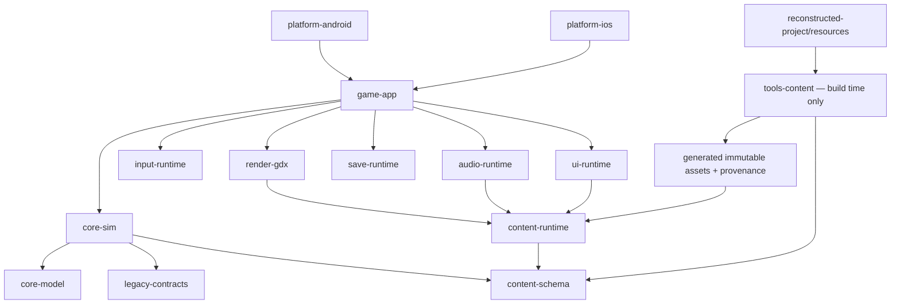

# Technical design cho bản rewrite Android/iOS

## 1. Trạng thái và quyết định

Đây là **thiết kế kỹ thuật**, không phải implementation. Không có code game mới,
không build launcher, không chạy JAR gốc và không thực thi simulator/device trong
phạm vi bài giao hiện tại.

Stack đề xuất: **Kotlin + LibGDX**, shared gameplay/content/runtime core, Android
và iOS launcher mỏng. Godot 4.x là fallback nếu iOS toolchain spike của LibGDX
không vượt gate. Chi tiết quyết định:
[`decisions/mobile-game-framework.md`](./decisions/mobile-game-framework.md).

## 2. Mục tiêu

### Functional

- Chạy native app package trên Android và iOS từ cùng gameplay code.
- Giữ tám mission, player movement/combat/parkour, actor AI, trigger, camera,
  collision, dialogue, menu, achievement, score, audio và save behavior.
- Tái sử dụng mọi gameplay resource đã phục hồi qua pipeline chuyển đổi offline.
- Giữ logical world 400×240 và pixel-art presentation, nhưng render mượt ở màn
  hình 60/120 Hz.
- Hỗ trợ touch hiện đại, safe area, suspend/resume và sandbox storage.

### Non-functional

- Deterministic simulation và replayable input.
- 60 FPS render target trên baseline device; 120 Hz là enhancement.
- Không parse JAR/custom pack trong runtime sản phẩm.
- Không network, ads, analytics hoặc obsolete IGP redirect.
- Mọi derived asset có source hash, transform version và rights disposition.
- Core gameplay không phụ thuộc Android/iOS/LibGDX API để có thể unit-test thuần.

## 3. Non-goals

- Không remake 3D hoặc thay đổi level/story.
- Không tự động “sửa” oddity trong bytecode khi chưa có parity evidence.
- Không lấy decompiled structured Java làm source compile trực tiếp.
- Không đưa file JAR, MIDlet runtime, RMS hoặc Java ME API vào app phát hành.
- Không ship cross-promotion, URL lịch sử hoặc `dataIGP` behavior.
- Không tuyên bố quyền phân phối asset; quyền sử dụng là release gate riêng.

## 4. Recovered facts và design choices

| Recovered fact | Design target | Loại quyết định |
|---|---|---|
| Loop target 62 ms | Simulation fixed tick 62 ms, render interpolation 60/120 Hz | Parity-first |
| 8.8 fixed-point position/velocity | Pure-Kotlin integer fixed-point core | Parity-first |
| Viewport landscape 400×240 | Offscreen logical framebuffer + pixel-perfect upscale | Parity-first |
| Touch rotation từ 240×400 | Direct landscape viewport mapping, không giữ rotation workaround | Modern platform |
| `j.c` screen FSM | Typed `ScreenState` nhưng giữ legacy numeric ID | Maintainability |
| `i.ax` type, `i.S` state | Behavior registry + explicit legacy IDs | Parity-first |
| Four tile layers/packed flags | Typed immutable `LevelBundle` | Content pipeline |
| Custom sprite/font binary | Build-time converter thành atlas/metadata | Runtime simplification |
| MIDI/WAV 34 slot + duration table | Offline normalized audio + ID/timing table | Cross-platform |
| RMS `/ASBR`, 512 byte | Versioned typed save + optional offline legacy importer | Reliability |
| IGP + `platformRequest()` | Loại khỏi product runtime; archive provenance only | Security/product |
| Hidden cheat overlay | Dev build only, stripped/gated release | Safety |

## 5. Kiến trúc tổng thể



### Dependency rules

- `core-model`, `legacy-contracts`, `content-schema`, `core-sim` là pure Kotlin;
  không import LibGDX hoặc platform SDK.
- `render-gdx`, `input-runtime`, `audio-runtime` là adapter quanh LibGDX.
- `platform-*` chỉ bootstrap/lifecycle/file path/store packaging; không có
  gameplay branch.
- `tools-content` chạy ở build/authoring time, không đóng vào runtime binary.
- Runtime chỉ đọc generated immutable assets và provenance manifest.
- Simulation chạy single-thread theo deterministic order. Background I/O không
  được mutate world trực tiếp.

## 6. Module contract

| Module | Trách nhiệm | Không được làm |
|---|---|---|
| `core-model` | Fixed-point math, geometry, IDs, deterministic RNG, immutable events | Renderer/platform I/O |
| `legacy-contracts` | Numeric class/type/state/flag/opcode maps, compatibility constants | Đổi ID vì “đẹp” |
| `content-schema` | Sprite/animation/font/level/entity/script/audio/string/provenance types | Đọc JAR trực tiếp |
| `core-sim` | Tick, world, player, actors, collision, combat, trigger, mission/script, camera target | Gọi graphics/audio/files |
| `content-runtime` | Load/validate generated manifests và immutable asset handles | Parse LZMA/custom pack lúc chơi |
| `render-gdx` | FBO 400×240, tiles, sprite batch, interpolation, effects, HUD layers | Mutate gameplay state |
| `input-runtime` | Touch/controller mapping, capture, frame sampling, tick command queue | Gọi player method trực tiếp |
| `audio-runtime` | ID scheduler, music/SFX policy, pause/resume, backend playback | Quyết định mission logic |
| `save-runtime` | Snapshot, schema version, checksum, atomic write, migration | Serialize LibGDX object graph |
| `ui-runtime` | Menu/dialogue/pause/results/credits/accessibility layout | Chứa combat/mission rules |
| `game-app` | Orchestration lifecycle, screen flow, preload, error boundary | Platform-specific gameplay |
| `platform-android/iOS` | Launcher, orientation, safe area, storage/lifecycle bridge | Fork shared rules |
| `tools-content` | Decode/convert/validate/atlas/audio/script/provenance | Có mặt trong shipped runtime |

## 7. Runtime flow

```text
launch
  -> validate generated content manifest
  -> load shell assets/fonts/options
  -> title/main menu
  -> select difficulty/mission or continue
  -> load immutable LevelBundle + referenced assets
  -> create deterministic WorldState
  -> fixed simulation ticks + interpolated render frames
  -> pause/dialogue/results/achievement
  -> atomic checkpoint/save
  -> unload level-scoped assets
```

Screen states được chuyển thành enum/sealed state dễ đọc nhưng giữ `legacyId`
trong mapping để đối chiếu `k.l(int)` và save/event data. Transition phải đi qua
một `ScreenStateMachine`; UI không tự đặt state global.

## 8. Time và deterministic simulation

### Authoritative clock

- Phase parity dùng `tickDuration = 62 ms`, đúng cadence recovered.
- Render chạy theo display refresh, thường 60 hoặc 120 Hz.
- Accumulator gọi zero hoặc nhiều tick trước mỗi render.
- Chỉ transform/camera/effect presentation được interpolate; state, collision,
  AI, animation-frame advance và script trigger chỉ đổi ở tick boundary.
- Khi app background, dừng simulation và reset accumulator khi resume; không
  catch-up thời gian treo.
- Giới hạn tối đa bốn catch-up tick/frame. Phần lag dư được drop có telemetry
  dev-only để tránh spiral-of-death.

### Tick order

Thứ tự phải mirror recovered `k.I()` và được đóng thành contract:

1. chốt input command cho tick;
2. advance screen/mission sub-state;
3. update player;
4. update entities theo stable legacy array order;
5. collision/attachment/trigger effects theo recovered call order;
6. resolve queued spawn/remove, không sửa collection giữa iteration;
7. update camera target và presentation events;
8. emit deterministic state hash trong test/dev mode.

Không dùng unordered map iteration làm logic authority.

### Numeric model

- Position/velocity/acceleration giữ integer 8.8 fixed-point ở core.
- Collision bounds dùng integer pixel rectangles.
- Float chỉ xuất hiện trong interpolation/render adapter.
- Overflow behavior cần test với Kotlin `Int`; không tự chuyển sang float/double.
- RNG nằm sau `DeterministicRandom`, dùng thuật toán/seed versioned và lưu seed
  trong replay/save. Nếu cần parity Java, implement đúng Java LCG trong core.

### Input latency

Touch được sample mỗi render frame nhưng chỉ consume ở tick kế. Renderer có thể
hiển thị pressed visual ngay, song không được thay đổi gameplay ngoài tick. Sau
khi parity đạt, cadence logic 60 Hz chỉ được cân nhắc bằng ADR riêng vì retime có
thể thay đổi AI, combo, animation và script.

## 9. Entity/gameplay architecture

### Parity-first model

Không dùng full ECS ở giai đoạn đầu. Recovered code có semantics dựa mạnh vào:

- `entityType (ax)`;
- numeric `state (S)`;
- stable ID (`aw`) và lookup;
- type-specific `Z[]` parameters;
- shared bit flags (`P`);
- mutation order trong monolithic handlers.

Thiết kế:

```text
WorldState
  entities: StableEntityStore
  player: PlayerState
  mission: MissionState
  screen: ScreenState
  camera: CameraState
  random: DeterministicRandomState

EntityState
  legacyType, legacyId, state, previousState
  fixedPosition, velocity, acceleration
  facing, flags, primary/secondary bounds
  typedParams + preservedRawParams
  animationState, links, timers

BehaviorRegistry[legacyType]
  update(entity, world, commands, eventQueue)
```

Player có `PlayerBehavior`; trigger/controller type 10 có behavior riêng chứa 56
state từ [`i-av-reconstruction.md`](./i-av-reconstruction.md). Central oddities
được giữ trong parity layer trước khi refactor helper.

### Collision/physics

- Port rectangle overlap, tile query và fixed-point integration từ `i/j/k`.
- Layer flags không được suy ra lại ở runtime; converter tạo typed flags.
- Resolve collision theo stable entity/layer order.
- Hitbox, hurtbox và interaction bounds là data riêng dù legacy tái dùng arrays.
- Mỗi thay đổi từ raw index sang type phải có fixture chứng minh.

### Combat/AI

- `EnemyCombatTables` giữ values recovered và difficulty mapping.
- State transition là data/event có ID, không string dispatch.
- Damage, invulnerability, animation gate và facing order test riêng.
- AI không đọc wall clock; chỉ đọc tick, deterministic RNG và immutable level
  query trong tick.

### Waypoints

`c` được port thành `WaypointGraph` với tối đa/actual node validation, stable ID,
next link, wait và speed. Converter từ entity record type 55 tạo graph trước khi
spawn actor phụ thuộc nó.

## 10. Mission scripting

Slot 7 chứa block/script descriptor stream. Giai đoạn parity không thay bằng Lua
hoặc arbitrary scripting. Converter tạo một `LegacyScriptProgram` typed:

```text
ScriptProgram
  blocks[]
    legacyBlockId
    commands[]
      opcode
      typedOperands
      sourceOffset
      rawBytesHash
```

Runtime interpreter:

- whitelist opcode recovered;
- bounds-check operand/index;
- deterministic, không file/network/reflection;
- event output thay vì gọi UI/audio trực tiếp;
- giữ source offset để trace lỗi về pack/entry;
- fail content build nếu gặp opcode/length không hiểu trong mission được ship.

Sau parity có thể thêm authoring DSL compile về cùng bytecode-neutral schema;
runtime schema vẫn không phụ thuộc DSL.

## 11. Rendering

### Logical framebuffer

- Render world vào framebuffer logical `400×240`.
- Nearest-neighbor sampling để giữ pixel art.
- Composite vào safe viewport lớn nhất giữ aspect ratio; letterbox/pillarbox thay
  vì stretch.
- Integer scale được ưu tiên; fractional final composite chỉ dùng khi thiết bị
  không thể integer-fit, với pixel snapping.
- Touch hit region được map qua đúng viewport, bỏ vùng bars.

### Render order

1. clear/background;
2. parallax/tertiary layers;
3. primary/secondary/quaternary tile layers theo recovered order;
4. depth-sorted entities với stable tie-breaker legacy ID/insertion order;
5. particles/effects;
6. world-space prompts;
7. HUD/dialogue;
8. dev overlay nếu debug build.

Simulation lưu previous/current transform; renderer interpolate position/camera,
không interpolate discrete sprite frame hoặc collision state.

### Sprite/font conversion output

Static recovery baseline đã có 84/84 sprite input parsed tới EOF, 4.376 module
inventoried và 4.371 pixel module xuất thành 12.102 PNG palette variant. Pipeline
rewrite phải dùng metadata/range/hash đó làm fixture/provenance, không decode lại
theo phỏng đoán. Bốn module runtime non-pixel cần typed disposition; một
pixel-bearing module partial (optional tail absent) phải giữ raw và chặn ship nếu
mission thực sự cần hình chưa chứng minh. Hai payload `0x27f1` là recovery dữ
liệu mức tin cậy cao, không phải runtime branch. Frame/animation assembly vẫn
phải được xác nhận từ record references, không suy từ filename PNG.

Mỗi sprite asset tạo:

- atlas page PNG;
- palette-normalized RGBA modules;
- module rectangles/hotspots;
- frame module list và transforms;
- animation sequence, duration, loop count;
- collision/attachment metadata nếu section có;
- source pack/entry/hash và converter version.

Bitmap font tạo glyph atlas, codepoint map, advance, line height và wrapping
metadata. Các transform rotate/flip phải được normalize hoặc biểu diễn rõ; không
bake mơ hồ rồi mất hotspot.

## 12. Input và controls

### Command model

```text
MOVE_LEFT, MOVE_RIGHT, MOVE_UP, MOVE_DOWN
JUMP, CROUCH, ATTACK, ACTION, SWITCH_WEAPON
PAUSE, MENU_ACCEPT, MENU_BACK
```

`InputFrame` giữ `held`, `pressed`, `released`, optional analog/vector và monotonic
sequence. Replay serialize command theo tick, không serialize raw screen pointer.

### Touch layout

- Landscape locked.
- Virtual pad trái; action/jump/attack phải theo recovered control surface.
- Multi-touch pointer capture: một pointer sở hữu movement zone, pointer khác sở
  hữu action; drag ra ngoài có rule rõ và release luôn được phát khi cancel.
- Safe-area inset và handedness option thay đổi layout nhưng không command
  semantics.
- Hit target tối thiểu được xác nhận trong UX phase; không dùng hard-coded physical
  pixel từ device cũ.
- Keyboard/gamepad có thể dùng cho desktop test/accessibility nhưng không là
  dependency của mobile release.

Original transform `x=inputY, y=240-inputX` chỉ là workaround portrait canvas;
runtime mới map trực tiếp screen → safe viewport → logical 400×240.

## 13. Content conversion pipeline

### One-way pipeline

```text
untouched recovered artifact + reconstruction manifest
  -> verify hash/inventory
  -> decode pack/container
  -> canonical intermediate representation
  -> validate every index/reference/opcode
  -> convert sprite/font/audio/level/string
  -> pack immutable runtime bundles
  -> emit provenance-manifest.json
  -> Android/iOS consume identical bundles
```

JAR gốc không được app runtime mở. CI chỉ dùng recovered inputs trong content job
được kiểm soát; product package chứa derived runtime assets, không chứa class
Java ME.

### Stable asset identity

ID canonical không phụ thuộc filename do người dịch đặt:

```text
jar/<sha256>/pack/<packId>/entry/<entryIndex>
jar/<sha256>/aux/<name>
```

Mỗi record provenance:

| Field | Ý nghĩa |
|---|---|
| `sourceArtifactSha256` | Hash JAR authority |
| `sourcePath` | Pack/entry hoặc aux resource |
| `sourcePayloadSha256` | Hash decoded raw payload |
| `sourceType` | Detected/proven type |
| `confidence` | Proven/high/inferred/unknown |
| `transformId/version` | Converter và configuration |
| `derivedFiles/hashes` | Runtime outputs |
| `rightsStatus` | approved/restricted/unknown |
| `runtimeDisposition` | ship/archive/exclude-with-reason |

Build fail nếu runtime asset thiếu provenance, hash đổi không có version bump,
hoặc `rightsStatus != approved` cho release artifact.

### Disposition mọi recovered resource

| Source | Runtime disposition |
|---|---|
| Packs `1`–`5` | Convert common sprite/font/UI/mapping assets |
| Packs `6`–`13` | Convert eight level/entity/script bundles |
| Pack `14` | Convert indexed UI/story string tables |
| Pack `15` | Convert level/scene sprite assets |
| Pack `16` | Convert hai bảng toán fixed-point cosine Q8/square-root Q4 |
| Pack `17` | Convert 34-slot audio table, giữ three empty IDs |
| File `0` | Archive MIME metadata; converter input only |
| File `999` | Archive catalog/provenance validation |
| `icon.png` | App icon source, qua platform icon pipeline |
| `dataIGP` + 29 PNG | Archive đầy đủ; không ship quảng cáo/URL. Optional offline museum only after rights/product approval |
| 22 empty pack slots | Giữ ID/tombstone trong schema; không compact index |
| 114 signature-generic payloads | Family đã phân loại 114/114; giữ raw/hash/confidence, converter typed cho family đã biết và explicit contract cho record subtype còn opaque |

“Tái sử dụng tất cả resource” được hiểu là không mất asset: mọi resource có ledger
và disposition. Gameplay asset được convert; quảng cáo obsolete được archive chứ
không tái kích hoạt. Không thể coi engine license là quyền phân phối IP/content.

## 14. Level data contract

Mỗi pack `6`–`13` map thành `LevelBundle`:

Converter phải bám grammar/corpus oracle trong
[`level-record-formats.md`](./level-record-formats.md): slot `0` có 4.286 record
framed; slot `7` có 144 group, 510 lane, 2.366 event và 3.705 instruction parse
đúng EOF. Managed level tree hiện có 10 file / 34.570.387 byte / tree SHA
`d2f71b3fbede3bc29c32df5bb666fcba46cb431b32e18bf17f66f665bbc2ff60` /
manifest SHA `75ff246a5aa567a1f9cb7b8f2b58978305d88750f8bbef1589fe722c5f0f0648`.
Các metadata byte/opcode chưa có runtime meaning vẫn giữ opaque.

```text
LevelBundle
  missionId
  legacyPackId
  levelType
  primaryLayer       // slot 1 + dimensions slot 2
  primaryFlagsRaw    // slot 3, runtime-unused legacy plane; transform meaning inferred
  secondaryLayer?    // slot 4 + dimensions 5 + flags 6
  scriptDescriptors  // slot 7
  tertiaryLayer?     // slot 8 + dimensions 9 + flags 10
  lowerLayer?        // slot 11 + dimensions 12 + flags 13
  entityRecords      // slot 0
  sourceHashes[14]
  confidenceByField
```

Validator:

- dimensions footer đúng 4 byte/two `u16 LE`;
- tile count phù hợp width×height hoặc có documented packing rule;
- packed flags đủ coverage;
- entity ID/link/reference hợp lệ;
- script opcode và operand không vượt buffer;
- sprite/audio/string IDs tồn tại;
- empty optional layer chỉ ở configuration cho phép;
- slot 3 luôn giữ raw bytes/hash/provenance; converter validate exact
  `ceil(primaryTileCount/4)` và không đưa plane này vào runtime parity khi chưa có
  ADR chứng minh một semantics mới.

## 15. Audio design

- Stable `AudioId 0..33`, không renumber empty slot.
- MIDI được render offline bằng pinned synthesizer + soundfont + settings; hash
  soundfont/config trong provenance để Android/iOS không khác timbre/timing.
- WAV được normalize sample format/level qua deterministic converter; bản gốc
  vẫn ở archival input.
- Runtime giữ music/SFX option riêng như recovered UI.
- `AudioDurationTable` là compatibility metadata cho script/state gates; không
  lấy backend callback timing làm gameplay authority.
- Parity mode có `LegacyAudioScheduler` tái tạo preemption/single-player policy.
  Backend có thể dùng pool/channel hiện đại nhưng scheduler quyết định clip nào
  được nghe.
- Background/pause dừng hoặc pause channel theo lifecycle; resume không phát lại
  event đã consume nếu policy không yêu cầu.

## 16. Save/persistence

### Runtime model

Tách:

- `CampaignSave`: mission unlock/progress, difficulty, score, achievements,
  checkpoint/player/mission state, deterministic seed;
- `SettingsSave`: music/SFX, controls, accessibility;
- `SaveEnvelope`: schema version, content version, timestamp metadata, payload
  checksum và optional backup generation.

### I/O guarantees

- Serialize snapshot immutable, không serialize live entity graph.
- Mọi snapshot mang `saveRevision` đơn điệu do simulation thread cấp. Một
  `SaveCoordinator` single-writer sở hữu queue, file tạm, backup rotation và
  atomic replace; không code path nào khác được ghi trực tiếp.
- Queue coalesce các request chưa bắt đầu về revision mới nhất, nhưng không đảo
  thứ tự write đang chạy. Completion có revision thấp hơn committed revision bị
  loại, nên checkpoint cũ không thể overwrite suspend save mới hơn.
- Mỗi write: tạo file tạm theo revision, flush/fsync nếu platform hỗ trợ, kiểm
  checksum, rotate đúng một last-known-good backup, rồi atomic replace. Chỉ sau
  replace thành công mới tăng `committedRevision`.
- Validate version/content ID/checksum trước load.
- Migration từng version, idempotent và round-trip tested.
- Trên suspend, capture snapshot trên simulation thread, enqueue revision mới
  nhất rồi yêu cầu coordinator drain trong lifecycle deadline. Nếu hết budget,
  giữ file committed gần nhất và file tạm có tên revision để phục hồi/cleanup ở
  lần mở sau; không block vô hạn và không công bố partial save.
- Không lưu PII, advertising ID hoặc network state.

### Legacy compatibility

Một offline tool có thể import 512-byte RMS record `/ASBR` nếu người dùng có file
record hợp pháp. Tool giữ unknown/reserved bytes và báo confidence. Runtime không
phụ thuộc RMS hoặc JAR; không tự tìm dữ liệu ứng dụng Java ME trên device.
Legacy importer phải bám byte map, reset quirks và RAM-only boundary tại
[`save-format.md`](./save-format.md), gồm việc 398 byte reserved được round-trip
chứ không tự gán nghĩa.

## 17. UI, localization và accessibility

- Giữ string identity theo `(table,index)`; thêm semantic key chỉ là alias.
- UI/story/credits text từ pack 14 được compile thành immutable indexed bundle.
- Translation mới là layer riêng, fallback về recovered text; không mutate source
  JSON.
- Dialogue layout hỗ trợ safe area và font scaling nhưng không đổi timing/game
  state tùy thuộc wrap count.
- Menu flow giữ title, main, options, help, about, level select, difficulty,
  gameplay, pause, results, achievements và credits.
- IGP invitation/catalog states bị bypass hoặc map sang local `Legacy Extras`
  không URL; default release ẩn hoàn toàn.
- Accessibility plan: scalable controls, left-handed layout, independent music/SFX,
  subtitles/text persistence, reduced-flash option và configurable haptics.

## 18. Platform integration

### Chung

- Landscape orientation, full-screen safe-area aware.
- No network/ads/analytics permission or SDK.
- App lifecycle chuyển thành explicit events: `foreground`, `background`,
  `memoryPressure`, `surfaceLost`, `surfaceRestored`.
- Surface recreation reloads GPU handles từ immutable assets nhưng không reset
  simulation/save.

### Android

- Thin LibGDX launcher, app-private storage, audio focus, lifecycle forwarding.
- Không request storage/network permission cho core game.
- Test process recreation, multi-window/background, audio focus loss và varying
  refresh rate.

### iOS

- Thin launcher qua backend được support bởi LibGDX release đã khóa.
- App sandbox, safe area, interruption/background handling và asset packaging.
- Toolchain spike bắt buộc trước production; nếu fail thì kích hoạt Godot fallback
  ADR, không fork gameplay sang native Swift.

Minimum OS/API versions được quyết định tại kickoff theo store requirement hiện
hành và device matrix của môn học/product; không hard-code một con số có thể lỗi
thời trong design này.

## 19. Security, privacy và robustness

- Offline by default; không `platformRequest`, HTTP client, socket hoặc remote
  config.
- Custom binary decoder chỉ chạy build-time với bounds/length/count limits.
- Runtime generated bundle có schema version, content hash và strict validation.
- Không deserialize Java object hoặc execute recovered code/data.
- Script interpreter whitelist opcode, không reflection/eval/file/network.
- Debug cheat menu và telemetry chi tiết chỉ có trong non-release build.
- Crash/reporting SDK, nếu sau này thêm, cần ADR/privacy review riêng.

## 20. Testing strategy

Không test nào chạy JAR gốc. Oracle đến từ exact bytecode, decoded data, static
contracts và expected state mutation đã ghi tài liệu.

| Layer | Tests |
|---|---|
| Upstream integrity | `verify-static-reconstruction.py`, hash/CRC/count checks |
| Pack decoder | Bounds, split parts, empty slots, marker/LZMA, malformed fixtures |
| Sprite/font converter | Header/tag/palette/RLE/packed pixel fixtures, transform/hotspot golden PNG |
| Level converter | 14-slot schema, dimensions, flags, entity links, opcode/reference validation |
| Audio converter | ID preservation, deterministic output hash, duration tolerance |
| Core math | 8.8 fixed-point, overflow, collision edge/corner cases |
| Entity behavior | State transition/effect tests, đặc biệt `i.aV` states 10/30/31 |
| Player/combat | Input sequences, damage, facing, combo, attachment, parkour |
| Screen/mission | Mọi transition chính, dialogue, completion, unlock/score |
| Determinism | Cùng seed/content/input log → cùng state hash mỗi tick |
| Save | Round-trip, corruption, backup, migration, content-version mismatch; checkpoint/suspend overlap, queue coalescing, stale completion, lifecycle deadline |
| Render | Golden frame/layer order/hotspot/font wrap ở logical 400×240 |
| Lifecycle | Pause/resume, surface loss, process/background, audio interruption |
| Device UI | Safe areas, aspect ratios, touch capture, 60/120 Hz |

### Replay artifact

Replay chứa:

- content manifest hash;
- simulation version;
- initial save/world seed;
- tick-indexed command frames;
- optional expected state hash checkpoints.

Không chứa wall-clock pointer samples hoặc platform-specific object.

## 21. Performance budgets

Các số sau là target để gate implementation, không phải benchmark đã chạy:

| Budget | Target |
|---|---|
| Render cadence | 60 FPS baseline; 120 Hz optional |
| 60 Hz total frame | `<16,67 ms` p95 trên baseline device |
| Simulation tick work | `<4 ms` average, `<8 ms` p95 khi tick chạy |
| Gameplay allocation | 0 steady-state allocation sau warm-up/preload |
| GC hitch | Không hitch >2 ms trong active gameplay |
| Mission warm load | <3 s từ local storage trên baseline device |
| Foreground resume | <500 ms nếu GPU resources không mất; có loading state nếu reload |
| Runtime memory | Initial gate <128 MiB peak; điều chỉnh chỉ bằng measurement/ADR |

Biện pháp:

- preconvert mọi asset;
- atlas/batch tiles và sprites;
- object pool chỉ nơi profiling chứng minh cần;
- immutable level data;
- không parse JSON/binary trong frame;
- preload mission dependency manifest;
- dev overlay đo CPU/GPU/tick backlog/draw calls/memory.

## 22. Build và CI design

Pipeline đề xuất:

```text
static-integrity
  -> content-convert
  -> content-validate
  -> pure-core unit/replay tests
  -> render golden tests
  -> Android build/tests
  -> iOS build/tests
  -> provenance/rights audit
  -> signed release artifacts
```

Rules:

- converter/toolchain/version/checksum được lock;
- generated runtime asset không sửa tay;
- content change phải tạo manifest diff;
- Android/iOS nhận cùng content bundle hash;
- release fail nếu unknown/restricted asset được đánh dấu `ship`;
- original JAR không được đóng vào app package.

## 23. Migration plan

### Phase 0 — Evidence freeze

Output design-time:

- khóa JAR/source/resource hashes;
- semantic map và unknown register;
- provenance schema;
- legacy constants/state/opcode catalog.

Gate: static verifier pass; mọi source asset có stable ID.

### Phase 1 — Cross-platform toolchain spike

Không dùng game gốc; dùng sample derived asset và synthetic state.

- shared pure-Kotlin tick/hash;
- 400×240 framebuffer;
- touch event → command queue;
- sample audio;
- save sandbox;
- Android/iOS launch/suspend/resume.

Gate: cả hai platform pass. Fail iOS timebox → Godot fallback decision.

### Phase 2 — Content pipeline

- pack/string/sprite/font/audio/level/script converter;
- provenance manifest;
- strict validators và golden fixtures;
- rights disposition cho từng asset.

Gate: 260/260 slot có disposition; 84/84 sprite binary có explicit result
(83 full, 1 partial), 4.376/4.376 module có status và mọi sprite cần ship đã được
validate; 34/34 audio IDs và 265/265 strings giữ identity; mọi mission bundle
parse không còn unknown opcode bắt buộc.

### Phase 3 — Deterministic vertical slice

- core loop/fixed math/input/camera/render;
- player locomotion/collision;
- một representative level section;
- save/replay/state hash;
- basic audio/HUD/dialogue.

Gate: deterministic replay, stable 60 FPS presentation, lifecycle/save pass trên
cả hai platform.

### Phase 4 — Gameplay parity systems

- full player combat/parkour;
- actor families/AI/waypoints;
- trigger/controller states, gồm `i.aV` 56-case behavior;
- mission script interpreter;
- menus/options/achievements/results.

Gate: unit/scenario coverage cho mọi recovered state family và không unknown
gameplay opcode trong eight mission content.

### Phase 5 — Full content integration

- packs 6–13, all dialogue, sprites, audio, credits;
- progression/difficulty/score/checkpoint;
- asset unload/preload và memory tuning.

Gate: tám mission load, progress và complete trong rewrite test plan; every shipped
asset traces to approved provenance.

### Phase 6 — Platform/release hardening

- device matrix, safe areas, refresh rates;
- performance/battery/memory;
- save migrations and recovery;
- accessibility/polish;
- release stripping của debug/cheat;
- legal/trademark/content-rights review.

Gate: Definition of Done bên dưới.

## 24. Risk register

| Risk | Impact | Mitigation | Decision gate |
|---|---|---|---|
| Structured decompile sai central FSM | Cao | Simple/fallback/javap cross-check, state-effect tests | Không port freehand warning-tagged method |
| Một pixel module partial / frame assembly chưa khóa | Cao | Dùng 12.102 golden PNG + byte ranges, giữ raw optional-tail absent asset, validate reference graph | Block mission có sprite/frame chưa chứng minh |
| Một số object/script record subtype chưa typed field-level | Cao | Call-site/schema work, opaque raw preservation | Mỗi shipped subtype cần explicit contract |
| Level slot 3 không được legacy runtime dùng, transform meaning chưa rõ | Trung bình | Giữ raw/hash, validate 2-bit coverage, archive-not-runtime mặc định | Revisit chỉ khi có source/editor evidence mới |
| `i.aV` mutation complexity | Cao | Mechanical translation, 56-state matrix, replay tests | States 10/30/31 phải có scenario tests |
| 62 ms cadence cảm giác chậm | Trung bình | Render interpolation, input visual feedback | Retime chỉ sau parity bằng ADR |
| MIDI khác timbre/timing | Trung bình | Pinned offline synth/soundfont, duration tests | Derived audio hashes same platforms |
| LibGDX iOS backend friction | Cao | Phase-1 spike, Godot fallback | Không viết production gameplay trước gate |
| Save corruption/version drift | Cao | Atomic write, checksum, backup, migration tests | Block release nếu round-trip/migration fail |
| Lifecycle/surface loss | Cao | Explicit events, immutable assets, device tests | Android+iOS background test required |
| Asset rights không rõ | Rất cao | Rights ledger/gate, archive-not-ship disposition | Không ship asset chưa approved |
| IGP accidentally restored | Trung bình | No network deps, state bypass, package audit | Release must contain no URLs/IGP flow |

## 25. Definition of Done cho một implementation tương lai

- Android và iOS build dùng cùng `core-sim`, content schema và bundle hash.
- Original JAR/class/custom pack không có trong runtime package.
- 12 legacy subsystem có trace sang module/test hiện đại.
- 260/260 resource slot có provenance/disposition; empty IDs không bị compact.
- Tám mission, menu/dialogue/results/credits và save progression hoạt động theo
  acceptance scenarios của rewrite.
- Deterministic replay cho cùng input/seed tạo cùng state hash.
- Render đạt target 60 FPS và simulation không phụ thuộc refresh rate.
- Suspend/resume, surface loss, audio interruption và atomic save pass trên cả
  Android/iOS device matrix.
- Không network/ads/analytics/IGP redirect; debug cheat bị loại/gate release.
- Mọi shipped asset có rights approval và derived hash.
- Known deviations với legacy behavior có ADR, test và user/product approval.

## 26. Open design decisions

Không blocker cho tài liệu, nhưng implementation kickoff phải chốt:

1. Chốt/pin LibGDX và iOS backend/toolchain sau spike; `1.14.2` là ứng viên
   theo official stable tại ngày evidence, không phải version lock sẵn.
2. Baseline device/OS matrix theo store/course requirement hiện hành.
3. Runtime audio format và pinned MIDI synthesizer/soundfont.
4. Rights disposition của icon/splash/IGP/copyrighted gameplay assets.
5. Có giữ strict 62 ms logic cadence ở final release hay làm optional modern
   retime sau parity.
6. Có cần tận dụng slot 3 như transform plane mới hay tiếp tục archive-only; legacy
   runtime-unused đã được chứng minh, nhưng provenance/meaning lịch sử còn opaque.

Không quyết định nào ở trên cho phép chạy JAR gốc; mọi xác minh tiếp tục dựa trên
static artifact và behavior của implementation mới khi dự án thực sự được code.
