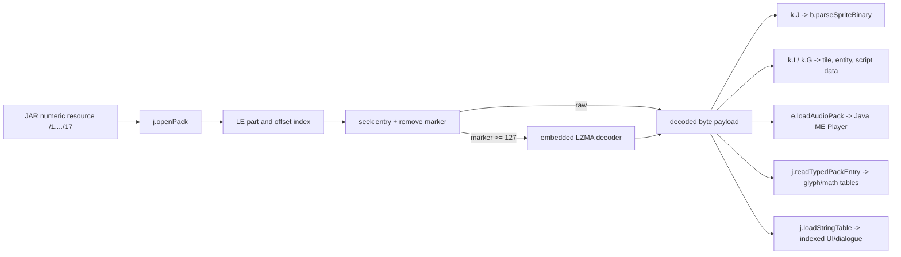
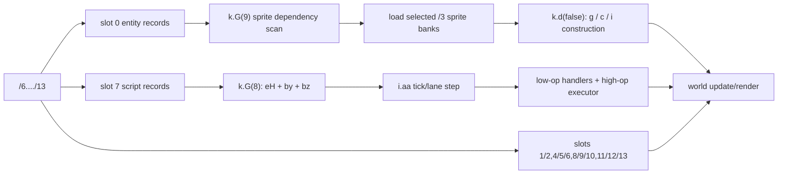
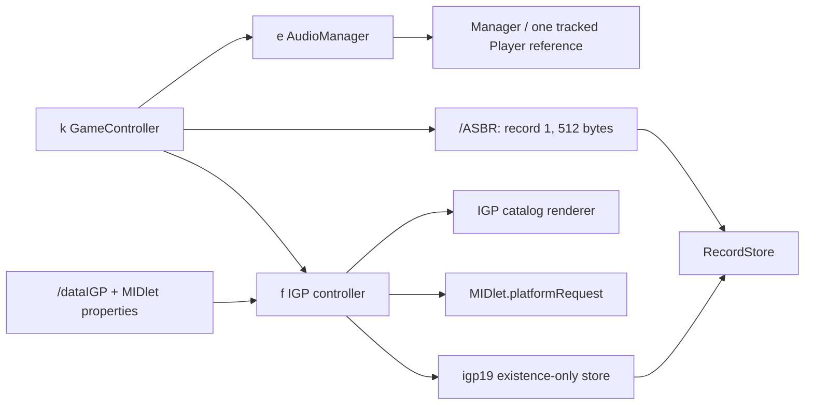

# Scout: Content, Persistence, and Platform Subsystems

## Summary

The original runtime has one indexed-pack gateway (`j`), one sprite/font decoder-renderer (`b`), staged orchestration in `k`, an audio adapter (`e`), and a separate legacy IGP controller (`f`). Numeric pack payloads remain raw runtime data: the delivered PNG/JSON trees are offline reconstruction artifacts and are never read by the original classes.

Evidence is strong for pack framing, sprite modules/palettes, font lookup, tile-layer slots, entity/script framing, audio slots, `/ASBR` RMS, and the `dataIGP -> platformRequest` path. Lost commercial names, many entity subtype fields, some script metadata/opcodes, the semantic meaning of level slot `3`, and most IGP record fields remain unknown or inferred.

## Scope and Authority

- Static only. No JAR, MIDlet, emulator, simulator, class loading, or target-code execution was used.
- Bytecode is authority where structured decompile is damaged. Relevant anchors: `j.javap.txt:3338` (`j.a(String)`), `3695` (`j.e(int)`), `3885` (`j.f(int)`); `b.javap.txt:1002` (`b.a(byte[],int)`), `6804` (pixel fill), `7379` (glyph map); `k.javap.txt:23100` (`k.G(int)`), `25141` (`k.H(int)`), `25203` (`k.I(int)`), `25616` (`k.J(int)`), `26460` (`k.e(boolean)`); `f.javap.txt:1667`, `1782`, `3259`, `9160`.
- Canonical aggregate evidence: `reconstructed-project/reconstruction-manifest.json` keys `analysis_mode`, `game_execution_performed`, and `resources`; inventory safety/counts: `reconstructed-project/inventory/summary.json`.
- Confidence vocabulary follows `docs/code-standards.md:10-18`: **proven**, **high-confidence**, **inferred**, **unknown**. Proposed aliases are descriptive, not recovered original names; `inventory/semantic-aliases.json:3-4` explicitly records that distinction.

## Component Boundaries and Proposed Aliases

| Symbol | Proposed responsibility / alias | Confidence | Static boundary evidence |
|---|---|---:|---|
| `j` | `GameCanvasRuntimeAndResourcePackReader` | high-confidence | Existing alias at `inventory/semantic-aliases.json:57-60`; pack open/index/part seek at `structured/j.java:637-741`; raw/LZMA entry materialization at `444-624`; typed objects at `803-813,988-1069`; strings at `1103-1173`. It also owns unrelated Canvas/runtime helpers, so it is not a pure repository. |
| `b` | `GloftSpriteAndBitmapFont` | high-confidence | Existing alias at `semantic-aliases.json:17-20`; sprite load `structured/b.java:123-700`, draw paths `907-997,1038-1315`, glyph table `1553-1607`. It consumes decoded bytes but never opens packs or level streams. |
| `f` | `IgpPromotionController` | high-confidence | Existing alias at `semantic-aliases.json:37-40`; `/dataIGP` index/slices `structured/f.java:177-228`; catalog/property setup `559-749`; UI update/render `1185-1327,1438-1511`; external handoff `1845-1871`. It is separate from normal game packs and rendering. |
| `e` | `AudioManager` | high-confidence | Existing alias at `semantic-aliases.json:32-35`; fixed 34 stream/MIME slots, one static tracked `Player` reference, normal-path stop-before-replace at `structured/e.java:9-71`; exclusivity on stop/close error or race is not proven. |
| `k` | `GameController` plus content-load/save orchestration | high-confidence | Existing alias at `semantic-aliases.json:62-65`; boot content `structured/k.java:3949-4097`; staged level load `4741-5065`; layer load `5234-5272`; RMS `5557-5575`; audio wrappers `5696-5712`. |

### Method aliases worth carrying into a modern design

| Original descriptor | Proposed alias | Confidence / evidence |
|---|---|---|
| `j.a:(Ljava/lang/String;)V` | `openPack` | high-confidence; canonical alias `semantic-aliases.json:331-334`; source `j.java:637-654`. |
| `j.m:(I)I` | `seekPackEntry` | high-confidence; alias `semantic-aliases.json:356-359`; source `j.java:685-732`. |
| `j.n:(I)V` | `decodeEntryMarker` | high-confidence doc-level refinement from `j.java:735-741`; canonical `semantic-aliases.json:361-364` still says the older `decodeEntryLengthMarker`, so the machine overlay has naming debt rather than independent support for this refinement. |
| `j.e:(I)[B` | `readDecodedPackEntry` | high-confidence; alias `semantic-aliases.json:336-339`; runtime LZMA/raw branch `j.java:444-624`. |
| `j.f:(I)Ljava/lang/Object;` | `readTypedPackEntry` | high-confidence; alias `semantic-aliases.json:341-344`; source `j.java:803-813,988-1069`. |
| `j.a:(Ljava/lang/String;I)V` | `loadStringTable` | high-confidence; alias `semantic-aliases.json:366-369`; source `j.java:1118-1129`. |
| `j.a:(Ljava/lang/String;II)V` | `loadFixedMathTables` | high-confidence; reads typed entries `0/1` into tables `T/U` at `j.java:303-307`; consumers at `334-348,418-428`. Arguments `i2/i3` are unused in recovered source, so do not assign semantics to them. |
| `b.a:([BI)V` | `parseSpriteBinary` | proven grammar, descriptive name; source `b.java:123-700`, bytecode anchor `b.javap.txt:1002`. |
| `b.a:(I[B)V` | `applyModuleSubstitutionMap` | proven; identity map plus `u16LE source,target` pairs at `b.java:713-733`, bytecode anchor `3558`. |
| `b.a:([S)V` | `loadUnicodeGlyphHash` | high-confidence; bucket/overflow construction at `b.java:1553-1588`, lookup `1590-1607`. |
| `b.a:([BIII)Z` | `decodeModulePixels` | proven for seven runtime branches; `b.java:1371-1549`, bytecode anchor `6804`. |
| `b.a:(Graphics;IIII)V` | `drawModule` | high-confidence; bitmap/primitives and transforms at `b.java:1038-1315`. |
| `b.a:(Graphics;IIIIII)V` | `drawFrame` | high-confidence; walks module placement records at `b.java:915-951`. |
| `b.a:(Graphics;IIIIIII)V` | `drawAnimationFrame` | high-confidence; resolves animation-frame record then frame draw at `b.java:907-913`. |
| `k.J:(I)Lb;` | `loadSpriteEntry` | high-confidence; `j.e(i) -> b.a(bytes,0)` at `k.java:5328-5335`, bytecode `k.javap.txt:25616-25636`. |
| `k.H:(I)[B` | `loadTileLayerAndDimensions` | high-confidence; canonical alias `semantic-aliases.json:386-389`; source `k.java:5234-5241`. |
| `k.I:(I)V` | `loadLevelLayers` | high-confidence; canonical alias `semantic-aliases.json:391-394`; source `k.java:5244-5272`. |
| `k.G:(I)Z` | `advanceLevelLoadStage` | high-confidence; canonical alias `semantic-aliases.json:381-384`; source `k.java:4741-5065`, bytecode authority `k.javap.txt:23100`. |
| `k.e:(Z)V` | `loadOrSaveGameRecord` | high-confidence; canonical alias `semantic-aliases.json:406-409`; source `k.java:5557-5575`. |
| `e.a:(Ljava/lang/String;)V` | `loadAudioPack` | high-confidence; canonical alias `semantic-aliases.json:301-304`; source `e.java:16-30`. |
| `e.a:(IZ)V` | `playAudioSlot` | high-confidence; canonical alias `semantic-aliases.json:311-314`; source `e.java:36-58`. Boolean is unused in recovered body; do not name it. |
| `e.b:()V` | `stopAudio` | high-confidence; source `e.java:60-71`. |
| `f.c:()Z` | `loadIgpSliceIndex` | high-confidence; reads `u16LE count` plus `u32LE[count]` offsets at `f.java:177-203`. |
| `f.b:(I)[B` | `readIgpSlice` | high-confidence; range and `/dataIGP` seek at `f.java:212-228`. |
| `f.e:()V` | `initializeIgpCatalog` | high-confidence; parses slice `0`, version, MIDlet properties, availability at `f.java:559-749`. |
| `f.a:(MIDlet,Canvas,II)V` | `initializeIgp` | high-confidence; stores platform objects and invokes catalog init at `f.java:384-405`. Width/height parameters are ignored; hard-coded `400x240` is used. |
| `f.a:(Ljava/lang/String;I)V` | `enterIgp` | high-confidence; starts loader thread and probes `igp19` at `f.java:759-801`. Second argument is not used for language selection in this build. |
| `f.a:(I)Z` | `updateIgp` | high-confidence; load/input/state FSM at `f.java:1185-1327`. |
| `f.a:(Graphics)V` | `drawIgp` | high-confidence; source `f.java:1438-1511`. |
| `f.run:()V` | `platformRequestWorker` | high-confidence; source `f.java:1845-1871`, bytecode `f.javap.txt:9160`. |

## Indexed-Pack Runtime Contract

The numeric archive resources `1` through `17` are indexed little-endian packs; logical pack `3` spans physical files `3`, `3.1`, and `3.2`. First part: `u16LE totalEntries`, `u16LE partCount`, `u16LE[partCount] firstEntry`, then `u32LE[entryCount+1]` offsets. Later parts start at their offset table. Equal adjacent offsets are valid empty slots (`docs/resource-formats.md:33-51`; runtime reads at `j.java:637-653,627-632`).

For a nonempty entry, runtime removes one marker byte. Marker `<127` means raw; marker `>=127` means compressed and logical marker `marker-127`. `j.n(int)` sets the compression flag (`j.java:727-741`); `j.l(int)` performs raw copy or an embedded LZMA-alone-compatible decoder (`444-624`). Canonical totals are `17` packs, `260` indexed entries, `238` nonempty, `22` empty, `24` LZMA, `214` raw, and `2,707,152` decoded bytes (`reconstruction-manifest.json.resources`).

### Archive/entry family to runtime consumer

| Archive resource | Decoded semantic payload | Original runtime path and use | Confidence / gap |
|---|---|---|---|
| `/1` entries `0,1,3` | Sprite binaries; boot/logo and two bitmap-font sprite assets | `k.R()` opens `/1`; `k.J(0/1/3)` parses with `b`; entries `1/3` become font renderers `bW/y` (`k.java:3953-3977`). | Sprite role proven; exact visual names inferred from boot call sites. |
| `/1` entry `2` | Typed `short[609]` Unicode-to-glyph hash | `j.f(2) -> bW.a(short[])` and `y.a(short[])` (`k.java:3974-3976`). Bucket grammar/lookup at `b.java:1553-1607`; complete recovered map in `decoded/pack-1/entry-002-font-glyph-map.json`. | High-confidence semantic name; duplicate keys and first-match behavior must be preserved (`docs/resource-formats.md:181-199`). |
| `/2` entries `0..5` | Six UI sprite binaries | Boot `k.R()` loads all six via `J` into `A[]` (`k.java:4058-4076`). | Proven sprite payload; specific screen names not fully recovered. |
| `/3`, `/3.1`, `/3.2`, logical entries `0..74` | 62 nonempty gameplay sprite banks; 13 empty slots | `k.G(9)` scans entity descriptors to mark required bank IDs, opens `/3`, `k.G(10..84)` lazily calls `J(index)`, then later constructs entities (`k.java:4925-5011,5034-5065`). Some boot banks load directly (`k.java:4024-4030,4077-4083`). | Data flow proven. Exact art/gameplay name for every bank unknown. Empty indexes are preserved in `pack-3/metadata.json.entries`. |
| `/4` entries `0..3`; `/5` entry `0` | Sprite-module substitution tables, repeated `u16LE source,target` | `k.G(163)` applies `/5` to `z[52]` variant `0`, then `/4` variants through `b.a(variant,bytes)` (`k.java:5042-5055`; `b.java:713-733`). | Proven map behavior. Visual meaning of variants unknown. |
| `/6`..`/13`, slots `0..13` | Eight mission level packs: entity stream, tile layers/dimensions/flag planes, script stream | `k.I(level)` loads tile layer groups; `k.G(8)` reads entity slot `0` and script slot `7`; later stages scan sprite dependencies and instantiate (`k.java:4833-4923,4925-5065,5234-5272`). | Slot mechanics high-confidence/proven. Mapping each pack to named mission is only medium-confidence correlation with `/14` order (`resource-formats.md:284-293`). |
| `/14` entry `0` | 127 UI/options/help/credits strings | Boot `j.a("/14",0)`, then `j.f()/j.g(i)` copies strings (`k.java:3978-3995`). | Proven string table and index retention. |
| `/14` entries `1..8` | Mission dialogue/objective tables (35,13,19,22,15,10,16,8 strings) | Level stage `1` loads entry `1+level` (`k.java:4745-4756`). | Table mechanics proven; narrative-to-level labels medium-confidence. |
| `/15` entries `0..12` | Special/level-mode sprite binaries | `k.G(4..7)` selects entries through `ej[level*4+...]` for `bY`, `bZ`, optional `ca`, then pre-renders palettes/modules (`k.java:4770-4831`). | Runtime role high-confidence; exact domain names (background/vehicle/boss/etc.) unknown. |
| `/16` entries `0,1` | Typed fixed-point cosine Q8 and square-root Q4 tables | Boot calls `j.a("/16",0,1)` (`k.java:4007-4011`); method reads typed entry `0 -> T`, `1 -> U` (`j.java:303-307`), consumed by trig/sqrt helpers (`334-348,418-428`). | Formula/table identity proven (`resource-formats.md:219-227`). |
| `/17` entries `0..33` | 13 MIDI, 18 RIFF/WAVE, empty `22,26,27` | Boot `e.a("/17")` (`k.java:3995-4000`); `e` reads every slot with `j.e`, identifies MIME by first byte, stores streams (`e.java:16-30`), then creates one Java ME `Player` (`36-58`). | Proven. Policy divides slots `<10` vs `>=10`, supporting music/SFX label; three MIDI remain at `17,21,28`, so media type is not identical to policy class. |
| `/dataIGP` | Separate IGP 2.1 indexed blob containing catalog text/config/images | `f` opens it directly with `Class.getResourceAsStream`, not through `j` (`f.java:177-228,1884-1886`). Slice `0` initializes catalog/property mapping; later slices produce strings and `Image` objects (`559-749,966-1139`). | High-confidence IGP controller. Field-level proprietary schema incomplete. |
| `/icon.png` | MIDlet icon | Declared by `META-INF/MANIFEST.MF:6-7`; no structured-source consumer. | Platform declaration proven. |
| `/0` | MIME catalog (`audio/x-wav`, `audio/midi`, `audio/x-amr`) | No reference in any of the 12 structured classes or bytecode string loads. Offline extractor parses it. | File grammar/data proven; original runtime consumer absent. Do not route `e` through it: `e` hard-codes MIME strings. |
| `/999` | Archive catalog of 20 names/sizes | No reference in the 12 classes; offline extractor validates sizes. | Offline/forensic metadata only for this recovered runtime. |

`decoded/summary.json.classification` corroborates all 238 nonempty entries have a semantic family: 131 proven, 99 high, 8 inferred, 0 unclassified (`reconstruction-manifest.json.resources.semantic_confidence`, `.unclassified_semantic_entries`).

## Sprite, Font, Palette, and Render Data

### Sprite binary

- Header: `u16LE magic/version 0x05df`, `u32LE flags -> b.aD`, `u16LE moduleCount -> b.ab` (`resource-formats.md:130-144`; loader `b.java:137-160`). The loader itself skips the first two bytes rather than validating magic, so magic validation belongs to offline tooling, not claimed original runtime behavior.
- Module records are tag-discriminated, not fixed structs. Observed code handles tags `0,255..247`; tag selects bitmap versus primitive record, optional ARGB/color, 8/16-bit dimensions, and extra geometry (`b.java:167-350`). Current corpus distribution is `0:4372`, `253:2`, `254:2` (`sprites-decoded/summary.json.module_tag_counts`).
- Frame-module placement records are `ap/ar/as/aq` (+ optional palette selector `at`); frame records are `ai/aj` plus optional bounds; animation-frame records are `av/aw/ax/ay/i`; animation records are `au/h`. This naming is inferred from their draw consumers, not original names: `drawAnimationFrame -> h/av/i/ax/ay -> drawFrame` (`b.java:907-913`), and `drawFrame -> ai/aj -> ap/ar/as/aq -> drawModule` (`915-951`).
- Palette/pixel tail is guarded by flag `0x01000000`. Palette format/count/size load at `b.java:515-589`, pixel code/payload offsets at `590-653`. Runtime-observed palette formats are `0x8888` and `0x5515`; branch `0x6505` exists but corpus does not use it (`sprites-decoded/summary.json.palette_format_counts`; `b.java:534-588`).
- Seven pixel paths are runtime-proven: `0x64f0`, `0x56f2`, `0x1600`, `0x0400`, `0x0200`, `0x5602`, `0xa640`; they cover run-length/palette-indexed, 4/2/1-bit packed indices, literal 8-bit indices, and alpha overlay (`b.java:1381-1548`; `decode-gameloft-sprites.py:152-160`). Transform/draw goes through `Image.drawRegion`, RGB rotation helpers, or primitive drawing (`b.java:1038-1315`).
- Static recovery results: 84/84 sprite binaries consumed to EOF, 4,376 modules, 4,371 decoded pixel modules, 12,102 palette-variant PNGs, 83 full assets, 1 partial, 0 error (`sprites-decoded/summary.json.inventory`, `.pixel_reconstruction`, `.coverage`). These PNGs are analysis outputs, not runtime assets.
- The only partial asset is pack `3` entry `6`: optional palette/pixel tail absent at EOF, classified runtime-nonrendering (`sprites-decoded/summary.json.unsupported_or_error_locations[0]`). Four tag `253/254` modules are runtime non-pixel primitives.

### `0x27f1` boundary

`0x27f1` has **no recovered runtime fill branch** in `b.a(byte[],int,int,int)` (`b.java:1371-1549`). The offline decoder adds a pinned, explicitly `runtime_bytecode_branch=false`, high-confidence data-derived path for pack `3` entry `58` (`decode-gameloft-sprites.py:162-206`). Therefore recovered PNGs are valid forensic reconstruction evidence, not evidence that the MIDlet rendered that codec via a missing branch.

### Font lookup

Pack `1` entry `2` is a typed `short[609]`. Element `0` is `bucketCount=228`; 228 base `(codepoint,glyphId)` pairs follow, then overflow groups `(bucketIndex,count,pairs...)`. Runtime constructs `Q[bucket]` (`b.java:1553-1583`) and probes `codepoint % 228`, base first then overflow, returning fallback glyph `1` (`1590-1607`). Text layout/drawing consumes glyph metrics and sprite frames (`1613-1735`). Do not deduplicate repeated keys; first-match is observable.

## Level Data Pipeline

### Four tile-layer families

Each `/6`..`/13` pack has 14 logical slots. `k.H(dataSlot)` reads the tile byte plane and the following 4-byte `u16LE width,height` record (`k.java:5234-5241`). `k.I` materializes:

- primary `1/2 -> et`, always;
- secondary `4/5 -> ep`, flags `6 -> eq`, except modes where absent/unused;
- tertiary `8/9 -> eu`, flags `10 -> ev`, depending on level mode;
- quaternary/lower `11/12 -> er`, flags `13 -> es`, for selected modes (`k.java:5244-5266`).

Slot `3` is a well-formed primary companion plane sized `ceil(slot1.length/4)`, but no class calls `j.e(3)`. `j.o(int)` only skips unread bytes into private scratch (`j.java:747-772`). Runtime-unused is proven; “2-bit transform/orientation” is inferred by sibling shape and the 431 nonzero cells in pack `10` (`resource-formats.md:259-282`).

### Slot `0`: entity descriptors

Grammar is `record* EOF`, each record `signed count8` followed by `count8 * s16LE`; scratch capacity is 25 (`level-record-formats.md:34-52`; `k.java:4628-4646`). Runtime dispatch is raw type `0/25 -> new g(short[])`, `55 -> c.a(short[])`, otherwise `new i(short[])` (`k.java:4647-4699`). The generic entity constructor fixes `entityId=field1`, `x=field2`, `y=field3`, `type=field0`, `flags=field6`, facing bit 0 (`i.java:1936-1945`). It then resolves sprite bank references and subtype fields (`i.java:1944+`).

`k.G(9)` first scans the same records to mark required `/3` sprite entries via type-specific maps (`k.java:4929-4999`); sprite banks load in stages `10..84`; only stage `164` instantiates records through `k.d(false)` (`k.java:5001-5065`). This proves a dependency-discovery pass before entity construction. Corpus totals: 4,286 records / 103,336 bytes, all eight payloads exact EOF (`levels-decoded/summary.json.inventory`; `level-record-formats.md:88-103`).

### Slot `7`: timeline group/lane/event/instruction stream

Runtime `k.G(8)` parses raw slot `7` into script IDs `eH`, lane byte blobs `by`, and raw cursors `bz`; it appends a synthetic two-byte cursor trailer to each lane (`k.java:4833-4920`). Structured source has corrupted switch labels/types, so bytecode is authoritative; exact correction is documented at `level-record-formats.md:212-222`, bytecode `k.javap.txt` PCs `1086..1098` within method anchor `23100`.

Framing is group count -> `(scriptId,laneCount,groupMeta)` -> lanes `(mode,laneMeta,[modeExtra],eventCount)` -> events `(tick,opcodeCount,instructions)` with opcode-specific widths (`level-record-formats.md:181-202,247-295`). `k.s(id)` maps script ID to `eH` (`k.java:5544-5550`). Entities initialize/reset per-lane cursors from `k.bz` (`i.java:18478-18491`), and `i.aa()` advances ticks, reads `k.by`, interprets low opcodes, and delegates high opcodes to `i.a(opcode,bytes,...)` (`i.java:17930-18476,18499+`).

Corpus totals: 144 groups, 510 lanes, 2,366 events, 3,705 instructions, 27,214 bytes; all eight script payloads exact EOF (`levels-decoded/summary.json.inventory`). Unknowns remain: group/lane metadata, mode `3` executor behavior, low opcodes `41..44`, masks `23/24`, and many type-specific entity fields (`level-record-formats.md:322-330`).

## Audio

`e.loadAudioPack("/17")` opens the pack and reads all 34 slots (`e.java:16-30`). Nonempty entries become `ByteArrayInputStream`; first byte `R` selects `audio/x-wav`, first byte `M` selects `audio/midi`. Pack metadata proves MIDI indexes `0..9,17,21,28`, WAV indexes `10..16,18..20,23..25,29..33`, and empty `22,26,27` (`decoded/pack-17/metadata.json.entries`). Observed WAVs are PCM mono 8-bit 8 kHz (`resource-formats.md:295-303`).

Playback is deliberately narrow: one static tracked `Player` reference; reset stream; `Manager.createPlayer(stream,mime)`; `setLoopCount(1)`; start; stop/close prior tracked player (`e.java:36-71`). Stop/close exceptions are swallowed and the methods are unsynchronized, so actual underlying active-player exclusivity is not proven. `h.a[34]` holds per-slot millisecond durations and `e.a()` estimates activity from wall clock (`structured/h.java:4-5`; `e.java:32-34`). `k.z(int)`, `k.w()`, and `k.x()` are the game-facing play/stop/status wrappers (`k.java:5696-5712`). Settings logic uses threshold `10` (`e.java:41-44`), supporting `0..9 music`, `10..33 SFX`; media signatures do not share that partition.

## IGP / Cross-Promotion

`f` is a self-contained Gameloft IGP 2.1 controller, initialized after boot content and save load (`k.java:4087-4097`). It parses `/dataIGP` itself:

1. `f.c()` reads a little-endian slice count and `u32LE` offset table (`f.java:177-203`).
2. `f.b(index)` reopens the blob, skips header+offsets+slice offset, and returns that slice (`212-228`).
3. `f.e()` parses slice `0`, locale/category arrays, version `2.1z`, MIDlet URL properties, and available promotion entries (`559-749`).
4. Loader state `f.d(index)` converts later slices into strings and `Image` instances (`966-1139`); `f.a(int)` is update/input FSM and `f.a(Graphics)` draws it (`1185-1327,1438-1511`).
5. User selection copies a resolved URL to `aD` (`f.java:1313-1323`); the worker invokes `MIDlet.platformRequest(url)` (`1845-1871`).

There is no HTTP/socket API in the dependency inventory: `inventory/dependencies.json` lists 29 external classes and no `Connector`, `HttpConnection`, socket, or datagram. Thus `f` delegates the URL to the platform; it does not implement an in-process network client. Offline extraction found 29 valid PNGs and 880 printable runs (`decoded/summary.json.auxiliary`), but the original runtime reads slices, not the extracted image directory.

The URL predicate `f.b(String,int)` rejects only null/empty values and sentinel strings `DEL`, `NO`, and `0`; there is no scheme/host allowlist before `platformRequest` (`f.java:408-423,1313-1323,1845-1857`). The source is `/dataIGP`/MIDlet deployment metadata selected by a user action, not arbitrary gameplay text. Whether an external JAD supplied mutable properties is unknown, so static evidence identifies a trust boundary but does not prove remote exploitability. A shipping rewrite should remove this legacy promotion path or pin allowed schemes and hosts.

The `igp19` RMS claim must be bounded: entering IGP only opens `RecordStore.openRecordStore("igp19",false)`, falls back to create `true`, and closes it (`f.java:782-794`; `f.javap.txt:4097-4112`). No `addRecord`, `setRecord`, or `getRecord` exists in `f`. Static evidence therefore proves an IGP store namespace/existence marker, **not persisted IGP state content**.

## `/ASBR` Persistence

Game persistence is independent of packs. `k.bA` is a fixed 512-byte destination buffer (`k.java:291`). Boot zeroes all bytes, attempts to load record 1 if present, otherwise assigns in-memory difficulty `1` (`k.java:4039-4053`). `k.e(false)` calls `getRecord(1,bA,0)` but ignores its returned length, so a short record leaves the pre-zeroed tail and is not rejected; an overlong/device error is swallowed. `k.e(true)` creates the first record or overwrites record ID 1, always writing 512 bytes (`k.java:5557-5575`). Multi-byte helpers write/read little-endian shorts (`k.java:5352-5357`; `docs/save-format.md:17-29`).

Static consumers establish these durable categories:

- settings/promotion: difficulty `8`, IGP-new acknowledgement `10`, control mode write-only `80`;
- campaign/progression: `14-15`, checkpoint gate/data `16-79`, permanent baselines, per-level counters;
- scores `81-128`; achievements `130-132`;
- 398 bytes are unaccessed/reserved and round-trip because saves write the whole buffer (`docs/save-format.md:39-89`).

There is no magic, version, checksum, timestamp, length, backup, or checkpoint-level ID (`save-format.md:17-29,145-159`). Restore uses marker at `16`, then player position/facing/weapons/stats/counters from the documented offsets (`k.java:5176-5200`). The 1000 x 22-byte entity snapshot `bf` plus tombstones `bg` is RAM-only: `k.d(true)` restores it (`k.java:4653-4681`), but no path copies it into `bA`/RMS (`save-format.md:123-143`). `/ASBR` alone therefore cannot reproduce exact entity world state after process loss.

## Original Runtime vs Offline Reconstruction

| Concern | Original runtime behavior | Offline reconstruction behavior |
|---|---|---|
| Pack source | `j` uses classpath `getResourceAsStream`, part switching, marker removal, embedded decompressor (`j.java:637-741,444-624`). | `extract-java-me-resource-packs.py` opens the pinned ZIP/JAR, validates part ranges/offsets, uses Python `lzma.FORMAT_ALONE`, hashes and writes payload/metadata (`script:1-8,404-515`). |
| Type/semantic classification | No general classification layer; call sites know entry IDs. | Signature detection and semantic pass create JSON labels/maps (`extract script:78-97,121-130,474-515`). `/0`, `/999`, and IGP PNG scanning are forensic convenience. |
| Sprites | `b` parses binary in memory and emits Java ME images/RGB/primitives. | Decoder accepts only extracted `.bin` + provenance, never JAR/classes (`decode-gameloft-sprites.py:2-14,38-40`), validates 84 files/PNGs, and writes module palette variants. `0x27f1` is explicitly non-runtime recovery. |
| Levels | `k`/`i` consume raw slots `0..13`; no JSON. | Decoder accepts only extracted slot `0/7`, never archive/classes/target code (`decode-gameloft-level-records.py:2-7,29-59`); outputs exact-offset JSON and aggregate validation. |
| IGP | `f` reads proprietary slices from `/dataIGP` and builds `Image` objects. | Extractor scans the entire blob for valid PNG signatures/CRCs; 29 output PNGs are not original input paths (`extract script:342-396`; `data-igp-images/metadata.json` array length `29`). |
| Persistence | Java ME RMS `/ASBR` and existence-only `igp19` access. | Save/IGP docs are static maps; no RMS file was executed or produced. |

## Mermaid-Ready Outlines

### 1. Numeric pack to runtime

### 2. Level dependency and execution pipeline

### 3. Platform-facing boundaries

## Counter-Evidence and Cautions

1. `structured/k.java:4833-4920` contains decompiler type/switch corruption (`true` case labels). Use `k.javap.txt:23100`, especially PCs `1086..1098`, and `level-record-formats.md:212-222` for the `by/bz` invariant.
2. Original loaders commonly swallow exceptions (`j.java:617-618`; `b.java:698-699`; `e.java:56-57`; `f.java:750-752`; `k.java:5572-5574`). Offline scripts are intentionally stricter and should not be described as parity for malformed-input behavior.
3. Two `j` exact-read loops subtract `read()` without handling `-1`; truncated input grows remaining and moves the offset backward, the next read throws, and the outer catch exits the loop while the method still advances/returns the full requested length (`j.javap.txt:3834-3908,5042-5120`). This is false success with a partial/corrupt buffer, not an EOF spin. `f.b(index)` ignores the returned `skip` count, overwrites from slice offset zero on partial reads, and continues calling `read(bArr)` with valid offset zero after EOF, so its remaining count grows and it can loop indefinitely (`f.java:212-228`). Modern importers need bounded exact-read and atomic failure.
4. `k.G(stage)` catches every exception and returns the same `false` used for ordinary nonterminal stages. State `9` advances the frame-derived stage counter without retry/rollback, so a failed stage can be skipped and later stages can see partial state (`k.java:1067-1089,4741-5089`).
5. Manifest/distribution dimensions conflict: MIDlet manifest declares `240x400`, while IGP/game code uses `400x240` (`archive/META-INF/MANIFEST.MF:14-15`; `f.java:384-389`). Preserve the mismatch as evidence.
6. No runtime parity measurements exist by design. Structured sources are non-buildable evidence views, not a runnable restored game.

## Recommendations

1. Model a modern importer as immutable `PackIndex -> DecodedEntry -> TypedContent`, retaining original pack/entry IDs, raw bytes, hash, marker, and confidence; keep offline PNG/JSON as derived evidence.
2. Preserve sprite bank, palette variant, module/frame/animation indices. Do not flatten to filenames before resolving entity and remap references.
3. Preserve level raw unknown fields/opcodes and slot `3`; mark runtime-unused separately from semantic meaning.
4. Treat `/ASBR` as a legacy import format with strict 512-byte validation and explicit versioned modern save output. Never merge RAM entity snapshots into legacy RMS semantics.
5. Exclude `f`, `dataIGP`, historical URLs, and `igp19` from a shipping rewrite. Retain only in forensic archive/documentation.

## Unresolved Questions

- Original commercial names for sprite codec/module types and most sprite bank visual identities.
- Exact semantics of entity type-specific fields, `group_meta`, `lane_meta`, mode `3`, opcode `41..44`, and masks `23/24`.
- Provenance and intended meaning of level slot `3` beyond “valid plane, runtime-unused.”
- Whether an external JAD supplied additional IGP/deployment properties; none is present in the pinned JAR.
- Whether `igp19` was meant for a vendor implementation that is absent from this class; this artifact contains no record payload access.

Status: DONE_WITH_CONCERNS
Summary: Static pack/content flow is reconstructed from archive index through sprite/font/level/audio consumers, with IGP and RMS bounded to observed platform calls. Original runtime behavior is separated from offline extraction/PNG/JSON reconstruction.
Concerns/Blockers: Runtime parity is intentionally unmeasured; external JAD provenance, unknown script metadata/opcodes, and device-specific behavior on malformed streams remain unresolved.
