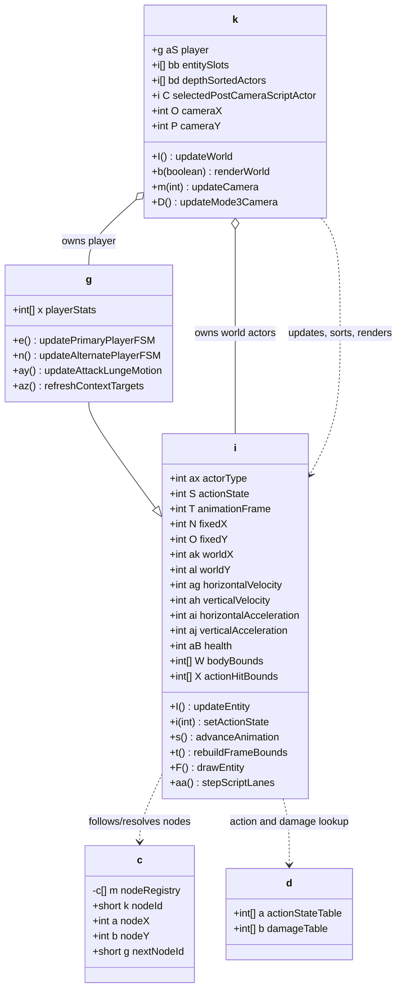
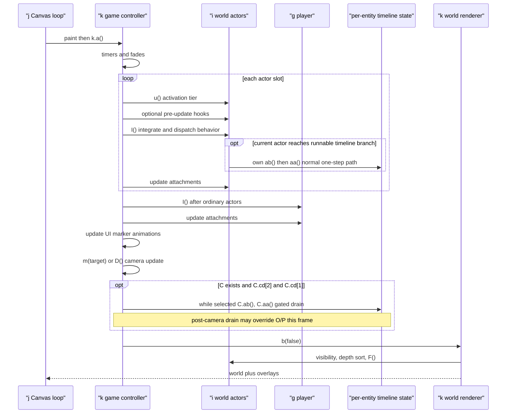
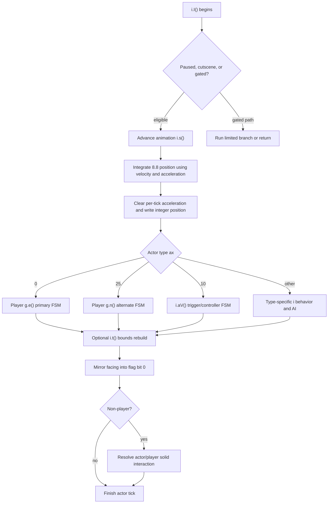

# Scout: Gameplay, Actor, AI, and Camera Architecture

## Summary

Gameplay is centered on a broad base actor class (`i`), a player specialization (`g extends i`), and the game controller/world owner (`k`). `i` combines entity data, 8.8 fixed-point motion, terrain and actor collision, state-driven animation, rendering, type-dispatched behavior, combat, and script execution. `g` adds two player finite-state machines selected by level entity type `0` or `25`. `k` owns registries, input masks, frame orchestration, camera state, visibility/depth sorting, and rendering. `c` is a separate fixed-capacity waypoint/node registry, while `d` contains shared action and difficulty/damage tables.

This is not a component-oriented engine internally. Behavior, animation, collision, AI, and combat are coupled through numeric actor type `ax`, actor state `S`, flags, and mutable rectangles. A faithful reconstruction should first preserve that phase order and state coupling, then introduce clearer modern boundaries around it.

Evidence is strongest for the class relationships, player selection, frame/tick order, fixed-point integration, animation/bounds rebuilding, collision paths, input masks, camera flow, script timing, health/damage mutation, and the special type-10 trigger/controller handler. Narrative names for most numeric actor types, the exact distinction between player types `0` and `25`, many state names, and several compact record fields remain unknown.

## Scope and Authority

- Static analysis only. No JAR, MIDlet, emulator, simulator, class loading, or target-code execution was used.
- Structured source is used where coherent; exact JVM bytecode is authority when the decompiler reports damage or produces impossible conditions.
- Confidence vocabulary follows `docs/code-standards.md:10-18`: **proven**, **high-confidence**, **inferred**, **unknown**.
- Proposed aliases are descriptive working names, not recovered originals. `reconstructed-project/inventory/semantic-aliases.json:3-4` makes the same distinction.
- Major bytecode anchors: `i.I()` at `reconstructed-project/bytecode/i.javap.txt:19348`, `i.aV()` at `39788`, `i.aa()` at `64769`, extended script execution at `66643`; `g.e()` at `reconstructed-project/bytecode/g.javap.txt:2214`, `g.ay()` at `15624`, `g.az()` at `16164`, `g.n()` at `17392`; loader `k.d(boolean)` at `reconstructed-project/bytecode/k.javap.txt:22641`.

## Static Actor Model

### Class and ownership boundaries

| Symbol | Proposed responsibility | Confidence | Evidence |
|---|---|---:|---|
| `i` | `Actor` / base runtime entity | high-confidence | Dense state, position, velocity, rectangles, sprite links, health, scripts, and relationships at `reconstructed-project/src/structured/i.java:6-122`; record constructor at `1896-1968`; central update at `3853-5303`. |
| `g` | `PlayerActor` | proven relationship, high-confidence role | `g extends i` and delegates its record constructor at `reconstructed-project/src/structured/g.java:4,101-103`; loader assigns the sole type `0/25` object to `k.aS`, discussed below. |
| `k` | `GameController` plus world/input/camera owner | high-confidence | Player, actor registries, scripts, camera and input fields at `reconstructed-project/src/structured/k.java:26,34-39,93-118,250-259`; existing alias at `reconstructed-project/inventory/semantic-aliases.json:62-65`. |
| `c` | `WaypointNode` and ordered mutable static node registry | high-confidence | Static 400-slot table, first-match lookup, record construction, relative clone IDs from 10000, reset at `reconstructed-project/src/structured/c.java:4-66`; actor code mutates node position/aux fields at `i.java:6433-6640,16909-17397`. Exact meanings of several behavioral fields remain inferred. |
| `d` | Shared actor action/damage lookup tables | inferred | Only two tables are declared at `reconstructed-project/src/structured/d.java:4-6`; `d.b` is selected by actor state and difficulty in `i.W()` (`i.java:7987-8009`), while `d.a` maps selections to state/animation values (`i.java:8703-8745`). |
| `b` | Sprite/animation data and renderer consumed by actors | high-confidence | `i` validates state against sprite animation counts and draws through `b` (`i.java:240-278,3328-3334`). Detailed sprite decoding belongs to the content report. |

### Record construction and identity

The base record constructor maps compact slot-0 fields directly into actor identity and transform: `aw = record[1]`, `ak = record[2]`, `al = record[3]`, fixed-point `N/O = position << 8`, `ax = record[0]`, `av = (record[6] & 1) != 0`, and `P = record[6]` (`reconstructed-project/src/structured/i.java:1896-1943`). It then selects/remaps sprite data and may reinterpret types (`1944-1968`). The record grammar and type routing are catalogued at `docs/level-record-formats.md:20-65`; the decoded corpus contains 4,286 slot-0 records (`reconstructed-project/resources/levels-decoded/summary.json:186-196`).

`ax` is therefore a serialized actor/controller discriminator, not a Java class discriminator. Most world objects are `i` instances and branch inside `i.I()` on `ax`; only the playable record is instantiated as `g`.

### Why `g` is the player and why types `0` and `25` are special

The structured loader is damaged: it contains a logically impossible condition involving `ax == 0` and `ax != 25` at `reconstructed-project/src/structured/k.java:4647-4699`. Exact bytecode resolves it:

- Raw record type `0` or `25` constructs `new g(record)` at `reconstructed-project/bytecode/k.javap.txt:22700-22714`.
- Raw type `55` routes through `c.a(record)` at `22715-22722`, matching waypoint/node registration.
- Other raw types construct `new i(record)` at `22723-22727`.
- Later loader bytecode treats `ax == 0 || ax == 25` specially and assigns the `g` instance to `k.aS` when no player exists (`22842-22954`); ordinary actors go to registries afterward (`22955` onward).
- The simpler decompile expresses the same route clearly at `reconstructed-project/src/simple/k.java:5968-5971,6040-6052`.

Decoded level records contain type `0` six times and type `25` twice (`reconstructed-project/resources/levels-decoded/summary.json:43-58`), with exactly one of those two types in each of packs `6` through `13`. This makes the player role **high-confidence** and the one-player-per-level invariant **proven for the decoded corpus**. The narrative difference between the two playable types is still unknown.

The dispatch completes the model: `i.I()` invokes `k.aS.e()` for player type `0` (`reconstructed-project/src/structured/i.java:3920-3923`) and `k.aS.n()` for type `25` (`5213-5218`). These are two player FSMs, not two unrelated entity handlers.

### Registry and ordering model

- `k.b(i)` registers an actor; `k.c(i)` removes it; `k.q(uid)` resolves the player or registry member (`reconstructed-project/src/structured/k.java:4544-4602`).
- `k.bb` is the actor-slot collection and `k.bd` is the render/interaction working list. `k.d(i)` inserts into `bd` ordered first by `az`, then by `al` (`k.java:2492-2504`).
- `k.C` selects one actor only for the post-camera gated drain. Each actor owns its normal one-step path inside its own `i.I()` when `ab()` is true (`i.java:9811-9816`); after camera update, `k.I()` has the separate selected-actor drain only when `C.cd[2] && C.cd[1]` (`k.java:2642-2650`).
- `i.u()` calculates camera-distance tier `au`; `i.v()` performs activation/visibility work (`i.java:575-629`).

Both `k.bb` and `k.bd` have fixed capacity 1,000 (`k.java:253-255`). `k.b(i)` silently returns when no free slot remains and `bc >= ba`; `k.d(i)` has no `be` guard and shifts on each insertion. The shipped corpus peaks at 849 raw records, so overflow in shipped play is not proven, while dynamic actors/attachments leave runtime reachability unknown. Rebuilding the ordered working list is worst-case O(`be²`) (`k.java:2492-2504,2860-2902,4544-4561`; `docs/level-record-formats.md:98`).

## State, Animation, and Bounds

`S` is both the actor's type-specific action/behavior state and the sprite animation index. It is not a globally meaningful enum. Different `ax` branches interpret the same numeric state differently, while `i.i(int)` also checks it against the selected sprite's animation count (`reconstructed-project/src/structured/i.java:240-278`). A reconstruction should model state values per actor family even if it initially retains numeric compatibility IDs.

| Original member | Proposed alias | Confidence | Evidence and behavior |
|---|---|---:|---|
| `i.i(int)` | `setActionState` | high-confidence | Validates the requested animation/state, applies type-specific side effects, copies old `S` into `Q` except for old state `35`, assigns `S`, resets `T/U` and an internal timer, and clears flag bit `64` (`i.java:240-278`; bytecode anchor `i.javap.txt:2622`). |
| `i.s()` | `advanceAnimation` | high-confidence | Uses sprite frame counts/durations, respects pause/flag gates, advances and wraps `T`, and applies cutscene-related side effects (`i.java:293-333`; bytecode `i.javap.txt:2879`). |
| `i.t()` | `rebuildFrameBounds` | high-confidence | Resolves sprite rectangles for state `S`, frame `T`, transform/facing, then offsets them into world space (`i.java:336-517`; bytecode `i.javap.txt:3048`). |
| `i.W` | `bodyBounds` / collision bounds | high-confidence | Used by general AABB and actor/player collision paths (`i.java:520-568,1305-1402,14846-14883`). |
| `i.X` | `actionHitBounds` | high-confidence, role not universal | Player/enemy attack tests compare `X` with the opposing actor's `W` (`i.java:1305-1402`). Some types may reuse it for another contextual action rectangle. |
| `i.Y` | `secondaryBounds` | inferred | Rebuilt from sprite collision data beside `W/X` (`i.java:336-517`) and used in type-specific visibility/interaction logic. A universal semantic name is not yet justified. |
| `i.F()` | `drawEntity` | high-confidence | Draws selected sprite animation/frame through `b` (`i.java:2957-3334`; bytecode `i.javap.txt:15528`). |

The renderer is not pure. During world rendering, attached or auxiliary actors can be inserted/advanced before sorted draw or drawn and then have `s()` called; it also mutates flash/HUD/fade timers (`reconstructed-project/src/structured/k.java:2848-2925,3085-3223,4209-4244,4326-4343`). Moving these writes out of render requires preserving exact interleaving, including render-only states 14/17.

## Physics and Collision

Positions `N/O` use 8.8 fixed point; `ak/al` are integer world coordinates. In the normal actor path, `i.I()` synchronizes fixed-point positions, integrates `ag/ah`, applies acceleration `ai/aj`, clears acceleration, and writes integer positions back (`reconstructed-project/src/structured/i.java:3887-3916`). A slow-motion branch divides deltas by `k.aI`. The type/player FSM dispatch follows this integration.

This sequence has a compatibility consequence: velocities selected by a player or AI state handler generally affect the next integration tick, although handlers sometimes snap or directly mutate `ak/al` immediately. Reordering input/AI before integration would subtly change collision, animation, and attack timing.

Terrain collision is tile-probe based:

- `i.a(boolean)` samples collision tiles, checks edges, resolves penetrations, snaps horizontal position where necessary, and rebuilds bounds (`reconstructed-project/src/structured/i.java:829-916`).
- `i.e(tileX,tileY)` delegates collision-tile access to the controller (`i.java:14828-14844`).
- General rectangle overlap helpers live at `i.java:520-568`.
- Actor-versus-actor solid resolution zeros relevant velocity/acceleration and snaps the actor out of overlap (`i.java:14846-14883`).
- After a type handler completes, `i.I()` can rebuild bounds, mirrors facing/direction `av` into flag bit `0`, and applies non-player actor/player collision handling (`i.java:5293-5303`).

There is no isolated physics engine: state handlers set motion, invoke tile probes, mutate bounds, and sometimes snap coordinates themselves.

## Input and Player Control

This build's concrete controller path is touch-driven. Pointer press/drag transforms the coordinates as `(y, 240 - x)`, hit-tests virtual controls, and submits a bit mask through `k.E(mask)` (`reconstructed-project/src/structured/k.java:486-516`). `k.E` clears/promotes input masks and remaps controls for map mode `3` (`k.java:553-574`). The input query helpers are:

| Method | Existing/proposed meaning | Evidence |
|---|---|---|
| `k.u(mask)` | held input | `reconstructed-project/src/structured/k.java:5585-5590`; canonical inventory aliases at `reconstructed-project/inventory/semantic-aliases.json:415-428`. |
| `k.v(mask)` | pressed-edge input | `k.java:5591-5593`; masks are promoted/cleared in `k.E` and at the end of the frame. |
| `k.w(mask)` | released-edge input | `k.java:5594-5596`. |
| `k.x(mask)` | repeat/derived input | `k.java:5597-5599`; exact repeat policy is less certain than held/pressed/released. |

The `k` key overrides are empty (`k.java:5577-5583`), despite legacy key mapping in base canvas `j` (`reconstructed-project/src/structured/j.java:267-276`), reinforcing the touch-control interpretation for this target. Input bookkeeping is finalized at the end of `k.a()` (`k.java:1594-1609`).

### Two player FSMs

- `g.e()` is the large primary-player FSM. It directly tests controller masks and coordinates state, movement, collision, animation, attacks, and contextual actions (`reconstructed-project/src/structured/g.java:529` onward). The structured source carries a decompilation warning; exact bytecode begins at `reconstructed-project/bytecode/g.javap.txt:2214` and contains 6,266 instructions.
- `g.n()` is the alternate-player FSM and also directly consumes movement inputs (`reconstructed-project/src/structured/g.java:5603-5750`). Exact bytecode begins at `g.javap.txt:17392` and contains 1,089 instructions.
- `g.az()` scans `k.bd` and refreshes contextual/combat targets using actor type, distance, facing, and obstruction/visibility-like gates (`g.java:5468-5543`; bytecode `g.javap.txt:16164`). `refreshContextTargets` is a high-confidence alias; exact role of every selected target slot varies by state.
- `g.ay()` applies attack/lunge horizontal motion and stops on collisions (`g.java:5363-5422`; bytecode `g.javap.txt:15624`). `updateAttackLungeMotion` is inferred.

The existing field aliases for player/controller and input state are catalogued at `reconstructed-project/inventory/semantic-aliases.json:67-167,253-267,370-428`.

## AI, Combat, and Trigger Controllers

### Type dispatch rather than a single AI layer

`i.I()` is the common actor tick and then a large `ax`-based dispatch (`reconstructed-project/src/structured/i.java:3853-5303`; exact bytecode at `reconstructed-project/bytecode/i.javap.txt:19348`, 3,216 instructions). Hostile-looking types such as `11`, `17`, `23`, `47`, `50`, and `73` share branches beginning near `i.java:3978`, but source evidence does not recover their commercial/narrative names. Avoid publishing numeric-to-character mappings without independent art/text corroboration.

AI is distributed across:

- Per-type state switches inside `i.I()` and helper methods.
- Node/path references through `c` records.
- Player/context scans through `k.bd`.
- Difficulty/action tables in `d`.
- Scripted state changes and trigger actors.

Type `10` is especially important: it is a trigger/controller family, not simply an enemy. `i.aV()` is called only for `ax == 10`; the structured decompiler failed, but the method was statically recovered from exact bytecode. `docs/i-av-reconstruction.md:3-27` documents recovery authority and call isolation, while the reconstructed state table at `52-94` shows interaction zones, scripted encounters, minigame/control behavior, and trigger-like states. State `30` includes same-tick redispatch behavior that looks odd but is bytecode-backed (`docs/i-av-reconstruction.md:159-176`) and should be preserved until proven otherwise.

### Health, damage, and attack paths

- Player health is `g.x[1]`: incoming damage subtracts from it at `reconstructed-project/src/structured/g.java:4398-4418`, with setters/checks at `4421-4433`.
- `g.a(i attacker)` applies a default hit or damage supplied by `attacker.W()` (`g.java:139-155`).
- Enemy/base health is `i.aB`. `i.j()` compares the player's action bounds `X` with the entity's body bounds `W`, chooses difficulty-sensitive damage/effects, and mutates combat state (`reconstructed-project/src/structured/i.java:1305-1402`). It is invoked from a common behavior branch at `4187`.
- `i.C()` handles health/death-related state transitions and effects (`i.java:1405-1479`).
- Player-selected-target attack helpers `g.aq()` / `g.ar()` reduce a target's `aB`, including difficulty-scaled `i.bu` damage (`g.java:4439-4547`).
- `i.W()` selects from `d.b` using actor state and game difficulty (`i.java:7987-8009`), supporting the alias `difficultyScaledAttackDamage`; table dimensions are clear, but thematic attack names are not.

Combat therefore uses mutable hit/body rectangles and direct health/state changes rather than a message-based combat system.

## Camera, Script Events, and Per-Frame Collaboration

The base canvas targets a 62 ms loop interval (`reconstructed-project/src/structured/j.java:82`). Its run loop repaints, services repaints, and sleeps (`j.java:196-218`); `paint` captures timing/input and invokes the abstract game callback (`j.java:221-264`). The game callback `k.a()` dispatches gameplay screens `8` and `21`: it calls `k.I()` in state `8` or state `21` with `u == 8`, then calls `k.b(false)`. Other state-21 substates skip `I()`; level mode `3` still calls `H()` to update type-24 actors in states `8/9/10`, then all paths render (`reconstructed-project/src/structured/k.java:796,859-869,2507-2514`). The world-update sequence below applies whenever full `k.I()` executes.

### Exact world-update order

`k.I()` at `reconstructed-project/src/structured/k.java:2516-2651` performs:

1. Timer/fade updates (`2517-2528`).
2. For each actor: camera-distance activation `u()`, conditional helpers, main `I()`, then attachment/linked-actor updates (`2529-2589`). A runnable timeline's normal `aa()` step occurs inside that `i.I()` path (`i.java:9811-9816`).
3. Player `I()` after ordinary actors, followed by player attachment updates (`2591-2600`).
4. UI/marker animation updates (`2601-2618`).
5. Camera update: special `D()` for mode `3`, otherwise normal `m(cJ)` (`2619-2626`).
6. Only when `C != null && C.cd[2] && C.cd[1]`, drain the selected entity's timeline with repeated `C.aa()` after camera (`2642-2650`); this does not replace the normal per-entity ownership in step 2.

Normal camera `k.m(int)` follows the player or a current target, adds facing/velocity look-ahead, blends toward a target, clamps to bounds, and updates viewport rectangle `ac` (`reconstructed-project/src/structured/k.java:1889-2089`). `k.D()` is a special mode-3 camera with different bounds (`k.java:2095` onward). A normal script step precedes this camera phase and its direct `k.O/k.P` writes may be overwritten. Only writes made by the gated post-camera drain are guaranteed to reach the renderer after the camera phase in the same frame.

### Script collaboration

`i.aa()` steps lanes from `k.by` using lane cursor `cL` and tick/progress `cK` (`reconstructed-project/src/structured/i.java:17930` onward; exact bytecode `i.javap.txt:64769`). Low opcodes include camera positioning (`11/12`), target state changes (`22/32`), and flag mutations (`23/24`). Lane mode `1` can directly interpolate `k.O/P` or move a target and linked actors, then rebuild bounds/visibility (`i.java:18332-18377`). Extended opcode execution is in `i.a(int,byte[],int,int,int)` (`i.javap.txt:66643`).

The slot-7 binary grammar is documented at `docs/level-record-formats.md:173-245`. Across the decoded corpus there are 144 groups, 510 lanes, 2,366 events, and 3,705 instructions (`reconstructed-project/resources/levels-decoded/summary.json:149-196`). This is a real timeline/event layer collaborating with actors and camera, not merely dialogue metadata.

### Render flow

`k.b(boolean)` begins at `reconstructed-project/src/structured/k.java:2679`. It draws the tile region, culls and depth-sorts actors (`2860-2904`), then calls `i.F()` in `bd` order (`2904-2932`). `i.F()` eventually calls the sprite renderer at `i.java:3328-3334`. Camera offsets `k.O/P` are subtracted throughout the draw paths. Sorting by actor `az` then vertical position `al` (`k.java:2492-2504`) provides the principal world-depth rule.

## One-Actor Tick in Compatibility Order

## Recommended Reconstruction Boundaries

These boundaries preserve the recovered behavior while making dependencies explicit:

1. **Compatibility actor core.** Keep `actorType`, per-family numeric state, fixed-point transform, velocities, sprite animation indices, flags, health, and the three frame rectangles together initially. Preserve `i.I()` phase order.
2. **Actor-family behavior adapters.** Split player-primary, player-alternate, trigger/controller type `10`, and validated enemy families behind behavior interfaces only after state tables and call order are regression-tested. Do not create one global `ActorState` enum.
3. **Collision world.** Extract tile sampling, AABB tests, terrain resolution, and solid actor resolution as operations over the compatibility actor state. Retain sprite-derived bounds and snap rules.
4. **Combat facade.** Wrap direct hitbox checks, table-driven difficulty damage, health mutation, and death-state transitions, while retaining the exact tick at which they execute.
5. **World controller.** Preserve actor updates (including normal in-actor timeline stepping), then player, camera, optional gated post-camera script drain, and render. Keep the two timeline paths explicit.
6. **Timeline/script VM.** Represent group/lane/event framing losslessly, including opaque bytes and unknown opcodes. Implement bytecode-proven operations; retain unknown payloads instead of guessing.
7. **Presentation adapter.** Separate sprite drawing from animation advancement only after accounting for auxiliary `s()` calls currently made in render.

### High-value working aliases

| Original | Suggested alias | Confidence |
|---|---|---:|
| `i.I()` | `updateEntity` | high-confidence |
| `i.i(int)` | `setActionState` | high-confidence |
| `i.s()` | `advanceAnimation` | high-confidence |
| `i.t()` | `rebuildFrameBounds` | high-confidence |
| `i.a(boolean)` | `probeAndResolveTileCollision` | high-confidence |
| `i.e(int,int)` | `sampleCollisionTile` | high-confidence |
| `g.e()` | `updatePrimaryPlayerFSM` | high-confidence |
| `g.n()` | `updateAlternatePlayerFSM` | high-confidence |
| `g.az()` | `refreshContextTargets` | high-confidence |
| `g.ay()` | `updateAttackLungeMotion` | inferred |
| `i.aV()` | `updateType10TriggerController` | high-confidence |
| `i.aa()` | `stepScriptLanes` | high-confidence |
| `i.a(int,byte[],int,int,int)` | `executeExtendedScriptOpcode` | high-confidence |
| `k.m(int)` | `updateCamera` | high-confidence |
| `k.D()` | `updateMode3Camera` | high-confidence |
| `k.bb` | `entitySlots` | high-confidence |
| `k.bd` | `renderInteractionWorkingList` | high-confidence |
| `k.C` | `selectedPostCameraScriptEntity` (gated drain only) | high-confidence |
| `c.k`, `c.a`, `c.b`, `c.g` | `nodeId`, `nodeX`, `nodeY`, `nextNodeId` | high-confidence |
| `d.a` | `actionStateTable` | inferred |
| `d.b` | `difficultyDamageTable` | inferred |

## Decompiler and Parity Warnings

- `k.d(boolean)` must be reconstructed from bytecode, not the impossible structured conditional at `structured/k.java:4647-4699`.
- `i.aV()` has a hard structured-decompiler failure; use the recovered static reconstruction and exact bytecode authority described in `docs/i-av-reconstruction.md:3-27`.
- Structured `i.I()`, `g.e()`, `g.n()`, `i.F()`, and `i.aa()` contain decompiler warnings or very large control-flow flattening. Preserve switches, fall-through, early returns, and same-tick redispatch until tests prove a simplification equivalent.
- Animation/state `S` is type-local despite being consumed by the sprite system. A global semantic rename would create false certainty.
- Rendering advances some auxiliary animation state (`k.java:2907-2925`); a renderer made pure without compensating simulation calls will run differently.
- Fixed-point integration occurs before most per-type FSM logic. A conventional input-before-physics rewrite changes one-tick timing.

## Unresolved Questions

- What narrative or gameplay mode distinguishes serialized player type `25` from type `0`?
- What are the verified character/object names for the remaining `ax` values? Static control flow alone is insufficient.
- Which exact semantic names apply to every player/enemy state number? `S` meanings are actor-family-specific.
- What are the complete meanings of flag field `P` beyond proven uses such as mirrored facing bit `0` and observed gates including bit `64`?
- What are the exact semantics of the remaining `c` node fields, especially timing/speed/behavior fields currently inferred from use?
- Slot-7 `group_meta` and `lane_meta` remain opaque; lane mode `3` is parser-supported but no executor/corpus instance is established; low opcodes `41-44` are partitioned but lack an executor/corpus case; opcode `23/24` flag meanings remain unnamed (`docs/level-record-formats.md:322-330`).
- Several extended opcodes `100-114` have proven widths/counts but incomplete semantic names (`docs/level-record-formats.md:274-294`).
- Does `i.Y` have one stable cross-type meaning, or is it deliberately a reusable secondary sprite rectangle?

Status: DONE
Summary: Static gameplay architecture reconstructed across actor identity, dual player FSMs, update/render ordering, animation and bounds, fixed-point physics, collision, distributed AI/combat, camera, and script collaboration.
Concerns/Blockers: Original narrative names and several compact flags/node/script fields remain unknowable from current static evidence; they are marked inferred or unknown rather than guessed.
