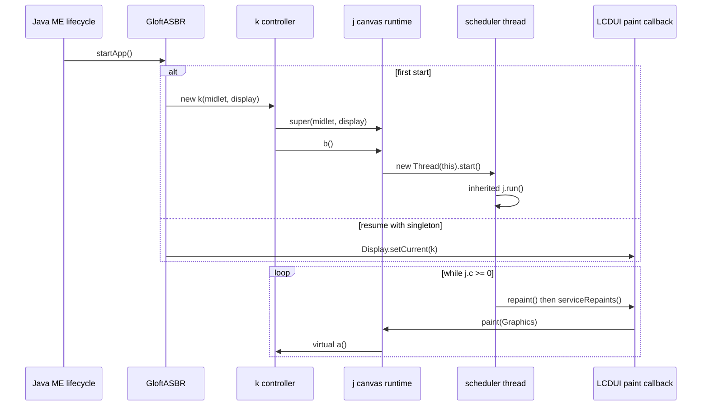
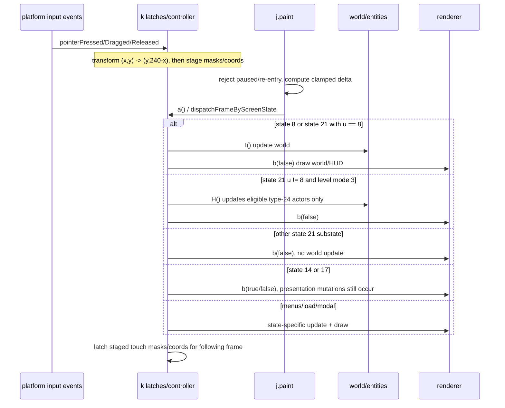
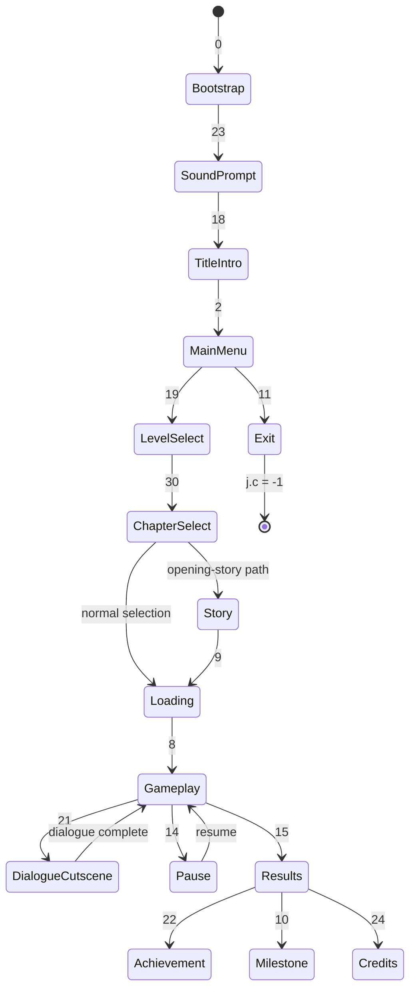

# Scout: Lifecycle, Engine, Controller, Audio, and Persistence

## Summary

The recovered bootstrap chain is `GloftASBR.startApp()` -> `new k(midlet,
display)` -> `j.<init>()` -> `k.ad()` -> `j.b()` -> `new Thread(k).start()`.
`k` does not define another `run`; the thread executes inherited `j.run()`, which
schedules `repaint()`/`serviceRepaints()`. Actual update and render both happen in
the virtual frame callback `j.paint()` -> `k.a()`. This is proven by source and
bytecode, not by running the MIDlet.

The strongest architectural split is: `GloftASBR` owns MIDlet references and
bootstrap; `j` owns the Canvas, scheduler, timing, and pack reader; `k` owns the
screen FSM, world load/update/render policy, touch latches, audio policy, and the
512-byte `/ASBR` buffer; `e` owns one static tracked Java ME `Player` reference; `a` is a passive animation
cursor despite implementing `Runnable`; `h` is the 34-slot duration table.

## Evidence Basis

- Primary: structured source with exact lines.
- Control-flow authority where structured output warns: simple source and
  `javap`. In particular `k.a:()V`, `k.l:(I)V`, and `k.G:(I)Z` are checked against
  `k.javap.txt:5238`, `:8777`, and `:23100` respectively.
- Target-filtered inventory confirms calls rather than supplying semantics. For
  example, `calls.json` records the sole game-loop `Thread` construction under
  `j.b:()V` around JSON lines 55938-55978, and records
  `k.a:()V` calls to `k.I`, `k.b`, `k.N`, and `k.G` with bytecode offsets.
- No JAR, MIDlet, emulator, simulator, classloader, or class file was executed.

## Proposed Class Aliases

Aliases are working names, not claimed original Gameloft identifiers.

| Symbol | Proposed alias | Confidence | Static basis |
|---|---|---|---|
| `GloftASBR` | `AssassinsCreedMidlet` | proven | Extends `MIDlet`; implements all three lifecycle callbacks and constructs `k` (`GloftASBR.java:8-45`; `GloftASBR.javap.txt:94-198`). |
| `j` | `GameCanvasLoopAndPackRuntime` | high-confidence | Extends `Canvas`, implements `Runnable`, schedules frames, samples timing/input, and owns multipart pack/LZMA access (`j.java:15-105`, `:143-307`, `:627-813`). |
| `k` | `GameControllerStateMachine` | high-confidence | Extends `j`; constructor starts loop; `k.a()` dispatches 0..31 screen states and owns loading/world/UI/save/audio policy (`k.java:9`, `:479-484`, `:734-1617`). |
| `a` | `SpriteAnimationCursor` | high-confidence | Holds sprite, animation/frame, elapsed time and loop state; `b(int)` advances and `c()` draws (`a.java:5-18`, `:44-144`). |
| `e` | `TrackedPlayerAudioManager` | high-confidence | Static 34-slot stream table plus exactly one static tracked `Player` reference; normal path stops/closes before replacement, but exception/concurrency exclusivity is unproven (`e.java:9-70`; `e.javap.txt:147-387`). |
| `h` | `AudioSlotDurationMillis` | proven | A 34-element table indexed by current audio slot and compared directly with `System.currentTimeMillis()` delta (`h.java:4-5`; `e.java:32-34`). |

## MIDlet Bootstrap and Object Construction

1. `GloftASBR.<init>` stores the new MIDlet in static `GloftASBR.c`
   (`GloftASBR.java:13-15`; bytecode `GloftASBR.javap.txt:94-103`).
2. On first `startApp`, it reads `MIDlet-Version`, derives `k.bK` from
   `HAS-BLOOD`, then stores `new k(this, Display.getDisplay(this))` in static
   `GloftASBR.a` (`GloftASBR.java:21-36`; bytecode
   `GloftASBR.javap.txt:114-153`). On later `startApp`, it only makes that existing
   canvas current; it does not create another controller/thread.
3. `k.<init>` calls `j.<init>`, reseeds the runtime RNG, initializes bitmap-cache
   groups in `ad()`, then calls inherited `j.b()` (`k.java:479-484`; bytecode
   `k.javap.txt:4072-4086`).
4. `j.<init>` records `this` as static `j.h`, initializes `j.c=-1`, captures the
   MIDlet and Display, makes the Canvas fullscreen/current, builds legacy key
   maps, and seeds scheduling timestamps (`j.java:110-141`; bytecode
   `j.javap.txt:1058-1301`).
5. `j.b()` is idempotent while `j.c>=0`. On first call it sets logical size
   `400x240`, sets `j.c=0`, and starts `new Thread(this)` (`j.java:143-152`;
   bytecode `j.javap.txt:1303-1324`). Dynamic type is `k`, but execution resolves
   to inherited `j.run()`.

## Thread and Frame Ownership

### Scheduler

- `j.run()` makes the canvas current, lowers the startup/re-entry gate `z`, and
  loops while `j.c >= 0` (`j.java:197-219`; bytecode
  `j.javap.txt:1428-1484`).
- When not paused it calls `repaint()` then `serviceRepaints()`, and targets a
  `62 ms` period (`j.B=62` at `j.java:82`; sleep arithmetic at `j.java:206-211`).
  This is approximately 16.1 scheduler iterations/second, not proof of a fixed
  simulation step.
- While paused it does not terminate or wait on a monitor; it repeatedly sleeps
  `1 ms` (`j.java:202-205`).
- A scheduler exception sets `j.c=-1`; normal or exceptional loop exit clears a
  pack buffer and invokes the captured MIDlet's `notifyDestroyed()`
  (`j.java:213-219`; `j.javap.txt:1476-1484`).
- Inventory shows other `Thread` starts only in promotion class `f`; these are
  IGP workers, not the game-loop scheduler. Therefore `j` owns the sole static
  game loop, not necessarily every thread in the JAR.

### Paint, timing, update, render

`j.paint()` is the actual frame boundary (`j.java:221-265`; bytecode
`j.javap.txt:1505-1600`):

1. Reject if paused or already/startup painting (`b || z`).
2. Snapshot base keypad masks, clear their edge accumulators.
3. Compute `j.f = now - H`, clamp to `0..1000 ms`, increment elapsed accumulator
   and frame/stage counter `j.g`.
4. Publish the `Graphics` instance and invoke abstract `j.a()`, dynamically
   `k.a()`.
5. Clear the re-entry gate.

There is a nested failure boundary: `k.a()` catches and swallows `Exception`
around nearly the entire screen/update/render dispatch (`k.java:734-1616`). Most
world/render failures therefore do not reach `j.paint()`'s catch that would set
`j.c=-1`; a frame may stop after partial global mutation and the loop continues.
Because touch-mask publication/clearing is at the tail of that same try block
(`k.java:1594-1609`), an earlier failure also skips the input tail and can carry
partial latch state into the next frame.

Static code proves scheduling order but not which physical Java ME implementation
thread executes `paint()`. `serviceRepaints()` establishes completion ordering;
LCDUI owns the callback semantics. A rewrite should not assume the scheduler
thread and paint/update thread are identical.

For gameplay state `8`, and state `21` only when substate `u == 8`, bytecode
explicitly calls world update before world draw: `k.I()` at bytecode offset 2750,
then `k.b(false)` at 2771 (`k.javap.txt:6477-6499`; structured
`k.java:859-868`). Other state-21 substates skip `I()`; in level mode `3` they
call `H()`, which still updates type-24 actors in states `8/9/10`, then draw
(`k.java:2507-2514`). `k.I()` updates entities, the player, attachments,
triggers, camera/script state (`k.java:2516-2651`).
`k.b(false)` draws cached tiles/backgrounds, constructs a depth-ordered entity
list, calls entity `F()` render methods, then HUD/overlays
(`k.java:2679-2752`, `:2812-2929`, `:3078-3255`). State `17` calls only
`k.b(false)`, so it has no full world update, but it is not mutation-free:
renderer code rebuilds `bd/be`, advances selected helper animations, and mutates
flash/HUD/fade timers. State `14` similarly calls `k.b(true)` without `k.I()`
(`k.java:1122-1145,2848-2925,3085-3223,4209-4244,4326-4343`).

## Pause, Resume, Destroy, and Exit

| Boundary | Proven behavior | Missing/counter-evidence |
|---|---|---|
| `GloftASBR.pauseApp()` | Calls only `notifyPaused()` (`GloftASBR.java:17-19`; bytecode `:105-112`). | Does not call `k.c()`, set `j.b`, save, or stop the loop directly. |
| `Canvas.hideNotify()` | Calls virtual `c()` (`j.java:177-179`), resolving to `k.c()`. `k.c()` clears input, optionally pauses a script/cutscene, stops audio, then `super.c()` sets static pause flag `j.b=true` (`k.java:5818-5835`; bytecode `k.javap.txt:27448-27488`). | Loop remains alive and polls with 1 ms sleeps. |
| `Canvas.showNotify()` | Calls virtual `d()` (`j.java:181-183`), resolving to `k.d()`. Controller repairs modal/game state and attempts audio selection, then `super.d()` resets clocks, clears pause, restores display, repaints, and clears base input (`k.java:5768-5815`; `j.java:162-175`). | `k.bH` and `k.fj` have no non-`<clinit>` writes in field inventory; pause therefore overwrites `bG` with `-1` in observed code. Audio restoration is an apparent dead/legacy path, not proven resumption. |
| `GloftASBR.destroyApp(boolean)` | Clears current display, nulls `GloftASBR.a`, calls `notifyDestroyed()`, nulls `GloftASBR.c` (`GloftASBR.java:38-45`; bytecode `:181-198`). | Does **not** set `j.c=-1`, interrupt/join the thread, stop audio, save RMS, or clear static `j.A`. Static evidence cannot prove prompt loop termination if the platform calls this externally while the loop is active. |
| In-game exit state `11` | `k.a()` sets `j.c=-1` and returns (`k.java:1104-1106`; bytecode `k.javap.txt:7507-7509`). | `j.run()` then calls `notifyDestroyed()` independently, so there are two distinct destruction notification paths. |

## Controller FSM

`j.c` is a fused field: non-negative values are screen states, while negative
means scheduler termination. `k.a()` uses a bytecode `tableswitch 0..31`
(`k.javap.txt:5384-5418`). `k.l(int)` is the normal transition gate: it stores the
previous state in `ex`, resets common menu/dialogue/input/timing fields, performs
entry actions and destination rewrites, then saves old `j.c` in `cy`, writes the
destination to `j.c`, and clears input (`k.java:1637-1842`; bytecode
`k.javap.txt:8777-9307`). It is central, not exclusive: `k.P()` restores a stacked
state directly (`k.javap.txt:18465-18484`), state `11` writes `-1` directly, and a
menu branch writes state `11` directly (`k.javap.txt:19066-19081`).

### Screen-state aliases

| Value | Proposed alias | Confidence | Evidence boundary |
|---:|---|---|---|
| `-1` | `terminated` | proven | `j.run` loop guard; state 11 assigns it. |
| `0` | `bootstrapLoading` | proven | Calls staged `R()` (`k.java:796-799`, `:3949-4101`). |
| `1` | `titleTouchPrompt` | high-confidence | Prompt render; input enters IGP invitation (`k.java:800-812`). |
| `2` | `mainMenu` | high-confidence | Menu background/list/navigation (`k.java:813-829`). |
| `3` | `optionsMenu` | high-confidence | Options list and navigation (`k.java:830-837`; setting writes near `:3880-3939`). |
| `4` | `statisticsScores` | high-confidence | Calls score/stat renderer `F()` and reads score ranges (`k.java:838-840`, `:2338-2410`). |
| `5` | `helpPages` | high-confidence | Calls paged help renderer `G()` (`k.java:841-843`, `:2412-2490`). |
| `6` | `aboutLegal` | high-confidence | Renders long legal/about text (`k.java:844-858`). |
| `7` | `transitionOnlyOrUnused` | proven | Tableswitch maps to shared default; no dedicated handler (`k.javap.txt:5393`). |
| `8` | `liveGameplay` | proven | World update then draw (`k.java:859-868`). |
| `9` | `stagedLevelLoading` | proven | Draws loading screen, calls `G(j.g)` (`k.java:1067-1100`). |
| `10` | `milestoneInterstitial` | high-confidence | Calls post-level interstitial `ag()` (`k.java:1101-1103`). |
| `11` | `exit` | proven | Sets `j.c=-1` (`k.java:1104-1106`). |
| `12` | `confirmationModalA` | high-confidence | Shared modal render/entry handling (`k.java:1107-1121`, `:1656-1661`). |
| `13` | `confirmationModalB` | high-confidence | Shared handler; rewrites to 31 when message ID `bx>=0`. |
| `14` | `pauseMenu` | proven | Draws frozen world plus pause menu; entered from hide/resume paths (`k.java:1122-1139`, `:1790-1800`). |
| `15` | `levelResults` | high-confidence | Calls results calculation/display `M()`; transition can redirect to achievement/milestone. |
| `16` | `transitionOnlyOrUnused` | proven | No dedicated switch body (`k.javap.txt:5402`). |
| `17` | `noFullWorldUpdatePresentation` | proven | No `I()`, but `k.b(false)` still performs presentation/working-list mutations (`k.java:1143-1145,2679-3255`). |
| `18` | `titleAudioIntro` | high-confidence | Logo/title frames wait on `e.a()` then transition to menu (`k.java:1146-1175`). |
| `19` | `levelSelection` | high-confidence | Selects `aj`, clears checkpoint marker, transitions toward sequence/load (`k.java:1177-1207`). |
| `20` | `openingStoryCrawl` | high-confidence | Character-by-character story text then `l(9)` (`k.java:1208-1306`). |
| `21` | `gameplayDialogueCutscene` | high-confidence | Same world pipeline as 8 plus sub-FSM `u=0..10` (`k.java:859-1021`). |
| `22` | `achievementNotification` | high-confidence | Calls achievement screen `ah()`; states derive from bytes 130..132. |
| `23` | `soundEnablePrompt` | proven | Sets `bE/bF`, then enters 18 (`k.java:1310-1325`). |
| `24` | `endingCreditsCrawl` | high-confidence | Long ending scroll and fade (`k.java:1326-1387`). |
| `25` | `igpInvitation` | high-confidence | Invites promotion, calls `f.a`, then enters 27 (`k.java:1388-1421`). |
| `26` | `transitionOnlyOrUnused` | proven | No dedicated switch body (`k.javap.txt:5412`). |
| `27` | `igpCatalog` | proven | Delegates input/render to `f` (`k.java:1422-1435`). |
| `28` | `informationModal` | high-confidence | Calls generic modal handler `ae()` (`k.java:1436-1438`). |
| `29` | `difficultySelection` | proven | Choice count gated by hard-unlock save byte 69 (`k.java:1439-1447`). |
| `30` | `chapterSequenceSelection` | high-confidence | Calls grouped selector `af()` (`k.java:1448-1450`). |
| `31` | `messageModal` | high-confidence | Displays message `bx`, returns to 13 (`k.java:1451-1475`). |

The graph is the strongest coarse path, not an exhaustive transition graph.
Menus/modals use stack helpers `O()`/`P()` and `k.l()` may rewrite destinations.

## Bootstrap and Level Resource Boundaries

### Global bootstrap (`state 0`, `R()`)

`R()` uses `cu` as a staged substate (`k.java:3949-4101`):

| `cu` | Boundary |
|---:|---|
| `0` | Open pack `/1`; load first splash sprite. |
| `1` | Load global sprites/fonts; materialize string table `/14` index 0; inspect 34 audio slots from `/17` (31 nonempty payloads). |
| `2-3` | Timed splash/logo presentation; load palette/resource setup from `/16` and common sprites from `/3`. |
| `4` | Zero all 512 save bytes, call `k.e(false)`, derive difficulty/promotion/achievement state. |
| `5` | Load common UI pack `/2` plus persistent sprites `/3`. |
| `6` | Initialize achievements/IGP and transition to sound prompt state 23. |

### Per-level staging (`state 9`, `G(int)`)

State 9 draws `N()` then passes monotonically increasing frame counter `j.g` to
`G` (`k.java:1067-1089`; bytecode `k.javap.txt:7053-7064`). The linear view is
clearer than the type-damaged structured view (`src/simple/k.java:6095-6561`):

| Stage | Boundary |
|---:|---|
| `1` | Load level string table `/14`, index `1+aj`; read persistent baseline stats. |
| `2` | Allocate/reset offscreen tile cache (`U()`). |
| `3` | Load level tile/flag layers through `I(aj)`. `H(slot)` pairs payload with four-byte little-endian width/height companion (`k.java:5234-5272`). |
| `4-7` | Load/configure level background sprite groups from `/15`. |
| `8` | Read entity stream entry `0` and script/event stream entry `7` from level pack `ec[aj]`; parse script lane boundaries. |
| `9` | Scan entity records to determine required sprite IDs; open sprite pack `/3`. |
| `10-84` | Incrementally instantiate needed sprite IDs, one stage per slot. |
| `85` | Close `/3`; apply palette/frame setup tables. |
| `87-161` | Incrementally prepare loaded sprite animation/frame state. |
| `163` | Load supplemental module/frame payloads from `/5` and `/4`. |
| `164` | Instantiate entity records via `d(false)`. |
| `>164` | Return `true`; loading screen waits for release/touch, then clears checkpoint marker and transitions to state 8. |

`j` is the low-level pack owner: `j.a(String)` opens multipart resources and
reads little-endian part/index tables; `j.e(int)` returns decoded bytes;
`j.f(int)` parses typed entries; `j.e()` closes current stream
(`j.java:637-745`, `:803-813`). `k` chooses packs/slots and retains decoded level
arrays, so resource mechanics belong to `j`, resource semantics/lifetime to `k`.

## Input Scheduling

Base `j` contains a keypad map and key edge/held masks (`j.java:110-138`,
`:267-301`), but concrete `k.keyPressed` and `k.keyReleased` are bytecode-empty
(`k.java:5577-5583`; `k.javap.txt:26544-26556`). This artifact's controller path
is therefore touch-driven; the inherited key-map code is present but shadowed.

Pointer callbacks rotate portrait event coordinates into game coordinates:
`gameX=inputY`, `gameY=240-inputX` (`k.java:486-516`; bytecode
`k.javap.txt:4088-4187`). They feed the IGP controller `f` as well as game latches.

| Symbol | Proposed alias | Confidence | Behavior |
|---|---|---|---|
| `k.eK` | `stagedPressMask` | high-confidence | ORed by `E(mask)` from pointer press/drag. |
| `k.eL` | `stagedHeldMask` | high-confidence | ORed on press; moved to staged release and cleared on release. |
| `k.eN` | `stagedReleaseMask` | high-confidence | Receives released held mask. |
| `k.bB` | `pressedThisFrame` | proven | `k.v(mask)` tests it; assigned from `eK` at frame tail. |
| `k.bC` | `heldThisFrame` | proven | `k.u(mask)` tests it; assigned from `eL` at frame tail. |
| `k.eM` | `releasedThisFrame` | proven | `k.w(mask)` tests it; assigned from `eN` at frame tail. |
| `k.x(mask)` | `isRecentRepeatOrDouble` | inferred | Requires current press equal previous nonzero press and age `<5`; exact UX intent is not named in code (`k.java:5597-5599`). |
| `k.J/K` | `latchedPointerPosition` | high-confidence | Set from current `cj/ck` after state dispatch (`k.java:1509-1515`). |
| `k.H/I` | `latchedReleasePosition` | high-confidence | Set from `ch/ci` after state dispatch, then source reset (`k.java:1516-1519`). |

The main state dispatch consumes prior latches, then at its tail publishes staged
touch masks/positions for the following frame (`k.java:1594-1609`). `E(mask)` also
updates `bC` immediately (`k.java:553-574`), so held-state visibility can be
same-frame if the platform interleaves callbacks. Exact event-thread interleaving
is not statically provable.

## Animation Scheduling

`a` is not an engine thread. Its `run()` is empty and static `d()` performs no
work (`a.java:146-157`). Callers explicitly invoke:

- `a.a(animation, loops)` to select/reset an animation (`a.java:53-60`);
- `a.b(deltaMillis)` to advance frame timer and loop count (`a.java:112-144`);
- `a.c()` to draw through sprite class `b` using global `j.a` Graphics
  (`a.java:99-110`).

Selected aliases:

| Symbol | Proposed alias | Confidence |
|---|---|---|
| `a.d` | `sprite` | proven |
| `a.e` | `animationIndex` | proven |
| `a.f` | `frameIndex` | high-confidence |
| `a.g` | `frameElapsedMillis` | high-confidence |
| `a.h` | `remainingLoops` | high-confidence |
| `a.i` | `finished` | high-confidence |
| `a.a(int,int)` | `selectAnimation` | high-confidence |
| `a.b(int)` | `advanceByMillis` | high-confidence |
| `a.c()` | `drawCurrentFrame` | proven |

## Audio Boundary

`k.R()` boot stage 1 calls `e.a("/17")` (`k.java:3995-4000`). `e` opens the
pack through `j`, reads slots `0..33`, infers WAV/MIDI MIME from first byte, and
retains each payload as a resettable `ByteArrayInputStream` (`e.java:16-30`;
bytecode `e.javap.txt:147-194`).

| Symbol | Proposed alias | Confidence | Boundary |
|---|---|---|---|
| `e.a[34]` | `audioStreams` | proven | Decoded in-memory streams. |
| `e.c[34]` | `audioMimeTypes` | proven | `audio/x-wav` or `audio/midi`. |
| `e.b` | `currentPlayer` | proven | Sole tracked static `javax.microedition.media.Player` reference. |
| `e.d` | `playbackStartedAtMillis` | proven | Set immediately before player creation. |
| `e.e` | `currentAudioSlot` | proven | Set after `Player.start`, reset by stop. |
| `k.bE` | `musicEnabled` | high-confidence | Gates slots `<10`. |
| `k.bF` | `soundEffectsEnabled` | high-confidence | Gates slots `>=10`. |
| `e.a(String)` | `loadAudioPack` | proven | Inspects 34 slots and classifies 31 nonempty payloads. |
| `e.a()` | `isSlotDurationActive` | proven | Uses elapsed wall time `< h.a[currentSlot]`, not `Player` state. |
| `e.a(int,boolean)` | `playAudioSlot(int,unusedLegacyFlag)` | proven | Boolean local is never read in bytecode (`e.javap.txt:245-340`). |
| `e.b()` | `stopAndClosePlayer` | proven | Stop, close, null one player (`e.javap.txt:342-371`). |
| `h.a` | `slotDurationMillis` | proven | 34 values, indexed by `e.e`. |

There is no mixer API. On the normal path, before a new eligible start, `e` calls
`e.b()` and replaces the sole tracked reference. Stop/close exceptions are
swallowed and methods are unsynchronized, so underlying active-player
exclusivity is not proven. When
both policy flags are enabled and the synthetic duration says a slot is active,
the bytecode returns without starting another slot (`e.javap.txt:255-286`). The
method parameter previously described as `allowRestart` has no effect and should
not receive that alias. All audio exceptions are swallowed. Pause stops/closes
the player; no reliable automatic resumption is proven.

## Persistence Boundary

### Durable `/ASBR`

`k` is the only owner of game-save RMS. Static `k.bA` is exactly 512 bytes
(`k.java:291`). `k.e(boolean)` opens `/ASBR`; `true` adds record 1 or replaces it
with all 512 bytes, while `false` reads record 1 into the preallocated `bA` and
ignores `getRecord`'s returned length. Normal paths close the store, but the
whole branch is under one catch: an add/set/get failure jumps past `close`, so an
exceptional path can leak the handle; every exception is swallowed
(`k.java:5557-5575`; bytecode `k.javap.txt:26460-26520`). No
magic/version/checksum/record-length validation is in this boundary.

The initial durable load happens inside bootstrap state 0 after first zeroing all
512 bytes (`k.java:4034-4054`). Filtered call inventory finds codec calls only
from controller/UI/progression paths (`k.a`, `k.M`, `k.Q`, `k.R`, and a text/menu
helper); `k.R` passes `false` for the bootstrap load, while save calls pass `true`
at explicit UI/progression events. Neither MIDlet pause/destroy nor canvas hide
performs `k.e(true)`.

### Checkpoint and RAM-only snapshot

Checkpoint entity code writes checkpoint/player/stat fields into `k.bA` but does
not call the RMS codec (`i.java:13468-13510`, `:17269-17306`). It also serializes
each live entity into `k.bf` with a 22-byte stride
(`k.java:258-259`, `:4604-4613`). `k.d(true)` restores these RAM bytes during a
retry (`k.java:4625-4705`). No static copy from `bf/bg` to `bA` exists. Thus:

- `bA`: durable only after a later explicit `k.e(true)` call;
- `bf/bg`: process-local checkpoint world snapshot, never RMS;
- pause/destroy: no guaranteed checkpoint flush.

RMS calls elsewhere belong to promotion class `f`, which opens separate store
`igp19` (`f.java:782-793`). Filtered inventory contains no other RecordStore
owner. This is a strict boundary between game-save record payloads and the
existence-only IGP store probe; no IGP record payload state is proven.

Selected aliases:

| Symbol | Proposed alias | Confidence |
|---|---|---|
| `k.bA` | `saveRecord512` | proven |
| `k.e(boolean)` | `loadOrSaveGameRecord(save)` | proven |
| `k.bf` | `entityCheckpointSnapshot22ByteSlots` | proven |
| `k.bg` | `entityCheckpointTombstones` | high-confidence |
| `k.G(int)` | `advanceLevelLoadStage` | high-confidence |
| `k.H(int)` | `loadTileLayerAndDimensions` | high-confidence |
| `k.I(int)` | `loadLevelLayers` | high-confidence |
| `k.I()` | `updateWorld` | high-confidence |
| `k.b(boolean)` | `drawWorld` | high-confidence |
| `k.a()` | `dispatchFrameByScreenState` | high-confidence |
| `k.l(int)` | `transitionScreenState` | high-confidence |
| `j.c` | `screenStateAndLoopSentinel` | proven |
| `j.b` | `canvasPaused` | proven |
| `j.B` | `targetFramePeriodMillis` | proven |
| `j.f` | `frameDeltaMillisClamped` | proven |
| `j.b()` | `startGameLoopThread` | proven |
| `j.run()` | `schedulePaintLoop` | proven |
| `j.paint(Graphics)` | `sampleTimingAndDispatchFrame` | proven |

## Counter-Evidence and Ambiguity

- `GloftASBR.destroyApp` is not a loop shutdown function. Any architecture claim
  that it joins/stops the engine is contradicted by its bytecode.
- `GloftASBR.pauseApp` does not implement the effective Canvas pause path; that is
  `hideNotify -> k.c -> j.c`. Platform callback ordering remains external.
- `j.c` must not be modeled as a pure screen enum: negative is the run-loop
  sentinel.
- `k.l(int)` is the main transition API but not exclusive; stacked-modal restore
  and exit write `j.c` directly.
- `62 ms` is a target scheduler period. `j.f` is real elapsed time clamped at
  1000 ms, and much gameplay logic is frame-count based. Deterministic fixed-step
  behavior is not proven.
- The physical thread running `paint/k.a` cannot be named from static bytecode;
  only `repaint/serviceRepaints` ordering is proven.
- `k.a`, `k.l`, `k.G`, and `k.d(boolean)` contain decompiler warnings/type damage.
  State dispatch/order and load thresholds above were accepted only where simple
  view and/or `javap` agree.
- `e.a(int,boolean)` ignores the boolean; `allowRestart` is counterfactual.
- `e.a()` reports table-duration activity, not actual `Player` completion.
- The apparent pause-audio resume fields `bH/fj` lack runtime writes in the field
  inventory. Reliable automatic music continuation is unknown and likely absent.
- Save exceptions are swallowed; no save occurs automatically on pause/destroy,
  and checkpoint buffer mutation is not itself durable.

## Recommendations for Architecture Reconstruction

1. Preserve three distinct runtime boundaries in any parity model: scheduler
   (`j.run`), platform paint callback (`j.paint`), and controller frame dispatcher
   (`k.a`). Do not collapse thread identity into the call-order diagram.
2. Model `j.c` as `{terminated | screenState}` or split it only with a verified
   compatibility adapter; direct writes make naïve enum replacement unsafe.
3. Keep input as staged event masks with explicit frame publication if exact
   parity matters. A modern immediate input model can change edge timing.
4. Separate audio data ownership (`e`), audio policy (`k.bE/bF`), and synthetic
   duration (`h`) when translating; retain the ignored boolean as a compatibility
   placeholder only if call signatures must match.
5. Treat `/ASBR`, checkpoint fields in `bA`, and `bf/bg` world snapshots as three
   persistence tiers. Do not imply checkpoint durability without an explicit RMS
   write event.

## Unresolved Questions

- Which Java ME implementation thread executed `paint()` on the target device,
  and could pointer callbacks interleave with `k.a()`? Static artifacts bound but
  cannot answer this.
- Were dead audio-resume fields (`bH`, `fj`) populated by a vendor-specific
  transform absent from the recovered bytecode? Inventory says no for this JAR.
- Exact domain labels for states 10, 12, 13, 28, and 31 remain UI-text/call-flow
  interpretations; their control-flow roles are stronger than their names.
- Does bootstrap's extra direct `RecordStore.openRecordStore(...).getNumRecords()`
  leak a handle on the original device, or did the vendor RMS implementation
  tolerate it? There is no explicit close at that call site (`k.java:4045`).

Status: DONE_WITH_CONCERNS
Summary: Static evidence proves the bootstrap/thread/frame chain, fused screen FSM, staged level loader, touch/update/render ordering, single-player audio boundary, and split durable/RAM persistence tiers. Destroy does not explicitly stop the loop, paint-thread identity is platform-owned, and audio resume fields appear dead.
Concerns/Blockers: Decompiler-damaged controller methods were bounded with simple and bytecode views; exact UI labels and platform callback interleaving remain unknown.
